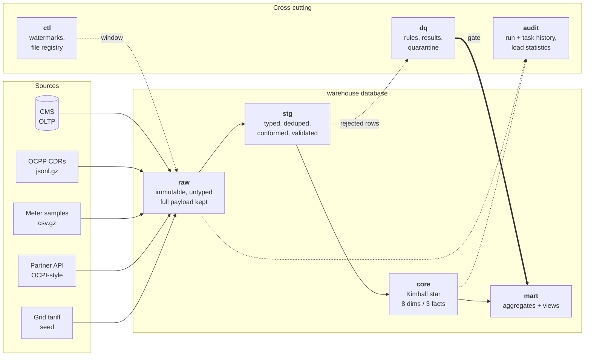
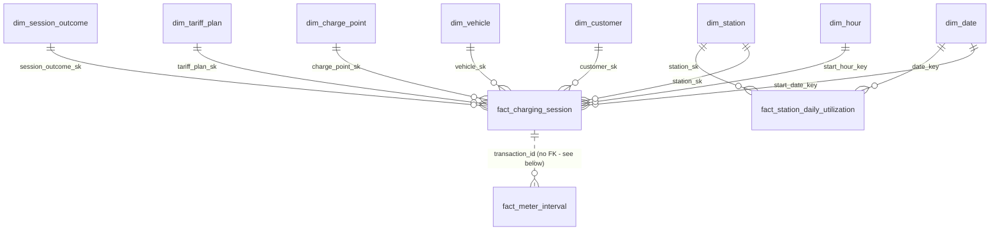
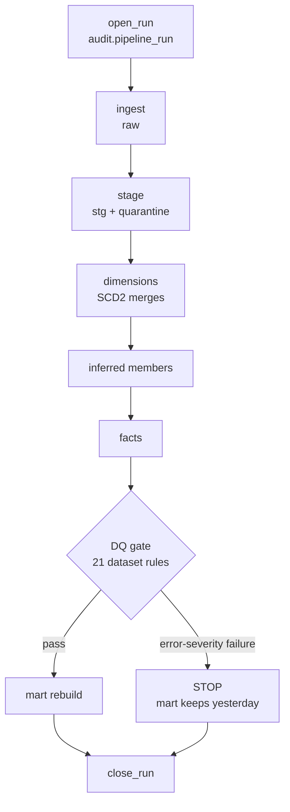

# Orchestrated Warehouse

A batch data warehouse for **VoltHive Energy Pvt. Ltd.**, a fictional Indian EV
charge point operator. Four heterogeneous sources land in an immutable `raw`
layer, are conformed through `stg`, modelled dimensionally in `core`, and
published to `mart` behind a data-quality gate — orchestrated by Airflow,
running on PostgreSQL 16, reproducible from an empty machine with three
commands.

Everything below describes what is **in this repository and passing**. Where
something is deliberately not built, it says so under
[Limitations](#limitations) rather than being quietly omitted.

```
make up          # PostgreSQL + Airflow, healthy or the command does not return
make run-clean   # schema, synthetic data, and a full pipeline run
make analytics   # the ten showcase queries, against what you just built
```

---

## Contents

- [The problem](#the-problem)
- [Architecture](#architecture)
- [Data model](#data-model)
- [How the pipeline behaves](#how-the-pipeline-behaves)
- [Data quality](#data-quality)
- [Incremental loading and idempotency](#incremental-loading-and-idempotency)
- [Orchestration](#orchestration)
- [Observability and lineage](#observability-and-lineage)
- [Repository layout](#repository-layout)
- [Getting started](#getting-started)
- [Running it](#running-it)
- [Testing](#testing)
- [Results & Evidence](#results--evidence)
- [Design decisions](#design-decisions)
- [Limitations](#limitations)
- [Future work](#future-work)

---

## The problem

VoltHive operates public charging stations across eight Indian cities. The
data arrives from four systems that disagree with each other:

| Source | Shape | Arrives | Awkward because |
|---|---|---|---|
| **CMS** (`cms` database) | Master data: stations, charge points, customers, vehicles, tariff plans | Continuously; extracted on a `updated_at` watermark | Exposes current state only — history has to be **built**, not read |
| **OCPP charge detail records** | Gzipped JSONL, partitioned `dt=/city=` | Nightly files | Retry storms duplicate records; corrections arrive as `record_version = 2`; older firmware reports energy in kWh not Wh |
| **Meter telemetry** | Gzipped CSV, one row per five-minute sample | Nightly files | Samples arrive out of order, duplicated, and sometimes **before** the session header they belong to |
| **Roaming partner API** | OCPI-style JSON, cursor-paginated | Polled | Records are restated for up to a week while billing disputes settle |

Plus a seed file of state-wise grid tariff slabs, which is what makes margin —
rather than only revenue — computable.

The questions the warehouse has to answer are ordinary and the data model is
what makes them answerable:

> *Did the 30 kW → 60 kW charger upgrade increase energy per session?*
> *Which stations earned nothing yesterday, and for how many days running?*
> *Is roaming growing, and is it diluting margin?*

The first needs **Type 2 history**. The second needs a fact that contains rows
for things that did **not** happen. The third needs the two directions of
roaming kept apart. None of them is answerable from a table of sessions.

---

## Architecture

**EL-then-T.** Sources are loaded into `raw` untransformed and untyped, and
every transformation afterwards is SQL over data already in the warehouse.
This is the single decision most of the rest follows from: when a
transformation is found to have been wrong for a month, the fix is to replay
from `raw` (`scripts/restate.py`) without contacting any source system and
without caring whether that source still holds the data.



Seven schemas in one `warehouse` database, plus a separate `cms` database
standing in for the source OLTP so that "read from another system" is a real
connection with its own read-only role, not a folder.

| Schema | Holds | Mutability |
|---|---|---|
| `raw` | Exactly what arrived, plus lineage columns | Append-only |
| `stg` | Typed, deduplicated, conformed rows | `UNLOGGED`, rebuilt every run |
| `core` | Dimensions and facts | Delete-insert over a restatement window |
| `mart` | Aggregates and semantic views | Fully rebuilt |
| `ctl` | Watermarks, source registry, ingested-file registry | Mutable operational state |
| `audit` | Pipeline runs, task attempts, load statistics | Append-only history |
| `dq` | Rule definitions, check results, quarantine | Mixed |

`ctl` and `audit` are separate on purpose: one is state you overwrite, the
other is history you never do. Putting them together makes it impossible to
say which is which.

### Technology, and why each is here

| Choice | Reason it earns its place |
|---|---|
| **PostgreSQL 16** | The warehouse and the source OLTP in one engine, with partitioning, `EXCLUDE` constraints, `COPY`, window functions and JSONB. No cloud account needed to run the project. |
| **Airflow 2.10.5** (LocalExecutor) | Dependencies, retries, backfills, Datasets and a UI. LocalExecutor because Celery would add Redis and two more containers to run four DAGs on one machine. |
| **Docker Compose** | The stack starts healthy or `make up` does not return. Reproducibility is the point. |
| **SQL files, not ORM** | Every set-based transformation is a `.sql` file that can be linted, diffed and run in `psql`. Python orchestrates; it does not compute. |
| **psycopg 3** | Server-side cursors and `COPY` for bulk paths. |
| **structlog** | JSON to stdout with a PII-redaction processor, correlated by `pipeline_run_id`. |
| **pytest** | 333 tests, markered `unit` / `dags` / `integration` / `e2e`. The database is never mocked. |

What is deliberately **not** here: dbt (the point is to show the mechanics it
hides), Spark (a million rows is a PostgreSQL problem), Kafka (the sources are
genuinely batch), and a cloud warehouse (nothing in the design needs one).

---

## Data model

A Kimball star: eight dimensions, three facts, all three fact types.



| Fact | Type | Grain |
|---|---|---|
| `fact_charging_session` | Transaction | One completed charging session |
| `fact_meter_interval` | Transaction (high volume) | One interval between two meter samples |
| `fact_station_daily_utilization` | **Periodic snapshot** | One station on one IST business date — **densely generated** |

**The snapshot is dense on purpose.** Idle time is the *absence* of sessions,
and you cannot count absences in a table that only contains sessions. If only
busy days produced rows, every utilisation average would be computed over busy
days only and every number would be optimistically biased — invisibly, because
the missing rows are missing.

**`fact_meter_interval` has no declared foreign key to `fact_charging_session`,
deliberately.** Declaring it would make the interval load fail whenever the
session load had not run in the same window, destroying task-level
restartability. The relationship is enforced by the load's `INNER JOIN` and
*verified* by an error-severity rule, `FACT_METER_ORPHAN_SESSION` — which is a
real check that has caught a real bug (see
[`tests/integration/test_facts.py`](tests/integration/test_facts.py),
`test_a_window_that_ends_mid_session_leaves_no_orphan`).

### Techniques on show

- **Surrogate keys** on every dimension, `GENERATED BY DEFAULT AS IDENTITY` so
  the special members can be seeded with explicit values.
- **Unknown (-1) and Not-Applicable (-2) members** in every dimension. This is
  what makes every fact foreign key `NOT NULL`: joins never silently drop rows
  and `COUNT(*)` means what it says. The two are kept distinct because "we
  could not identify the device" is a data problem worth measuring and "this
  session had no VoltHive device" is not.
- **Inferred members** — a session on a charge point the CMS has not reported
  yet still loads, creating a placeholder dimension row that is *promoted in
  place*, keeping its surrogate key, when the real record arrives.
- **Degenerate dimension** — `transaction_id` sits on the fact with no
  dimension table, because there is nothing else to say about it.
- **Junk dimension** — `dim_session_outcome` collapses status, stop reason,
  auth method and roaming flag into ~60 rows instead of four low-cardinality
  columns on a million-row fact.
- **Hybrid Type 1 / Type 2** — attributes are versioned or overwritten
  individually, per the policy table in `sql/core/scd2_merge_*.sql`.
- **Range partitioning** — monthly on `date_key`, on `fact_meter_interval`
  only, because it is the only table where the restatement `DELETE` benefits
  from pruning.

### SCD Type 2, concretely

Four dimensions carry full history: `customer`, `station`, `charge_point`,
`tariff_plan`. Validity is a half-open interval
`[effective_from_utc, effective_to_utc)` with `9999-12-31` as the open
sentinel and `0001-01-01` as the beginning of time. Change detection is a
SHA-256 hash over the tracked columns only, computed identically in SQL
(`core.row_hash`) and in Python (`volthive.ingest.lineage.row_hash`) — a test
asserts the two produce byte-identical digests, because a hash that disagrees
across languages is a change-detection bug waiting for a rewrite.

Three constraints make a broken chain **impossible** rather than merely
unlikely:

```sql
CREATE UNIQUE INDEX ... ON core.dim_charge_point (charge_point_id) WHERE is_current;
CHECK (is_current = (effective_to_utc = '9999-12-31 00:00:00+00'));
EXCLUDE USING gist (charge_point_id WITH =,
                    tstzrange(effective_from_utc, effective_to_utc) WITH &&);
```

The merge is **set-based and handles N versions per key in one pass** — not a
row-by-row loop, and not the common "compare against the current row" shape
that quarantines legitimate historical versions arriving inside a lookback
window. That failure is not hypothetical: it produced 84 false
`SCD_RETRO_DATED_CHANGE` quarantine rows during development, and the fix (an
`already_loaded` classification joined on `(business_key, source_updated_at)`)
is the reason the merge has five CTEs rather than three.

---

## How the pipeline behaves



**The gate is the interesting edge.** When an error-severity rule fails, the
mart is **not** published and consumers keep yesterday's correct data. Stale
but correct beats fresh but wrong; a warehouse that publishes whatever it
computed is a warehouse nobody trusts twice.

---

## Data quality

44 rules declared in `configs/dq_rules.yml`, in two scopes:

- **23 row-scope rules** enforced inside the staging SQL. A failing row is
  moved to a quarantine table **with its complete original payload as JSONB**,
  the rule code that rejected it, and a human-readable detail string. Rows are
  never silently dropped and never silently repaired.
- **21 dataset-scope rules**, each a SQL contract returning
  `rows_evaluated`, `rows_failed` and `observed_value`, evaluated after the
  facts load and recorded in `dq.check_result`.

Each rejected row is attributed to **exactly one** rule, chosen by a fixed
priority order, so a rule's count is the number of rows it rejected rather
than the number it could have.

The reconciliation identity holds at every staging step and is asserted by the
integration suite:

```
rows_read = rows_staged + rows_quarantined + rows_duplicate_skipped
```

Rules cover the obvious (nullability, ranges, referential integrity,
uniqueness) and the less obvious: a **weekday-aware rolling-median row-count
anomaly** check, **schema drift** detection against a declared contract, a
cross-source duplicate check for roaming, and ratio rules on unknown and
inferred member usage.

Quarantine is a **process**, not a bin: rows have a lifecycle
(`NEW → TRIAGED → REQUEUED | WONTFIX`), `mart.v_quarantine_summary` exposes
how long the oldest untriaged row has been sitting, and
`scripts/requeue_quarantine.py` puts fixed rows back through the pipeline.

The synthetic data generator injects **21 catalogued defect types** at declared
rates, and writes a ground-truth manifest to `data/_truth/expected_defects.json`.
The tests compare the warehouse against **that independent oracle**, not
against the pipeline's own output — comparing a pipeline to itself passes just
as happily when the logic is uniformly wrong.

---

## Incremental loading and idempotency

Three patterns, chosen per source because the sources genuinely differ:

| Source | Pattern | Lookback | Why |
|---|---|---|---|
| CMS | Timestamp watermark on `updated_at` | 2 hours | Clock skew and in-flight transactions |
| OCPP / meter files | Partition discovery + SHA-256 file registry | 3 days | Late-arriving partitions |
| Partner API | Cursor on `last_updated` | 7 days | Records are restated for a week |

Lookback is a property of how a source behaves, not a global constant.

Every window's upper edge is Airflow's `data_interval_end`, **never `now()`** —
which is what makes a rerun of yesterday's DAG run process yesterday's window
rather than a moving target. Watermarks advance with `GREATEST` inside the
same transaction as the data, so there is no state in which rows landed but
the pipeline forgot.

Idempotency is achieved differently per layer, and **proved by checksum** in
`tests/e2e/test_idempotency.py`:

| Layer | Mechanism |
|---|---|
| Ingestion | File hash registry — a re-presented file is skipped, not reloaded |
| Staging | Window rebuild, scoped **by key** (see below) |
| Dimensions | Hash comparison — an unchanged row writes nothing |
| Facts | Delete-insert over a restatement window keyed on `dw_batch_key` |
| Mart | Full rebuild |

**Restatement windows are scoped by key, not only by date.** A staging table
keyed on a business key whose `dw_batch_key` is a *delivery* date is not safe
to restate by date: a correction delivered later moves the row into a later
window, after which reprocessing the original window collides on the primary
key. This is a real bug that was found and fixed here — the reasoning is
written out at the top of `sql/stg/10_session.sql` and
`sql/stg/11_partner_session.sql`, and the same class of error in the interval
fact is documented in `sql/core/load_fact_meter_interval.sql`.

The e2e suite proves, by comparing table checksums:

1. Re-running the entire pipeline changes **no data**.
2. Recovery from a simulated crash between the dimension and fact loads
   reaches **exactly** the state a clean run reaches.
3. Replaying from `raw` with no source contact reproduces the same facts.
4. A narrow restatement leaves other days untouched.
5. A full dimension-history rebuild reproduces the same chains and converges
   — running it twice moves nothing.

---

## Orchestration

Four DAGs, treated as an engineering component rather than a scheduler config.

| DAG | Schedule | Catchup | Does |
|---|---|---|---|
| `volthive_ingest_master` | Hourly | `False` | Watermark extract from CMS |
| `volthive_ingest_sessions` | Daily | **`True`** | Partition-based file ingest — backfillable |
| `volthive_build_warehouse` | **Dataset-triggered** | — | Stage → dimensions → facts → DQ gate → mart |
| `volthive_maintenance` | Weekly | `False` | Partition creation, retention, quarantine ageing, `ANALYZE` |

- **Datasets, not sensors, for cross-DAG dependency.** The build DAG runs when
  both ingestion DAGs have produced their datasets — no polling, no
  `ExternalTaskSensor` guessing at execution dates.
- **`catchup=True` only where a backfill is meaningful.** The session DAG's
  data intervals *are* the chunks; the master DAG has nothing to catch up to
  because the CMS exposes current state.
- **`max_active_runs=1` plus a PostgreSQL advisory lock.** The Airflow setting
  stops concurrent DAG runs; the advisory lock stops a manual `run_pipeline.py`
  from colliding with a scheduled run. One without the other is a false sense
  of safety.
- **Differentiated retries** — ingestion retries three times (a network blip
  is transient), transforms retry once (a SQL error is not).
- **`trigger_rule='all_done'`** on the run-closing and lock-releasing tasks,
  so a failed run is still *recorded* as failed and still releases its lock.
- **Params** (`lookback_days`, `skip_dq_gate`, `is_backfill`) so an operator
  can widen a window or force a publish from the UI without editing code.
- **Policy-as-test** — `tests/dags/` imports every DAG and asserts the
  scheduling policy above, so "someone set catchup=True on the master DAG"
  fails CI rather than surfacing as a mystery in production.

Backfills go through `scripts/backfill.sh`, which chunks a range so each chunk
commits independently and a crash resumes from the last committed chunk. It
passes `--backfill`, which **skips the dimension merges** — because the source
exposes current state, re-running a merge for a past date would stamp today's
attributes with a historical `effective_from` and corrupt the history the
dimension exists to preserve. Facts re-resolve against the dimension history
that already exists, which is correct. Rebuilding true dimension history is a
separate, explicitly guarded operation:
`scripts/rebuild_dimension_history.py`.

---

## Observability and lineage

- **Structured JSON logs** to stdout via structlog, with a redaction processor
  that removes PII by key at emit time — redaction as a processor, not as
  caller discipline, because caller discipline fails the first time someone
  adds a log line in a hurry.
- **`pipeline_run_id`** is a UUID generated at run start, pushed through XCom
  (which carries only that UUID and small counters — never data), and stamped
  on **every row** the run writes as `dw_run_id`. "Which run produced this
  row?" is a `WHERE` clause.
- **`audit.pipeline_run`** — one row per run, with the git SHA.
- **`audit.task_run`** — one row per task **attempt**, with a nullable
  foreign key so a failure callback can never itself fail.
- **`audit.load_stat`** — rows read / inserted / updated / quarantined /
  duplicate-skipped as separate counters, which is what makes the
  reconciliation identity checkable rather than aspirational.
- **`mart.v_pipeline_health`** — per DAG per day: ran, succeeded, how long,
  how much moved.

PII is minimised on the way in: the warehouse stores masked names and email
*domains* only. `raw` retains the original as evidence and is pruned by the
retention job. The `wh_analyst` role has `SELECT` on `mart`, `audit` and the
rule tables, and is explicitly `REVOKE`d from the quarantine tables, because
those hold full payloads including personal data.

---

## Repository layout

```
orchestrated-warehouse/
├── configs/            # generator.yml, dq_rules.yml, sources.yml
├── dags/               # 4 Airflow DAGs + shared datasets/callbacks/defaults
├── docker/             # Airflow image; PostgreSQL init (roles, dbs, extensions)
├── docs/               # SPECIFICATION.md, ADRs, diagrams
├── screenshots/        # captured evidence (see screenshots/README.md)
├── scripts/            # apply_schema, generate_data, run_pipeline, restate,
│                       # backfill.sh, rebuild_dimension_history, dq_report,
│                       # requeue_quarantine, run_analytics.sh, verify_stack.sh
├── sql/
│   ├── ddl/            # schemas, ctl, audit, dq, functions, raw, stg, core, mart
│   ├── seed/           # dim_date, dim_hour, unknown members, grid tariffs
│   ├── source/         # the simulated CMS OLTP schema
│   ├── stg/            # 12 staging transformations
│   ├── core/           # SCD2 merges, fact loads, inferred members
│   ├── mart/           # 3 aggregate builds
│   ├── dq/             # rule SQL
│   └── analytics/      # the 10 showcase queries
├── src/volthive/       # config, db, ingest, transform, dq, generator, audit
└── tests/              # unit / dags / integration / e2e
```

55 SQL files, 37 Python modules, 4 DAGs, 20 test modules.

---

## Getting started

**Prerequisites:** Docker with Compose v2, GNU Make, and Python 3.11 if you
want to run the tooling outside the container. On Windows, run from Git Bash.

```bash
git clone <this repository> && cd orchestrated-warehouse
bash scripts/generate_env.sh   # writes .env from .env.example, with fresh keys
make up                        # returns only when every service is healthy
make verify                    # asserts the privilege model is what it claims
```

**There is no `cp .env.example .env` step.** `generate_env.sh` reads the
example and writes `.env` itself, replacing the three placeholders that must
be generated per machine — the Fernet key that encrypts stored connection
passwords, the webserver's session-signing key, and the Airflow UI admin
password. Copying the file first would leave all three at
`REPLACE_ME_GENERATED_LOCALLY`, which Docker Compose accepts (it is a
non-empty string) and which is exactly the weakness the script exists to
remove.

Every other value comes from `.env.example` and works out of the box, so a
first run needs no credentials you have to invent. The database passwords are
visible local-development placeholders; change them before the stack is
reachable by anyone else.

### Signing in to Airflow

Open <http://localhost:8080>.

| | |
|---|---|
| **Username** | `admin` — fixed, and set by `AIRFLOW_ADMIN_USER` |
| **Password** | generated into your own `.env`; read it back with the command below |

```bash
grep AIRFLOW_ADMIN_PASSWORD .env
```

The password is **not** in `.env.example`, is never printed by the bootstrap,
and never appears in `docker compose logs` — a default UI password committed to
a public repository is a real credential the moment anyone publishes port 8080,
and "change it later" is not a control. `docker/airflow/init.sh` refuses to
start while the placeholder is still in place, so the stack cannot come up on a
credential that is public in this repository.

To rotate it, edit `AIRFLOW_ADMIN_PASSWORD` in `.env` and run `make up`. The
bootstrap **reconciles** the account to whatever `.env` says on every run
rather than only creating it when absent, so the file stays authoritative
instead of being silently overruled by the metadata database after first boot.
`bash scripts/generate_env.sh --force` issues a fresh one, at the cost of a new
Fernet key — which invalidates any connection password already stored in the
Airflow metadata database.

`make up` does not return until PostgreSQL and both Airflow services report
healthy, so there is no `sleep` and no guessing. `make verify` then checks
that each role can do exactly what it should — **and cannot do what it should
not**; every "must be denied" check fails the script if the operation
unexpectedly succeeds.

### Configuration

Every credential comes from the environment. `.env` is gitignored, `*.pem` and
`*.key` are gitignored, and `.env.example` contains only visible placeholders.
A test (`tests/unit/test_no_secrets_committed.py`) scans the whole working
tree on every run for provider-shaped keys, credential-shaped literals that do
not read as placeholders, and DSNs with inline passwords — and CI additionally
runs `gitleaks` over the commit **history**, because a credential removed in a
later commit still has to be rotated.

If credentials are unavailable, nothing stops: `scripts/generate_env.sh`
produces a working local `.env`, and the generator, schema and full pipeline
run against the local stack with no external account of any kind.

---

## Running it

```bash
make db-init                      # schemas, DDL, seeds, DQ rules
make generate PROFILE=tiny        # synthetic data (tiny | small | default | clean)
make run                          # ingest → stage → core → dq → mart
make analytics                    # the ten showcase queries
make dq-report                    # quality scorecard for the latest run
```

Or through Airflow: open <http://localhost:8080>, unpause the DAGs, and the
ingestion DAGs will trigger `volthive_build_warehouse` through Datasets.

Generator profiles:

| Profile | Window | Scale | For |
|---|---|---|---|
| `tiny` | 7 days | 6 stations, 200 customers, ~540 sessions | CI and the test suite |
| `small` | 3 months | 24 stations, 2,500 customers | An 8 GB laptop |
| `default` | 18 months | 120 stations, 25,000 customers, ~1M sessions | The real thing |
| `clean` | 7 days | as tiny, **zero defects** | Tests that need clean data |

The generator is **deterministic**: the same seed produces a byte-identical
tree, and a different seed produces a different one. Both halves are asserted,
because a seed that does nothing is as broken as one that is ignored.

Other operations:

```bash
make restate FROM=2026-06-01 TO=2026-06-05      # replay from raw, no source contact
make backfill FROM=2025-01-01 TO=2026-06-30     # chunked, resumable
make rebuild-dims DIM=charge_point              # previews; add YES=1 to apply
```

---

## Testing

```bash
make test        # unit + DAG integrity, no database, seconds
make test-int    # integration, against real PostgreSQL
make test-e2e    # idempotency, restatement and rebuild proofs
make check       # everything CI runs, in the same order
```

**333 tests.** The database is never mocked — every claim this project makes
is a claim about PostgreSQL behaviour, and a mock would assert only that the
mock works.

The suite is written to fail for real reasons:

- **An independent oracle.** Revenue is recomputed in Python from the fact's
  own inputs and compared, rather than compared to the warehouse's own output.
  Defect counts are compared to the generator's ground-truth manifest.
- **Behavioural constraint proofs.** Tests insert a deliberately overlapping
  SCD2 version and assert the exclusion constraint rejects it. A constraint
  that exists but does not apply to the rows you insert is worse than none,
  because it looks like protection.
- **Vacuity guards.** Several tests assert that the *trigger* they depend on
  is present — that a power upgrade was generated, that a meter reset was
  injected, that a session spans midnight — because a green check over an
  empty set is worse than a red one.
- **A secret scanner that is itself tested.** It asserts it actually walked
  the repository, so a broken path cannot masquerade as a clean tree.

---

## Results & Evidence

Every figure below was measured from one clean run of the `tiny` profile
(`make run-clean`, 7 days, 6 stations, 200 customers). They are reproducible:
same seed, same numbers.

<!-- SCREENSHOTS: see screenshots/README.md for what to capture and how.
     When you have them, add the image line under the matching bullet, e.g.
         
     Nothing is linked yet on purpose — a broken image is worse than none. -->

### Pipeline completes end to end — `screenshots/pipeline-success.png`

From an empty database: **21 files ingested** (14 CDR + 7 meter), 570 raw CDR
rows, 11,500 meter samples, 44 partner records. Staging conforms them to
512 sessions and 9,972 intervals. Core builds **539 session facts**, 9,866
interval facts and 60 dense station-days, then the mart publishes 12 / 183 /
158 rows. Run status `SUCCESS`.

### The SCD Type 2 payoff — `screenshots/analytics-results.png`

`sql/analytics/03_power_upgrade_before_after.sql` — four charge points upgraded
from 30 kW to 60 kW mid-window, measured through point-in-time dimension joins:

| Charge point | Upgraded | kW | Avg kWh/session | Avg power | Uplift |
|---|---|---|---|---|---|
| CP-BLR-0004 | 2026-06-04 | 30 → 60 | 12.25 → 21.38 | 25.4 → 40.6 kW | **+74.6%** |
| CP-HYD-0003 | 2026-06-02 | 30 → 60 | 13.76 → 23.79 | 24.0 → 41.0 kW | **+73.0%** |
| CP-HYD-0004 | 2026-06-04 | 30 → 60 | 15.70 → 26.93 | 22.8 → 40.9 kW | **+71.6%** |
| CP-BLR-0015 | 2026-06-02 | 30 → 60 | 17.31 → 24.19 | 25.0 → 38.4 kW | **+39.7%** |

This is the number that would collapse to approximately **zero** if the
dimension were Type 1, because every session would resolve to the device's
current power. All ten showcase queries return rows; the other nine are listed
in `sql/analytics/`.

### Data quality is enforced, not decorative — `screenshots/data-quality.png`

**14 / 14 error-severity rules PASS**, so the gate opens and the mart
publishes. Two warnings remain visible rather than suppressed:
`DIM_INFERRED_MEMBER_RATIO` at 31.25% (the `tiny` profile deliberately
amplifies the "device not yet in the CMS" defect) and `SCHEMA_DRIFT_OCPP`
(correctly detecting the injected `grid_carbon_intensity` field).

**803 rows quarantined** across 9 rule codes, each with its full original
payload. The reconciliation identity holds exactly:

```
570 raw CDR rows = 512 staged + 42 quarantined + 16 collapsed by dedupe
```

### Idempotency, proved rather than claimed — `screenshots/idempotency.png`

Re-running the entire pipeline over the same window:

```
tables compared : 12
differences     : 0
RESULT: BYTE-IDENTICAL across all 12 checksummed tables
```

The second ingest reports `files_seen=14  files_loaded=0
skipped_duplicate=14` — the SHA-256 file registry recognises every file it has
already loaded. `dw_run_id` and the insert/update timestamps are excluded from
the checksum by design, because delete-insert restatement is *supposed* to
restamp them.

### Orchestration — `screenshots/airflow-dags.png`

Four DAGs, zero import errors:

| DAG | Schedule | Catchup | Tasks | Datasets |
|---|---|---|---|---|
| `volthive_ingest_master` | `0 20 * * *` | False | 7 | produces `raw/cms_master` |
| `volthive_ingest_sessions` | `15 20 * * *` | **True** | 8 | produces `raw/sessions` |
| `volthive_build_warehouse` | **Dataset-triggered** | False | 11 | consumes **both** |
| `volthive_maintenance` | `0 21 * * 0` | False | 8 | — |

Build order: `acquire_advisory_lock → open_pipeline_run → staging →
dimensions → facts → dq_publish_gate → mart → close_pipeline_run →
release_advisory_lock`.

### Model invariants, checked on every run

```
null fact foreign keys        0      orphaned meter intervals     0
keys with >1 current row      0      SCD2 exclusion constraints   4
inferred members created     10      monthly partitions          48
```

---

## Design decisions

Full reasoning lives in `docs/adr/`; the load-bearing ones in brief:

1. **EL-then-T over ETL.** Raw is immutable, so a wrong transformation is
   replayable without the source. This is what makes `restate.py` possible.
2. **Two databases, five least-privilege roles.** The pipeline reads the
   source as `cms_reader`, which has `SELECT` and nothing else — "the pipeline
   cannot corrupt its own source" is a fact about the database, not a promise
   about the code.
3. **Unknown members over nullable foreign keys.** Every fact FK is `NOT NULL`,
   so joins never drop rows silently.
4. **Set-based SCD2 handling N versions per key.** A row-by-row merge is both
   slower and wrong in the presence of a lookback window.
5. **No FK from the interval fact to the session fact.** Operability beat the
   constraint; an error-severity rule and a targeted regression test verify
   what the constraint would have enforced.
6. **A publish gate, not a warning.** Error-severity failures stop the mart.
7. **Restatement scoped by key.** Delivery dates move; business keys do not.
8. **`0001-01-01`, not `-infinity`.** The correct sentinel is unreadable from
   Python — psycopg raises on it — which turns a good idea into a landmine for
   every script and test that ever selects the column.
9. **Airflow Datasets over sensors.** A dependency the scheduler understands
   beats a task that polls.
10. **Dimension merges skipped during backfill.** The honest answer to "why is
    my dimension backfill unsafe" is better than pretending it is safe.

---

## Limitations

Stated plainly, because a portfolio project that hides these is one that
cannot be discussed in an interview.

- **Watermark CDC, not log-based CDC.** The CMS exposes current state plus
  `updated_at`. A row updated twice between two extracts contributes one
  version, not two, and a hard `DELETE` in the source is invisible. Real CDC
  needs the write-ahead log; the caveat is written into
  `sql/source/00_cms_ddl.sql` rather than glossed over.
- **A dimension backfill is not automatic.** See above — this is a property of
  the source, not a gap in the code, and `rebuild_dimension_history.py` is the
  guarded operation that does it properly.
- **A revision arriving outside the lookback window is missed.** The 7-day
  partner lookback covers the documented dispute period; a restatement 30 days
  later needs an explicit `restate.py` run.
- **Single-node PostgreSQL.** The `default` profile's ~1M sessions is
  comfortable; this design would not be the right answer at 100× that.
- **`DIM_INFERRED_MEMBER_RATIO` warns on the `tiny` profile.** That profile
  deliberately amplifies the "device not yet in the CMS" defect so the rule has
  something to fire on, which pushes the ratio well above the 5% threshold.
  The warning is correct; the data is synthetic. It does not fire on `small`
  or `default`.
- **`sqlfluff`'s layout rules are disabled**, with the reasons written into
  `.sqlfluff`. The SQL aligns column definitions and inline comments on
  purpose; `sqlfluff fix` would rewrite 53 files to remove that alignment. The
  rules that find real defects — ambiguity, unqualified references,
  inconsistent `GROUP BY` — are enabled and held at zero.
- **No streaming, no cloud, no dbt.** Deliberate. Each would be a technology
  chosen to look impressive rather than because the problem needs it.

---

## Future work

Ordered by what would add the most, not by what would be easiest:

1. **Logical-replication CDC** for the CMS, which would remove the
   watermark caveat and make dimension backfills genuinely safe.
2. **A late-arriving-fact strategy beyond the lookback** — a
   pending-restatement queue driven by the business dates a run touched,
   rather than by the delivery dates it read.
3. **Column-level lineage** materialised from the SQL rather than documented
   alongside it.
4. **An anomaly-detection layer** over `dq.check_result` — the trend is
   already stored; nothing reads it yet beyond the scorecard.
5. **A `mart` contract test** that fails when a published column changes type
   or disappears, so consumers break at build time rather than at read time.

---

## Licence

MIT. See [LICENSE](LICENSE).

The data is synthetic by construction, not by promise: emails use the RFC 2606
reserved `.invalid` TLD and phone numbers use a reserved prefix, so nothing in
this repository can resolve to a real person or system.
