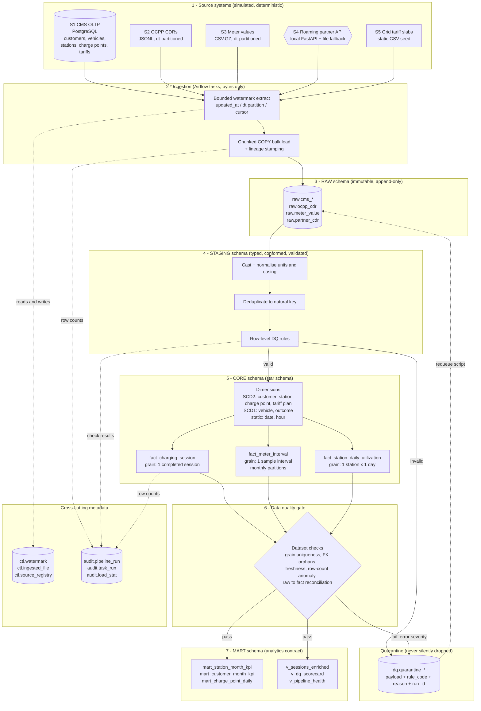

# ORCHESTRATED WAREHOUSE — Technical Specification v1.0

**Project codename:** `orchestrated-warehouse`
**Domain:** EV public-charging network operator (fictional company: **VoltHive Energy Pvt. Ltd.**, India)
**Target level:** 4 / 5 — strong fresher / junior Data Engineer portfolio project
**Status:** SPECIFICATION ONLY — no implementation code in this document
**Author role assumed:** Senior Data Engineer + hiring manager + architect + interviewer
**Date:** 2026-08-13

---

## 0. Executive summary

ORCHESTRATED WAREHOUSE is a locally runnable, production-style **batch data platform** for a fictional Indian EV charge point operator (CPO). It ingests four heterogeneous sources — an operational CMS database, OCPP charge-detail-record files, meter telemetry CSVs, and a roaming-partner REST API — into a layered PostgreSQL warehouse (`raw → stg → core → mart`), orchestrated by Apache Airflow, with SCD Type 2 dimensions, incremental watermark-driven loads, idempotent restatement windows, a row-level quarantine mechanism, structured logging keyed by a pipeline run ID, automated tests against a real PostgreSQL container, and GitHub Actions CI.

**Everything runs on a laptop with `docker compose up`. Zero cloud spend. Zero paid services.**

### The one-paragraph elevator pitch (for interviews)

> "I built a batch data warehouse for an EV charging network. Four sources land in a raw layer, get typed and validated in staging, and are modelled as a star schema with three fact tables at explicitly-defined grains. Charge points and tariffs change over time, so those dimensions are SCD Type 2 and facts join to them point-in-time — a session billed in February must use February's tariff, not today's. Loads are incremental off a watermark table with a lookback window for late-arriving records, and every load is idempotent: re-running any Airflow task produces the same result, not duplicates. Bad rows go to a quarantine table with a reason code instead of being dropped. Airflow orchestrates it with retries, timeouts, dataset-based dependencies and supported backfills, and CI runs lint, unit tests, DAG-integrity tests, and integration tests against a real Postgres."

### Design principles (referenced throughout)

| # | Principle | Consequence in this design |
|---|---|---|
| P1 | **Every component must be defensible in an interview** | No tool is added for résumé decoration. If I cannot explain why it exists in one sentence, it is cut. |
| P2 | **Idempotency over cleverness** | Reruns are the normal case, not the exception. Delete-insert restatement windows and hash-based merges everywhere. |
| P3 | **Never silently drop a row** | Rejected rows go to quarantine with a rule code and the original payload. |
| P4 | **Explicit grain before anything else** | No fact table is built until its grain sentence is written down. |
| P5 | **Deterministic, reproducible data** | The data generator is seeded. Two people running the project get identical warehouses. |
| P6 | **Local-first, cloud-shaped** | Patterns (landing zone, layered warehouse, orchestration, DQ gates) are what you'd use on Azure/AWS; the substrate is just Postgres. |
| P7 | **Honest scope** | ~1M fact rows, not "billions". No fabricated metrics anywhere in the README. |

### Conventions used in this spec

- **Naming:** `snake_case` everywhere. Dimensions `dim_*`, facts `fact_*`, staging `stg_*`, raw `raw_*`, views `v_*`.
- **Keys:** surrogate keys `<entity>_sk` (BIGINT, generated); natural/business keys `<entity>_id` (from the source system); date keys `date_key INT` in `YYYYMMDD` form.
- **Timestamps:** every stored instant is UTC and suffixed `_utc` (`session_start_utc`). Business calendar attributes are derived in **Asia/Kolkata (IST)** — see §5.9 "Time zone policy". Audit columns are `dw_*`.
- **Layer prefixes in text:** `raw.` = landed as-received, `stg.` = typed/conformed, `core.` = dimensional model, `mart.` = analytics-facing.
- **[MEASURE AFTER BUILD]** marks any number that must be measured from the real build, never guessed.

---

# PHASE 1 — JOB-SKILL ALIGNMENT

How this project maps onto what Indian JDs for "Data Engineer (0–2 yrs)" actually ask for in 2026. For each skill: **where** it appears, **why** it exists, **what gets asked**.

### 1. SQL

- **Where:** All transformation logic in `sql/` — staging conformance, SCD2 merge statements, fact loads with point-in-time dimension joins, mart aggregates, DQ check queries, reconciliation queries.
- **Why:** SQL is the actual job. Anything expressible as set-based SQL is written as SQL, not looped in Python. The SCD2 merge, the delete-insert restatement window, and the point-in-time join are the three set-based patterns that separate a junior DE from an analyst.
- **Interviewer asks:** "Write a query to find the tariff in effect when a session started." / "Why is `LEFT JOIN` + `IS NULL` sometimes better than `NOT IN`?" / "How would you deduplicate CDRs keeping the latest version per `transaction_id`?" (answer: `ROW_NUMBER() OVER (PARTITION BY transaction_id ORDER BY ingested_at DESC, source_row_seq DESC)`) / "What does this window function do?" / "How do you find orphan foreign keys?"

### 2. Python

- **Where:** `src/` — ingestion clients (DB, file, HTTP), the seeded data generator, the DQ engine, SCD2/watermark helper modules, structured logging, Airflow DAG definitions.
- **Why:** Python does what SQL cannot: talking to APIs, parsing semi-structured JSONL, retry logic, config loading, orchestration. Code is packaged as an installable module (`src/volthive/`) rather than loose scripts, so it can be imported by both Airflow and pytest.
- **Interviewer asks:** "Show me a function you're proud of." / "How do you structure code so Airflow tasks stay thin?" / "Generators vs lists for a 2M-row file?" / "How do you retry an HTTP call safely?" / "What's the difference between `__init__.py` packaging and just importing a file next door?"

### 3. ETL / ELT

- **Where:** The whole pipeline. Deliberately **EL-then-T**: extract and load raw *as-is* (E-L), then transform inside PostgreSQL (T).
- **Why:** Raw immutability means a transformation bug is fixable by replaying from `raw` instead of re-fetching from sources — which may no longer have the data. This is the single most important architectural decision in the project.
- **Interviewer asks:** "ETL or ELT — which did you use and why?" / "What do you do when a transformation was wrong for the last 30 days?" (answer: replay from raw over a restatement window, no source re-fetch) / "Why keep raw at all — isn't it duplicate storage?"

### 4. Apache Airflow

- **Where:** 4 DAGs — `volthive_ingest_master`, `volthive_ingest_sessions`, `volthive_build_warehouse`, `volthive_maintenance` — with TaskGroups, retries, timeouts, dataset-based cross-DAG dependencies, one genuinely-needed sensor, `on_failure_callback`, and supported backfills.
- **Why:** Orchestration is what makes a set of scripts a *platform*: dependency ordering, retry policy, scheduling, backfill, visibility, alerting.
- **Interviewer asks:** "Explain your DAG dependencies." / "What's the difference between `execution_date`/`data_interval_start` and `datetime.now()` — and why does using `now()` in a DAG break backfills?" / "What does `catchup=True` do?" / "How do you stop two runs stomping on each other?" (`max_active_runs=1`) / "XCom — when *not* to use it?" / "Why datasets instead of `ExternalTaskSensor`?"

### 5. PostgreSQL

- **Where:** Three logical databases in one instance — `cms` (simulated source OLTP), `warehouse` (the platform), `airflow` (metadata). Seven schemas in `warehouse`.
- **Why:** One engine that does everything needed: transactions, `COPY` bulk load, JSONB for raw payloads, partial/unique indexes for SCD2 currency, table partitioning for the high-volume fact, window functions.
- **Interviewer asks:** "Explain a partial unique index and where you used one." / "`COPY` vs `INSERT` — why does it matter?" / "What's in `pg_stat_statements`?" / "How do you know an index is being used?" / "MVCC and why `VACUUM` exists."

### 6. Data warehousing

- **Where:** Layered architecture `raw → stg → core → mart`, plus `dq`, `audit`, `ctl` cross-cutting schemas.
- **Why:** Layering isolates concerns: raw is immutable evidence, staging is where the data becomes trustworthy, core is the model, mart is the contract with consumers.
- **Interviewer asks:** "Why not load straight from source to the star schema?" / "Kimball vs Inmon — which is this and why?" / "What is a conformed dimension?" / "What lives in your mart layer and who consumes it?"

### 7. Dimensional modelling

- **Where:** 6 dimensions + 3 facts, plus a date dimension, unknown-member rows, and a documented per-attribute SCD policy.
- **Why:** It is still the lingua franca of BI-facing warehouses and the thing interviewers probe hardest, because it reveals whether you think in *business processes* or in *tables*.
- **Interviewer asks:** "Walk me through your model." / "Why is `dim_vehicle` Type 1 but `dim_customer` Type 2?" / "What's a degenerate dimension — do you have one?" (yes: `transaction_id`) / "How do you handle a fact arriving before its dimension member?" (inferred member) / "Additive, semi-additive, non-additive — give me one of each from your model."

### 8. Star schema

- **Where:** `core` schema: facts reference dimensions by surrogate key only; no snowflaking of `dim_station` into a city/state sub-dimension (deliberate, documented decision).
- **Why:** Query performance and comprehensibility. A star means one join hop from any fact to any descriptive attribute.
- **Interviewer asks:** "Star vs snowflake — which did you pick and what did you give up?" / "Why surrogate keys and not just the natural key?" (three reasons: SCD2 history, source-key instability, join performance on narrow integers) / "How many joins to answer 'revenue by city by month'?"

### 9. SCD Type 2

- **Where:** `dim_customer`, `dim_station`, `dim_charge_point`, `dim_tariff_plan`. Implemented with `effective_from` / `effective_to` / `is_current` / `row_hash`.
- **Why:** Tariffs and charge-point hardware change. Revenue attribution and utilisation analysis are wrong if you join to *current* attributes. This is the analytical justification, and it must be stated in business terms in the interview.
- **Interviewer asks:** "Type 1 vs 2 vs 3." / "Walk me through exactly what happens in the table when a charge point's tariff changes." / "How do you detect the change?" (hash of tracked columns) / "What if the same key changes twice in one batch?" / "How does the fact table pick the right version?" / "Is your SCD2 load idempotent — prove it."

### 10. Incremental loading

- **Where:** Every source. OLTP by `updated_at` watermark; files by `dt=` partition + processed-file registry; API by cursor.
- **Why:** Full reloads do not scale, destroy SCD2 history semantics, and hide the hardest and most-asked-about problem in data engineering: *how do you know what's new?*
- **Interviewer asks:** "How do you know what changed?" / "What if `updated_at` is not reliable?" / "Full vs incremental — when do you choose full?" / "What happens if a row is updated *while* your extract is running?" (bounded upper watermark)

### 11. Watermarks / high-water marks

- **Where:** `ctl.watermark`, one row per (source_system, entity), updated **in the same transaction that commits the data**.
- **Why:** The watermark is the pipeline's memory. Its correctness (advance on success only; derive from loaded data, not wall clock; bound the upper edge) is the difference between a pipeline that loses data and one that doesn't.
- **Interviewer asks:** "Where do you store it and when do you update it?" / "What if the job crashes after loading but before updating the watermark?" (re-run reloads a window — safe *because* the load is idempotent) / "Why not use `now()` as the new watermark?"

### 12. Idempotency

- **Where:** Raw append with a natural dedupe key; staging rebuild-per-window; SCD2 hash-compare merge; fact delete-insert restatement window; processed-file registry.
- **Why:** In orchestration, a task *will* run twice — retries, manual clears, backfills. Idempotency turns "we might duplicate data" into a non-event.
- **Interviewer asks:** "What happens if I clear this task and rerun it?" / "Define idempotency for a data pipeline." / "How do you make an `INSERT` idempotent?" / "Is `MERGE`/`ON CONFLICT` always enough?" (no — deletes and grain changes)

### 13. Data quality

- **Where:** `configs/dq/*.yml` rule definitions, `src/volthive/dq/` engine, `dq.check_result` + `dq.quarantine_*` tables, blocking gate task before the mart publishes.
- **Why:** A warehouse nobody trusts is worthless. Also, "how do you handle bad data?" is asked in essentially every data interview.
- **Interviewer asks:** "What checks do you run?" / "What do you do when a check fails — fail the DAG or continue?" (depends on severity; explain the gate) / "Row-level vs dataset-level checks." / "How do you detect a schema change upstream?" / "Why not Great Expectations?" (answer in §10.8)

### 14. Error handling

- **Where:** Typed exceptions in `src/volthive/exceptions.py`, per-task retry policy tuned to *whether the failure is transient*, transactional load boundaries, `on_failure_callback`, quarantine for data errors vs raised exceptions for system errors.
- **Why:** The key skill is *classification*: transient (retry), data (quarantine), contract (fail loudly). Retrying a malformed record 3 times is not error handling.
- **Interviewer asks:** "Which failures do you retry and which do you not?" / "Why doesn't a bad row fail your DAG?" / "How do you avoid a poison-pill row blocking the pipeline forever?"

### 15. Logging

- **Where:** `structlog` JSON logs bound with `pipeline_run_id`, `dag_id`, `task_id`, `source_system`, `entity`, row counters and duration; mirrored to `audit.task_run` / `audit.load_stat` tables.
- **Why:** Airflow logs answer "did it run?". The audit tables answer "how many rows, from where, how long, and is that normal compared to last week?" — which is what you're actually asked at 9 a.m. when a dashboard looks wrong.
- **Interviewer asks:** "How do you trace one record end-to-end?" (the `dw_run_id` stamped on every row) / "What do you log and at what level?" / "Structured vs plain-text logging." / "How do you avoid logging PII?"

### 16. Testing

- **Where:** `tests/unit`, `tests/dags`, `tests/integration` (real Postgres), with pytest markers and fixtures; ~40–60 tests target.
- **Why:** Testing data pipelines is rare in fresher portfolios and disproportionately impressive. It also proves the idempotency claim rather than asserting it.
- **Interviewer asks:** "How do you test a pipeline?" / "What do you mock and what do you not?" / "How do you test SCD2?" / "How do you test that a rerun doesn't duplicate?" / "What's a DAG integrity test?"

### 17. Docker

- **Where:** `docker-compose.yml` (3–5 services), a single custom Airflow image, healthchecks, named volumes, `depends_on: service_healthy`, `.env`-driven config, a `make` wrapper.
- **Why:** "Clone and run" is the single highest-leverage property of a portfolio project. A reviewer who cannot run it in 10 minutes will not read the code.
- **Interviewer asks:** "Image vs container." / "Why healthchecks and not `sleep 30`?" / "Bind mount vs named volume — which did you use for what and why?" / "How do you keep secrets out of an image?"

### 18. Git

- **Where:** Conventional-commit history, feature branches per implementation phase, PR-per-phase with the acceptance criteria as the PR checklist, tags `v0.1`…`v1.0`, ADRs in `docs/adr/`.
- **Why:** A clean, story-telling commit history is read by senior reviewers. 1 commit called "final project" is a negative signal.
- **Interviewer asks:** "Walk me through your git history." / "What's in a `.gitignore` for a data project?" / "How would you revert a bad migration?" / "Rebase vs merge."

### 19. GitHub Actions / CI

- **Where:** `.github/workflows/ci.yml` with jobs: lint → unit tests → DAG validation → integration tests (Postgres service container) → compose/image validation → secret scan.
- **Why:** It proves the tests actually pass on a clean machine, not just yours — and it's the cheapest possible demonstration of a CI mindset.
- **Interviewer asks:** "What runs in your CI?" / "How do you test something that needs a database in CI?" (service containers) / "How long does it take and how do you keep it fast?" (caching, markers) / "What would you add for CD?"

### 20. Backfills

- **Where:** `catchup=True` with `max_active_runs=1` on the session DAG, delete-insert restatement windows keyed on the Airflow data interval, and a documented `scripts/backfill.sh` procedure plus the "dimension history caveat".
- **Why:** Every real pipeline gets backfilled. Being able to say *why* your facts are safely backfillable but your SCD2 dimensions need a different procedure is a senior-sounding answer from a fresher.
- **Interviewer asks:** "How do you backfill 6 months?" / "What breaks if your DAG isn't idempotent and you backfill?" / "Can you backfill an SCD2 dimension?" (honest answer in §9.7) / "How do you avoid overloading the DB during a backfill?"

### 21. Pipeline dependencies

- **Where:** Intra-DAG task dependencies and TaskGroups; inter-DAG via Airflow **Datasets** (`raw.cms_master`, `raw.sessions`) so the warehouse build triggers when *both* upstream ingests publish.
- **Why:** Dimensions must load before facts (FK resolution); DQ gates must pass before the mart publishes. Dependency modelling *is* orchestration.
- **Interviewer asks:** "What's your task dependency graph and why that order?" / "Dataset scheduling vs sensors vs `TriggerDagRunOperator`." / "What happens if only one upstream DAG succeeds?"

### Coverage self-check

| JD requirement (typical India, 0–2 yrs DE, 2026) | Covered? | Where |
|---|---|---|
| Strong SQL incl. window functions | ✅ | SCD2 merge, dedupe, mart aggregates |
| Python for data processing | ✅ | `src/volthive/` |
| ETL/ELT pipeline development | ✅ | Whole project |
| Airflow (or similar scheduler) | ✅ | 4 DAGs |
| RDBMS / PostgreSQL | ✅ | Core substrate |
| Data modelling / warehousing | ✅ | Star schema, 3 fact types |
| Docker & Linux basics | ✅ | Compose stack, Makefile |
| Git & CI | ✅ | GH Actions |
| Data quality / validation | ✅ | DQ engine + quarantine |
| Spark / big data | ❌ **gap** | Deliberate — see §20.6 |
| Cloud (Azure/AWS/GCP) | ❌ **gap** | Deliberate — see §20.6 |
| Kafka / streaming | ❌ | Separate Project 3 |
| dbt | ❌ | See ADR-009 |

The two ❌ gaps are addressed honestly in Phase 20 rather than pretended away.

---

# PHASE 2 — DOMAIN CHOICE

## 2.1 The domain

**Public EV charging network operations for a fictional Indian CPO, "VoltHive Energy Pvt. Ltd."**

VoltHive owns and operates public charging stations across 8 Indian cities. Each *station* (a physical site — a mall basement, a highway plaza, an office park) contains multiple *charge points* (individual chargers), each with one or more connectors. Customers register on an app, link vehicles, and start charging sessions. Sessions are metered — energy is measured in kWh, sampled every few minutes — and billed against a tariff plan attached to the charge point. Some sessions are *roaming*: a customer of a partner network charges on a VoltHive charger (or vice versa), and those records arrive from a partner API rather than from VoltHive's own systems.

## 2.2 Why this domain (and not a tutorial clone)

**1. It is not a solved-and-published tutorial.** There is no canonical "EV charging ETL" walkthrough for an interviewer to recognise. A retail-sales star schema signals "I followed a course". This signals "I designed something."

**2. It is genuinely 2026-India relevant.** EV infrastructure is a visible, funded, growing sector in India (Tata Power, Statiq, ChargeZone, Jio-bp pulse). An interviewer instantly understands the business, which means the conversation stays on your *engineering*, not on explaining the domain.

**3. The dimensions genuinely change — with money attached.** This is the crux. Tariff per kWh changes (regulatory revisions, seasonal pricing, city-level differences). Charge points get hardware upgrades (30 kW → 60 kW), firmware updates, and get reassigned to different tariff plans. Stations change operator, capacity, and status. **If you join a February session to today's tariff, your February revenue is wrong.** That is a *business* justification for SCD Type 2, not an academic one — and it is exactly the story that makes an interviewer believe you understand *why* the pattern exists.

**4. The data is naturally, believably dirty.** Charging telemetry has real, well-known defects that are not contrived: duplicate charge-detail records from OCPP retry storms, meter readings that go backwards after a reset, sessions with a start but no stop (charger lost connectivity), device clock drift producing `end < start`, energy values in Wh vs kWh depending on firmware version, unknown charge point IDs from a device commissioned but not yet in the CMS. Every quality rule in Phase 10 maps to a real-world failure mode, which makes the quarantine story credible.

**5. It naturally requires multiple heterogeneous source systems.** A CPO really does have: a CMS/OLTP database (customers, assets, tariffs), a device-telemetry stream landing as files (OCPP CDRs and meter values), and roaming interchange with partner networks over an HTTP API (the OCPI standard). The heterogeneity is inherent, not bolted on to satisfy a requirement.

**6. It supports all three Kimball fact-table types without forcing it.**

- Transaction fact: one charging session.
- Periodic snapshot fact: station utilisation per day (answers "how busy is this site?", which cannot be derived cheaply from sessions alone because idle/available time is not a session).
- High-volume interval fact: meter samples within a session (enables charging-curve analysis, and justifies a real partitioning discussion).

**7. The analytics questions are obvious and business-shaped.** Revenue per station per month, utilisation by hour-of-day, energy delivered by city, average session duration by connector type, gross margin (session revenue minus grid energy cost), repeat-customer rate, charger downtime impact. This means the `mart` layer writes itself and the README can show real, meaningful queries.

**8. It has a clean India-specific texture that makes the project memorable:** INR pricing, GST on charging services, state-level grid tariff slabs, IST business dates against UTC device timestamps, city tiers, and fleet vs retail customer segments (a huge real distinction — fleet operators charge overnight at depot-adjacent sites).

## 2.3 What is explicitly *out* of scope for the domain

To keep it Level 4 and not Level 6:

- No real-time/streaming ingestion of OCPP messages (that is Project 3 — Kafka).
- No ML (no demand forecasting, no anomaly-detection models). Statistical row-count anomaly detection uses a plain rolling median, and that is deliberate.
- No geospatial routing/PostGIS. Latitude/longitude are stored as attributes only.
- No billing-system-of-record claims. The warehouse computes analytical revenue, and the README states plainly that it is analytical, not the invoicing source of truth.
- No user-facing app. The `mart` layer + SQL + Airflow UI is the interface.

## 2.4 Domains considered and rejected

| Domain | Why rejected |
|---|---|
| E-commerce orders | The canonical tutorial star schema. Instant "course project" signal. |
| Weather API | Single source, no meaningful dimensions, nothing changes slowly. |
| Netflix/movies dataset | Static Kaggle file. No incrementality, no change tracking, no source heterogeneity. |
| Stock market ticks | Naturally *streaming*, and dimensions barely change. Wrong shape for a batch/SCD2 project. |
| Ride-hailing | Good shape, but very close to e-commerce in modelling and heavily done. |
| Quick-commerce / dark stores | Strong candidate; rejected only because it sits in the same "retail sales" family that reviewers see constantly. |
| Hospital / diagnostics | Excellent modelling, but PII-heavy — spending interview time defending synthetic patient data is wasted effort. |

## 2.5 The synthetic-data honesty rule

All data is **generated by a seeded simulator** in `src/volthive/generator/`. This is stated in the README's first section, not buried. The README says:

> "All data in this project is synthetic, produced by a deterministic generator (`seed=42`) that models realistic charging behaviour and injects a controlled rate of realistic data defects. No real customer, vehicle, or company data is used. VoltHive Energy is fictional."

Generated defects are *configurable* (`configs/generator.yml`) so the DQ layer can be demonstrated and tested against a known-bad population — which is also how the quarantine tests assert exact expected counts.
---

# PHASE 3 — DATA SOURCES

Four heterogeneous sources plus one small static reference seed. Each is described with type, schema, volume, frequency, defects, load strategy, and entry path.

**Volume baseline** (configurable in `configs/generator.yml`; defaults chosen so a full build finishes on a laptop):

| Entity | Default volume |
|---|---|
| Simulation window | 2025-01-01 → 2026-06-30 (18 months) |
| Cities | 8 (Bengaluru, Delhi NCR, Mumbai, Hyderabad, Pune, Chennai, Ahmedabad, Kolkata) |
| Stations | 120 |
| Charge points | ~780 (avg 6.5 per station) |
| Customers | 25,000 |
| Vehicles | ~29,000 |
| Tariff plans | 14 (with ~40 versioned changes over 18 months) |
| Charging sessions | ~1,900/day → **~1.04M total** |
| Meter samples | ~11 per session → **~11.5M total** |
| Roaming (partner) sessions | ~6% of sessions → ~62k |

A `--profile small` generator flag (3 months, 2 cities, ~110k sessions) exists for CI and for laptops with 8 GB RAM.

---

## 3.1 Source S1 — VoltHive CMS (operational PostgreSQL database)

**Type:** Relational OLTP database. Physically a separate database (`cms`) inside the same PostgreSQL container; logically treated as an external system — separate connection string, separate credentials, read-only user, no cross-database joins possible in Postgres anyway (which is a *useful* constraint: it forces a real extract step).

> **ADR note:** In production this would be a different server, likely read from a replica. The README states this explicitly so nobody thinks the author believes a warehouse should share an instance with an OLTP system.

**Entities and schema:**

`cms.customers`

| Column | Type | Notes |
|---|---|---|
| customer_id | VARCHAR(20) PK | e.g. `CUS-000148` |
| full_name | VARCHAR(120) | |
| email | VARCHAR(160) | synthetic, `@example.invalid` |
| phone | VARCHAR(16) | synthetic `+9199xxxxxxxx` |
| city | VARCHAR(60) | **SCD2-tracked** (customers relocate) |
| state | VARCHAR(60) | **SCD2-tracked** |
| customer_segment | VARCHAR(20) | `RETAIL` / `FLEET` / `CORPORATE` — **SCD2-tracked** |
| subscription_plan | VARCHAR(20) | `PAYG` / `PLUS` / `FLEET_PRO` — **SCD2-tracked** |
| kyc_status | VARCHAR(20) | `PENDING` / `VERIFIED` / `REJECTED` — **SCD2-tracked** |
| signup_date | DATE | |
| is_active | BOOLEAN | soft delete flag — **SCD2-tracked** |
| created_at | TIMESTAMPTZ | |
| updated_at | TIMESTAMPTZ | **watermark column**, indexed |

`cms.vehicles` — vehicle_id PK, customer_id FK, make, model, model_year, battery_capacity_kwh, connector_type (`CCS2`/`CHAdeMO`/`TYPE2`/`BHARAT_AC001`), registration_state, created_at, updated_at.

`cms.stations` — station_id PK, station_name, address_line, city, state, pincode, latitude, longitude, site_type (`MALL`/`HIGHWAY`/`OFFICE`/`RESIDENTIAL`/`FLEET_DEPOT`), commissioned_date, num_bays, operator_name, is_active, created_at, updated_at.

`cms.charge_points` — charge_point_id PK, station_id FK, oem_vendor, model, current_type (`AC`/`DC`), rated_power_kw, connector_type, tariff_plan_id FK, firmware_version, status (`ACTIVE`/`MAINTENANCE`/`DECOMMISSIONED`), commissioned_date, created_at, updated_at.

`cms.tariff_plans` — tariff_plan_id PK, plan_name, price_per_kwh_inr, price_per_minute_inr, idle_fee_per_minute_inr, min_billable_kwh, gst_rate_pct, valid_from_date, is_active, created_at, updated_at.

- **Volume:** ~55k master rows total; ~150–400 changed rows per day.
- **Update frequency:** continuous in the source; extracted **daily** (hourly is supported by config and demonstrated on the master DAG's schedule discussion in §9.3).
- **Load strategy:** **INCREMENTAL** on `updated_at` with a bounded window and a 2-hour lookback (clock-skew tolerance).
- **Data quality problems (injected):** ~0.4% rows with `updated_at` older than `created_at`; occasional `NULL` city; `customer_segment` values with inconsistent casing (`Fleet` vs `FLEET`) and stray whitespace; duplicate `email` across customer IDs; a small number of `charge_points` referencing a `tariff_plan_id` that does not exist (dangling FK from a bad admin edit); phone numbers in 3 different formats.
- **How it enters:** `PostgresIngestOperator`-style Python task using psycopg3 with server-side cursor → chunked write into `raw.cms_<entity>` via `COPY`.

---

## 3.2 Source S2 — OCPP Charge Detail Records (JSONL files)

**Type:** Semi-structured newline-delimited JSON files, one file per city per day, written by the (simulated) OCPP central system into a partitioned landing directory:

```
data/landing/cdr/dt=2026-06-14/city=BLR/cdr_BLR_20260614.jsonl
```

**Record shape (one line = one completed session):**

```json
{
  "transaction_id": "TXN-20260614-BLR-004182",
  "charge_point_id": "CP-BLR-0117",
  "connector_no": 2,
  "id_tag": "IDT-8842013",
  "customer_id": "CUS-011482",
  "vehicle_id": "VEH-013009",
  "start_timestamp": "2026-06-14T03:41:22Z",
  "stop_timestamp": "2026-06-14T04:26:05Z",
  "meter_start_wh": 1284500,
  "meter_stop_wh": 1310880,
  "stop_reason": "Local",
  "session_status": "COMPLETED",
  "auth_method": "APP",
  "energy_unit": "Wh",
  "firmware_version": "3.4.1",
  "record_version": 1,
  "emitted_at": "2026-06-14T04:26:11Z"
}
```

- **Important fields:** `transaction_id` (natural key + degenerate dimension), `charge_point_id` (FK to dimension), `start_timestamp` (event time → drives partitioning, `date_key`, and point-in-time dimension resolution), `meter_start_wh`/`meter_stop_wh` (energy is a *delta*, which is where most defects live), `record_version` (a corrected CDR is re-emitted with a higher version — this is the reason the dedupe rule is "latest version per transaction_id", not "first seen").
- **Volume:** ~1,900 records/day, ~240 per city-file, ~600 KB/day.
- **Update frequency:** files land continuously; the day's file is considered complete at ~00:20 IST the following day.
- **Load strategy:** **INCREMENTAL by partition** — process `dt=` partitions in `[data_interval_start − 3 days, data_interval_end)`, guarded by a processed-file registry (`ctl.ingested_file`) keyed on `(file_path, file_sha256)`. A file whose hash is unchanged is skipped; a file that was *re-written* (corrections appended) is reprocessed and downstream restatement handles it.
- **Data quality problems (injected, rates configurable):**

| Defect | Rate | Handling |
|---|---|---|
| Duplicate `transaction_id` (OCPP retry storm), identical payload | 1.2% | Deduped in staging, counted, not quarantined |
| Corrected CDR (`record_version = 2`) with different meter values | 0.3% | Latest version wins; original superseded |
| `meter_stop_wh < meter_start_wh` (meter reset) | 0.4% | **Quarantine**, rule `CDR_NEGATIVE_ENERGY` |
| `stop_timestamp` NULL (dangling session, charger lost link) | 0.7% | **Quarantine**, rule `CDR_MISSING_STOP` (requeueable — a later file often carries the completed record) |
| `stop_timestamp < start_timestamp` (device clock drift) | 0.2% | **Quarantine**, rule `CDR_TIME_INVERSION` |
| `energy_unit` = `kWh` instead of `Wh` (older firmware) | 3% | **Conformed**, not rejected — unit normalisation in staging |
| `charge_point_id` not present in CMS | 0.15% | **Inferred dimension member** + DQ warning, not quarantined |
| Session duration > 24 h | 0.05% | **Quarantine**, rule `CDR_IMPLAUSIBLE_DURATION` |
| Energy > 350 kWh in one session | 0.05% | **Quarantine**, rule `CDR_ENERGY_OUT_OF_RANGE` |
| Late file: a `dt=` partition rewritten 2 days later with extra rows | ~1 per week | Caught by the 3-day lookback |
| New field appears in JSON (`grid_carbon_intensity`, from firmware 3.5) | from 2026-05 | Schema-evolution check → warning, JSONB raw absorbs it |

---

## 3.3 Source S3 — Meter value telemetry (CSV)

**Type:** Compressed CSV, one file per day (all cities), representing periodic `MeterValues` samples taken during active sessions.

```
data/landing/meter/dt=2026-06-14/meter_values_20260614.csv.gz
```

**Columns:** `sample_id, transaction_id, charge_point_id, sample_timestamp, energy_register_wh, power_kw, soc_percent, voltage_v, current_a, temperature_c`

- **Important fields:** `transaction_id` (links to the session — this is the fact-to-fact relationship), `sample_timestamp`, `energy_register_wh` (a cumulative register — interval energy is a `LAG()` difference within a session, which is a genuinely good SQL exercise), `soc_percent`.
- **Volume:** ~21,000 rows/day (~11 per session), ~1.5 MB/day gzipped; ~11.5M rows over the full window.
- **Update frequency:** daily file.
- **Load strategy:** **INCREMENTAL by partition**, same registry mechanism as S2, 3-day lookback.
- **Data quality problems (injected):** out-of-order samples within a session (0.8%); duplicated `sample_id` (0.5%); non-monotonic `energy_register_wh` within a session (0.3% — meter reset mid-session); `soc_percent` > 100 or < 0 (0.2%); `power_kw` NULL (1%); samples for a `transaction_id` that has no CDR (2% — an orphan, because the session is still open or its CDR is late); gaps > 15 min in a session.
- **Notable modelling consequence:** orphan meter samples are **not** quarantined; they are held in staging and re-joined on the next run within the lookback window, because the CDR legitimately arrives later. Only samples still orphaned after the lookback window expires are quarantined with `MTR_ORPHAN_EXPIRED`. This late-arriving-relationship handling is a strong interview talking point.

---

## 3.4 Source S4 — Roaming partner REST API (OCPI-style)

**Type:** HTTP JSON API exposing charge detail records for sessions where a VoltHive customer charged on a partner's network (and vice versa). Paginated, cursor-based on `last_updated`.

```
GET /ocpi/2.2/cdrs?date_from=2026-06-13T00:00:00Z&date_to=2026-06-14T00:00:00Z&offset=0&limit=500
Authorization: Token <token from env>
```

Response: `{"data": [ {...cdr...} ], "total": 1284, "limit": 500, "offset": 0, "next": "...offset=500"}`

**Record fields:** `cdr_id`, `partner_code` (`STATIQ`/`CHARGEZONE`/`PLUGO`), `direction` (`INBOUND`/`OUTBOUND`), `customer_id` (VoltHive customer, for OUTBOUND), `partner_location_id`, `partner_evse_id`, `start_date_time`, `end_date_time`, `total_energy_kwh`, `total_time_hours`, `total_cost_inr`, `currency`, `last_updated`.

- **Volume:** ~115 records/day; ~62k total.
- **Update frequency:** partner publishes continuously; records can be **revised** up to 7 days later (disputed billing) — hence a 7-day lookback for this source specifically, which is a nice illustration that lookback is a *per-source* property, not a global constant.
- **Load strategy:** **INCREMENTAL by cursor** on `last_updated`, stored in `ctl.watermark`. Paginated fetch with bounded page count and a hard timeout.

### 3.4.1 The fragility rule — deterministic local fallback

**No external internet API is used.** The API is served locally by a ~120-line FastAPI app (`src/volthive/mock_partner_api/`) that reads the generator's pre-built partner dataset and serves it with pagination, plus deliberately injected realistic misbehaviour (see below).

The ingestion code depends on an interface, not on HTTP:

```
PartnerCdrClient (Protocol)
├── HttpPartnerCdrClient      # used by default (VOLTHIVE_PARTNER_MODE=http)
└── LocalFilePartnerCdrClient # used when VOLTHIVE_PARTNER_MODE=file, or on connection failure with fallback enabled
```

Both read the *same* deterministic dataset, so results are byte-identical either way. Consequences:

1. The project runs even if the API container is disabled (`docker compose --profile with-api` is optional).
2. CI runs the file client — no network, no flakiness.
3. Unit tests mock `HttpPartnerCdrClient` at the transport layer (`respx`); one integration test runs against the real local API container.
4. It demonstrates dependency inversion, which is a genuine software-engineering signal.

**Injected API misbehaviour** (to make retry/error handling real rather than decorative): 3% of requests return HTTP 503; 2% return HTTP 429 with `Retry-After`; 1% return a truncated page (`total` disagrees with rows returned); occasional 8-second latency to exercise timeouts. All rates are config-driven and set to 0 in CI's deterministic tests, non-zero in the dedicated resilience test.

---

## 3.5 Source S5 — Grid tariff reference (static CSV seed)

**Type:** Small hand-authored CSV, version-controlled in `data/seed/grid_tariff_slabs.csv`.

**Columns:** `state, effective_from_date, effective_to_date, slab_name, commercial_rate_inr_per_kwh, source_note`

- **Volume:** ~60 rows. **Update frequency:** rarely (a few times a year). **Load strategy:** **FULL snapshot reload** — and this is deliberate: it demonstrates that "incremental everywhere" is dogma, not engineering. Tiny, slowly-changing reference data is cheaper and safer to reload wholesale, and the spec says so out loud.
- **Purpose:** lets `fact_charging_session` carry an `energy_cost_inr` (what VoltHive paid the grid) alongside `gross_revenue_inr` (what the customer paid), which makes **gross margin** a real, non-trivial derived measure in the mart. The `source_note` column records that the values are illustrative, not audited real tariffs.

---

## 3.6 Source summary matrix

| ID | Source | Type | Entry mechanism | Strategy | Watermark | Lookback | Volume/day |
|---|---|---|---|---|---|---|---|
| S1 | VoltHive CMS | PostgreSQL OLTP | psycopg3 server-side cursor → COPY | Incremental | `updated_at` | 2 h | ~300 rows |
| S2 | OCPP CDRs | JSONL files | Partition scan + file registry | Incremental | `dt` partition | 3 days | ~1,900 rows |
| S3 | Meter values | Gzipped CSV | Partition scan + file registry | Incremental | `dt` partition | 3 days | ~21,000 rows |
| S4 | Roaming partner | REST API (local) | Paginated HTTP / file fallback | Incremental | `last_updated` cursor | 7 days | ~115 rows |
| S5 | Grid tariffs | Static CSV seed | Direct COPY | Full snapshot | n/a | n/a | ~60 rows total |

---

# PHASE 4 — ARCHITECTURE

## 4.1 Layer responsibilities

Each layer has exactly one job. If a piece of logic could live in two layers, the rule is: **conform as early as possible, aggregate as late as possible.**

**1. SOURCE** — systems of record, outside the platform boundary. The platform never writes to them and never assumes it can re-read history from them.

**2. INGESTION (`src/volthive/ingest/`)** — moves bytes, does not interpret them. Responsibilities: connect, page/chunk, apply the watermark predicate, count rows, stamp lineage metadata (`dw_run_id`, `dw_source_system`, `dw_source_file`, `dw_ingested_at_utc`, `dw_row_seq`), bulk-load into `raw`. Explicitly **not** allowed: casting business types, filtering "bad" rows, deriving columns, joining. If ingestion decides what is valid, the evidence of what actually arrived is destroyed.

**3. RAW (`raw` schema)** — immutable, append-only, source-shaped. Text/JSONB typed so a malformed value can still land. This is the platform's replay tape: any downstream logic can be rebuilt from `raw` without touching a source system. Retention: 180 days (configurable), enforced by the maintenance DAG.

**4. STAGING (`stg` schema)** — where data becomes trustworthy. Responsibilities: cast to real types (and route cast failures to quarantine rather than exploding), normalise units (Wh→kWh) and casing/whitespace, deduplicate to the declared natural key, apply **row-level** DQ rules, split VALID → `stg.*` / INVALID → `dq.quarantine_*`, and compute derived columns that are needed by more than one consumer (e.g. session duration, interval energy via `LAG`). Staging is **rebuilt per restatement window**, never appended blindly — this is what makes it idempotent.

**5. TRANSFORMATION / CORE (`core` schema)** — the dimensional model. Dimension loads run first (SCD2 merge, inferred-member creation), then fact loads resolve surrogate keys via **point-in-time joins** and write with a delete-insert restatement window. All logic is set-based SQL in `sql/core/`; Python only supplies parameters and manages the transaction.

**6. DATA QUALITY (`dq` schema)** — spans layers rather than sitting between them. Row-level checks run *in* staging; dataset-level checks run *after* each layer as assertions; the **publish gate** runs after core and before mart, and blocks the mart refresh if any `error`-severity check fails.

**7. MART (`mart` schema)** — consumer-facing. Materialised aggregate tables (e.g. `mart_station_month_kpi`) plus semantic views that hide surrogate keys and SCD2 mechanics (`mart.v_sessions_enriched`, filtered to `is_current` where appropriate). Anything a reader would query directly lives here. Rebuilt full each run (they are small).

**8. AUDIT + CONTROL (`audit`, `ctl` schemas)** — the pipeline's own metadata: run/task records, per-load row statistics, watermarks, processed-file registry, source registry.

## 4.2 ASCII architecture diagram

```
┌──────────────────────────────────────────────────────────────────────────────────┐
│                              SOURCE SYSTEMS (simulated)                          │
├───────────────┬────────────────┬────────────────────┬────────────────────────────┤
│ S1 CMS OLTP   │ S2 OCPP CDRs   │ S3 Meter values    │ S4 Roaming partner API     │
│ PostgreSQL    │ JSONL          │ CSV.GZ             │ REST (local FastAPI)       │
│ customers     │ dt=YYYY-MM-DD/ │ dt=YYYY-MM-DD/     │ /ocpi/2.2/cdrs?cursor=...  │
│ vehicles      │ city=XXX/*.jsonl│ *.csv.gz          │ + file fallback client     │
│ stations      │                │                    │                            │
│ charge_points │  S5 grid_tariff_slabs.csv (static seed, full reload)             │
│ tariff_plans  │                │                    │                            │
└───────┬───────┴────────┬───────┴─────────┬──────────┴───────────┬────────────────┘
        │ updated_at      │ dt partition    │ dt partition         │ last_updated
        │ watermark       │ + file registry │ + file registry      │ cursor
        v                 v                 v                      v
┌──────────────────────────────────────────────────────────────────────────────────┐
│ INGESTION LAYER   src/volthive/ingest/   (Airflow tasks — move bytes only)       │
│  • bounded watermark predicate     • chunked COPY bulk load                      │
│  • lineage stamping: dw_run_id, dw_source_system, dw_source_file, dw_ingested_at │
│  • retry on transient errors only  • row counts -> audit.load_stat               │
└───────────────────────────────────┬──────────────────────────────────────────────┘
                                    v
┌──────────────────────────────────────────────────────────────────────────────────┐
│ RAW  (schema: raw)   immutable · append-only · source-shaped · TEXT/JSONB         │
│  raw.cms_customers  raw.cms_vehicles  raw.cms_stations  raw.cms_charge_points     │
│  raw.cms_tariff_plans  raw.ocpp_cdr  raw.meter_value  raw.partner_cdr             │
│  raw.grid_tariff_slab            [retention 180d, maintenance DAG]               │
└───────────────────────────────────┬──────────────────────────────────────────────┘
                                    v
┌──────────────────────────────────────────────────────────────────────────────────┐
│ STAGING (schema: stg)  typed · conformed · deduplicated · validated               │
│   cast  ->  normalise units/casing  ->  dedupe to natural key  ->  DQ row rules   │
│                                        │                                         │
│                 VALID ─────────────────┤────────────────── INVALID               │
│                   v                    │                      v                  │
│   stg.customer  stg.station            │        dq.quarantine_ocpp_cdr           │
│   stg.charge_point  stg.tariff_plan    │        dq.quarantine_meter_value        │
│   stg.session  stg.meter_interval      │        dq.quarantine_cms_entity         │
│   stg.partner_session                  │        (payload + rule_code + reason)   │
└───────────────────────────────────┬──────────────────────────────────────────────┘
                                    v
┌──────────────────────────────────────────────────────────────────────────────────┐
│ CORE  (schema: core)   Kimball star schema                                        │
│                                                                                   │
│   DIMENSIONS (load first)                     FACTS (load second)                │
│   ┌────────────────────────────┐              ┌──────────────────────────────┐   │
│   │ dim_date          (static) │              │ fact_charging_session        │   │
│   │ dim_hour          (static) │◄─────────────┤   grain: 1 completed session │   │
│   │ dim_customer      (SCD2)   │              ├──────────────────────────────┤   │
│   │ dim_vehicle       (SCD1)   │◄─────────────┤ fact_meter_interval          │   │
│   │ dim_station       (SCD2)   │              │   grain: 1 sample interval   │   │
│   │ dim_charge_point  (SCD2)   │              │   [PARTITIONED BY MONTH]     │   │
│   │ dim_tariff_plan   (SCD2)   │              ├──────────────────────────────┤   │
│   │ dim_session_outcome (SCD1) │◄─────────────┤ fact_station_daily_util      │   │
│   │ + unknown members (-1/-2)  │              │   grain: 1 station × 1 day   │   │
│   └────────────────────────────┘              └──────────────────────────────┘   │
│   point-in-time join:  d.effective_from <= session_start_utc < d.effective_to    │
│   idempotency: SCD2 hash-merge (dims) · delete+insert window (facts)             │
└───────────────────────────────────┬──────────────────────────────────────────────┘
                                    v
                    ┌───────────────────────────────┐
                    │ DQ PUBLISH GATE (dq schema)   │
                    │ dataset checks: uniqueness of │
                    │ grain, FK orphans, freshness, │
                    │ row-count anomaly, recon:     │
                    │ raw -> stg -> fact counts     │
                    │ severity=error  => BLOCK      │
                    └───────────┬───────────────────┘
                          pass  │  fail -> mart skipped, alert, quarantine review
                                v
┌──────────────────────────────────────────────────────────────────────────────────┐
│ MART (schema: mart)  · analytics contract                                        │
│  mart_station_month_kpi · mart_customer_month_kpi · mart_charge_point_daily      │
│  v_sessions_enriched · v_pipeline_health · v_dq_scorecard · v_quarantine_summary │
└──────────────────────────────────────────────────────────────────────────────────┘

CROSS-CUTTING ───────────────────────────────────────────────────────────────────
 ctl.watermark · ctl.ingested_file · ctl.source_registry
 audit.pipeline_run · audit.task_run · audit.load_stat
 structlog JSON logs bound to pipeline_run_id (== correlation id, stamped on rows)
 Airflow: retries · timeouts · datasets · catchup/backfill · on_failure_callback
```

## 4.3 Mermaid diagram (for the GitHub README)



## 4.4 Data flow narrative (one full daily run)

1. **01:30 IST (20:00 UTC prev day)** — `volthive_ingest_master` runs. Reads `ctl.watermark` for each CMS entity, extracts `updated_at > wm − 2h AND updated_at <= data_interval_end`, COPYs into `raw.cms_*`, writes row counts to `audit.load_stat`, advances the watermark **inside the same transaction**, and publishes Dataset `raw.cms_master`.
2. **01:45 IST** — `volthive_ingest_sessions` runs for the previous IST business day. A partition sensor confirms the CDR file exists (soft-fail after 45 min). Files in the 3-day lookback window are hashed, checked against `ctl.ingested_file`, and unprocessed/changed ones are loaded into `raw.ocpp_cdr` and `raw.meter_value`. The partner API task pages through the 7-day cursor window. Publishes Dataset `raw.sessions`.
3. **On both datasets** — `volthive_build_warehouse` triggers. Staging tasks rebuild `stg.*` for the restatement window, routing invalid rows to `dq.quarantine_*`. Dimension TaskGroup runs SCD2 merges (customer → station → tariff → charge point, in FK order) and creates inferred members for unknown charge points. Fact TaskGroup deletes the restatement window from each fact and re-inserts, resolving surrogate keys point-in-time.
4. **DQ gate** — dataset-level checks run; results land in `dq.check_result`. Any `error` fails the gate task.
5. **Mart** — only if the gate passed, mart tables are rebuilt and views refreshed. `audit.pipeline_run` is closed with status, duration and totals.
6. **Weekly (Sun 03:00 IST)** — `volthive_maintenance` does `VACUUM ANALYZE`, raw retention pruning, quarantine ageing report, watermark drift audit, and index bloat reporting.

## 4.5 Key architectural decisions (ADR index)

Full ADRs live in `docs/adr/`. Summary:

| ADR | Decision | Rationale | Rejected alternative |
|---|---|---|---|
| 001 | ELT, not ETL — transform inside Postgres | Replayability from raw; SQL is the right tool for set logic | ETL in pandas (memory-bound, untestable SQL skills) |
| 002 | 7 schemas in one database | Clear separation, single transaction boundary, one backup | Separate DBs (no cross-DB joins in Postgres = pain) |
| 003 | SCD2 via hash + expire/insert, not triggers | Explicit, testable, visible in SQL; triggers hide logic | DB triggers; temporal tables |
| 004 | Delete-insert restatement window for facts | Simplest provable idempotency for a bounded window | MERGE-only (cannot remove rows deleted upstream) |
| 005 | Airflow Datasets for cross-DAG dependency | Decoupled, no polling, no schedule coupling | ExternalTaskSensor (brittle, wastes a slot) |
| 006 | LocalExecutor, no Celery/Redis | 3 containers instead of 6; parallelism is enough at this scale | CeleryExecutor (over-engineering for a laptop) |
| 007 | Custom YAML DQ engine, not Great Expectations | ~300 LOC, fully explainable in an interview, zero heavy deps | Great Expectations / Soda (heavy, and hides the learning) |
| 008 | Partition only `fact_meter_interval`, by month | ~11.5M rows justifies it; other tables do not | Partition everything (cargo cult) |
| 009 | Hand-written SQL, no dbt | The point is to demonstrate the underlying skills; dbt is Project 4 | dbt-core (would hide SCD2/incrementality behind macros) |
| 010 | Synthetic data via seeded generator | Deterministic tests, controllable defects, no licensing issues | Kaggle dataset (static, clean, no incrementality) |
---

# PHASE 5 — DATABASE DESIGN

## 5.1 Database and schema layout

**PostgreSQL 16**, one instance, three databases:

| Database | Purpose | Owner role |
|---|---|---|
| `cms` | Simulated source OLTP. Read by the platform through a dedicated **read-only** role `cms_reader`. | `cms_owner` |
| `warehouse` | The platform. All 7 schemas below. | `wh_owner`; Airflow connects as `wh_etl` (DML + DDL on `raw`/`stg`, DML on the rest) |
| `airflow` | Airflow metadata DB. Never touched by pipeline code. | `airflow` |

**Schemas in `warehouse`:**

| Schema | Contents | Volatility | Retention |
|---|---|---|---|
| `raw` | Landed source data, source-shaped, TEXT/JSONB | Append-only | 180 days |
| `stg` | Typed, conformed, deduplicated, validated | Rebuilt per window | Current window only (7 days) |
| `core` | Star schema: dimensions + facts | Merge / restatement | Full history |
| `mart` | Aggregates and semantic views | Full rebuild | Full history |
| `dq` | Rule registry, check results, quarantine tables | Append-only | 365 days |
| `audit` | Pipeline run, task run, load statistics | Append-only | 365 days |
| `ctl` | Watermarks, ingested-file registry, source registry | Mutable state | Permanent |

> **Why `ctl` and `audit` are separate:** `ctl` is *operational state the pipeline reads to decide what to do next* — it is small, mutable, and losing it changes behaviour. `audit` is *the historical record of what happened* — append-only and safe to prune. Conflating them means your history table is also your control table, and truncating one breaks the other. This distinction is worth stating in an interview.

## 5.2 Standard audit columns

Every `raw` table carries:

| Column | Type | Meaning |
|---|---|---|
| `dw_raw_id` | BIGINT GENERATED ALWAYS AS IDENTITY, PK | Surrogate row id |
| `dw_run_id` | UUID NOT NULL | Correlation id of the pipeline run that landed the row |
| `dw_source_system` | TEXT NOT NULL | `CMS` / `OCPP` / `METER` / `PARTNER` / `SEED` |
| `dw_source_file` | TEXT NULL | Path for file sources, endpoint+offset for API |
| `dw_source_row_seq` | INT NULL | Line number in file / index in API page (tie-breaker for dedupe) |
| `dw_ingested_at_utc` | TIMESTAMPTZ NOT NULL DEFAULT now() | Landing time |
| `dw_batch_key` | DATE NOT NULL | Logical partition (the `dt` / data interval) — the delete key for restatement |

Every `stg`, `core` and `mart` table carries `dw_run_id`, `dw_inserted_at_utc`, and (where rows are updated) `dw_updated_at_utc`.

## 5.3 RAW layer

Design rule: **raw must be able to land anything**, including values that break their own declared type. Two shapes are used.

**Shape A — structured-but-untyped** (used for CMS and CSV sources): every business column is `TEXT`, plus the audit columns. Nothing can fail to land because of a cast.

`raw.cms_customers`

| Column | Type | Null | Notes |
|---|---|---|---|
| dw_raw_id … dw_batch_key | (audit block) | NOT NULL | see §5.2 |
| customer_id | TEXT | NULL | as received |
| full_name, email, phone, city, state | TEXT | NULL | as received |
| customer_segment, subscription_plan, kyc_status | TEXT | NULL | unnormalised casing preserved |
| signup_date, is_active, created_at, updated_at | TEXT | NULL | strings — cast happens in `stg` |
| src_row_hash | CHAR(64) | NOT NULL | sha256 of the concatenated source columns; enables cheap "did this row actually change" checks |

*(Same pattern for `raw.cms_vehicles`, `raw.cms_stations`, `raw.cms_charge_points`, `raw.cms_tariff_plans`, `raw.grid_tariff_slab`, `raw.meter_value`.)*

**Shape B — payload-preserving** (used for JSON sources): keeps the entire original document so schema evolution never loses data.

`raw.ocpp_cdr`

| Column | Type | Null | Notes |
|---|---|---|---|
| dw_raw_id … dw_batch_key | (audit block) | NOT NULL | |
| transaction_id | TEXT | NULL | promoted from payload for indexing/dedupe |
| charge_point_id | TEXT | NULL | promoted |
| start_timestamp_txt | TEXT | NULL | promoted, uncast |
| record_version | TEXT | NULL | promoted |
| payload | JSONB | NOT NULL | **the whole original line** |
| payload_hash | CHAR(64) | NOT NULL | sha256 of the raw line — exact-duplicate detection |

*(`raw.partner_cdr` uses the same shape, promoting `cdr_id`, `partner_code`, `last_updated_txt`.)*

**Indexes on raw:** deliberately minimal — `(dw_batch_key)` for restatement deletes and retention, `(transaction_id)` on `ocpp_cdr` for dedupe joins, `(payload_hash)` for duplicate detection. Raw is write-heavy and read-once-per-window; every extra index is pure cost. This restraint is itself an interview point.

## 5.4 STAGING layer

Typed, conformed, deduplicated, **window-scoped**. All staging tables are `UNLOGGED` (see §18.6 for the durability trade-off and why it is acceptable here).

`stg.session` — the conformed session, one row per `transaction_id`

| Column | Type | Null | Key | Meaning |
|---|---|---|---|---|
| transaction_id | VARCHAR(40) | NOT NULL | **PK** | Session natural key |
| record_version | INT | NOT NULL | | Winning (max) version |
| charge_point_id | VARCHAR(24) | NOT NULL | | Device natural key |
| connector_no | SMALLINT | NULL | | Connector on the device |
| customer_id | VARCHAR(20) | NULL | | Null for anonymous/RFID-only |
| vehicle_id | VARCHAR(20) | NULL | | Often null |
| id_tag | VARCHAR(32) | NULL | | Auth token — degenerate attribute |
| session_start_utc | TIMESTAMPTZ | NOT NULL | | Event time (drives everything) |
| session_end_utc | TIMESTAMPTZ | NOT NULL | | Validated `> start` |
| energy_delivered_kwh | NUMERIC(10,3) | NOT NULL | | `(meter_stop − meter_start)` normalised to kWh |
| duration_seconds | INT | NOT NULL | | Derived |
| stop_reason | VARCHAR(24) | NULL | | `Local`/`Remote`/`EVDisconnected`/`PowerLoss`/`EmergencyStop` |
| session_status | VARCHAR(16) | NOT NULL | | `COMPLETED`/`FAULTED` |
| auth_method | VARCHAR(16) | NULL | | `APP`/`RFID`/`ROAMING` |
| source_system | VARCHAR(12) | NOT NULL | | `OCPP` or `PARTNER` (conformed union) |
| business_date_ist | DATE | NOT NULL | | `session_start_utc AT TIME ZONE 'Asia/Kolkata'`::date |
| dw_run_id / dw_batch_key / dw_inserted_at_utc | | NOT NULL | | audit |

Indexes: PK on `transaction_id`; `(business_date_ist)`; `(charge_point_id, session_start_utc)` for the point-in-time dimension join.

`stg.meter_interval` — one row per *interval between consecutive samples* in a session

| Column | Type | Null | Key | Meaning |
|---|---|---|---|---|
| transaction_id | VARCHAR(40) | NOT NULL | PK part 1 | |
| interval_seq | INT | NOT NULL | PK part 2 | 1..n within session, ordered by sample time |
| interval_start_utc / interval_end_utc | TIMESTAMPTZ | NOT NULL | | |
| interval_seconds | INT | NOT NULL | | |
| interval_energy_kwh | NUMERIC(10,4) | NOT NULL | | `energy_register` delta via `LAG()`; negative deltas → quarantine |
| avg_power_kw | NUMERIC(8,3) | NULL | | |
| soc_start_pct / soc_end_pct | NUMERIC(5,2) | NULL | | 0–100 enforced |
| business_date_ist | DATE | NOT NULL | | |

Other staging tables: `stg.customer`, `stg.vehicle`, `stg.station`, `stg.charge_point`, `stg.tariff_plan`, `stg.grid_tariff_slab` — each typed, trimmed, upper-cased for code columns, deduplicated to latest `updated_at` per natural key.

## 5.5 CORE layer — dimensions

### Common SCD2 column block

| Column | Type | Null | Meaning |
|---|---|---|---|
| `<entity>_sk` | BIGINT GENERATED ALWAYS AS IDENTITY | NOT NULL | **Surrogate PK**. Facts reference only this. |
| `<entity>_id` | VARCHAR(n) | NOT NULL | **Business/natural key** from source |
| `effective_from_utc` | TIMESTAMPTZ | NOT NULL | Inclusive start of this version's validity |
| `effective_to_utc` | TIMESTAMPTZ | NOT NULL | **Exclusive** end; open version = `'9999-12-31 00:00:00+00'` |
| `is_current` | BOOLEAN | NOT NULL | `TRUE` for exactly one row per business key |
| `version_no` | INT | NOT NULL | 1,2,3… per business key (readability + tests) |
| `row_hash` | CHAR(64) | NOT NULL | sha256 over **tracked (Type 2) attributes only** |
| `is_inferred` | BOOLEAN | NOT NULL DEFAULT FALSE | TRUE if created as a late-arriving placeholder |
| `is_deleted` | BOOLEAN | NOT NULL DEFAULT FALSE | TRUE if source soft-deleted the entity |
| `source_updated_at_utc` | TIMESTAMPTZ | NULL | Source's own change timestamp |
| `dw_run_id` | UUID | NOT NULL | Run that created this version |
| `dw_inserted_at_utc` / `dw_updated_at_utc` | TIMESTAMPTZ | NOT NULL | |

**Constraints on every SCD2 dimension:**

```
PRIMARY KEY (<entity>_sk)
UNIQUE (<entity>_id, effective_from_utc)
CREATE UNIQUE INDEX ... ON core.dim_x (<entity>_id) WHERE is_current;   -- partial unique: exactly one current row
CHECK (effective_to_utc > effective_from_utc)
CHECK (is_current = (effective_to_utc = '9999-12-31 00:00:00+00'))
EXCLUDE USING gist (<entity>_id WITH =, tstzrange(effective_from_utc, effective_to_utc) WITH &&)  -- optional, btree_gist; guarantees no overlapping versions
```

The **partial unique index** and the optional **exclusion constraint** are the two details that make an interviewer sit up: they make "two current rows" and "overlapping history" *structurally impossible* rather than merely unlikely.

### 5.5.1 `core.dim_date` (static, generated once, Type 0)

| Column | Type | Meaning |
|---|---|---|
| date_key | INT PK | `YYYYMMDD` |
| full_date | DATE NOT NULL UNIQUE | |
| day_of_month, day_of_week, day_name, week_of_year | INT/VARCHAR | |
| month_num, month_name, quarter_num, year_num | INT/VARCHAR | |
| fiscal_year, fiscal_quarter | INT | **India FY: April–March** |
| is_weekend, is_month_end, is_quarter_end | BOOLEAN | |
| is_indian_public_holiday, holiday_name | BOOLEAN/VARCHAR | Seeded list, clearly marked illustrative |

Range: 2023-01-01 → 2030-12-31 (~2,900 rows). Indexes: PK, unique on `full_date`, index on `(year_num, month_num)`.

### 5.5.2 `core.dim_hour` (static, 24 rows, Type 0)

`hour_key SMALLINT PK (0–23)`, `hour_label VARCHAR(5)` (`'14:00'`), `day_part VARCHAR(16)` (`NIGHT`/`MORNING`/`AFTERNOON`/`EVENING`), `is_peak_tariff_hour BOOLEAN`. Exists because *hour-of-day utilisation* is the single most-asked question in charging analytics, and a 24-row dimension is cheaper and more descriptive than deriving `EXTRACT(hour …)` in every query.

### 5.5.3 `core.dim_customer` (**SCD Type 2**)

| Column | Type | Null | SCD | Business meaning |
|---|---|---|---|---|
| customer_sk | BIGINT | NOT NULL | — | Surrogate PK |
| customer_id | VARCHAR(20) | NOT NULL | key | Natural key |
| full_name_masked | VARCHAR(120) | NULL | **1** | Display name, masked (`Priya S.`) — corrections are not history |
| email_domain | VARCHAR(80) | NULL | **1** | Only the domain is warehoused (PII minimisation) |
| city | VARCHAR(60) | NULL | **2** | Relocation changes attribution of revenue-by-city |
| state | VARCHAR(60) | NULL | **2** | |
| city_tier | VARCHAR(8) | NULL | **2** | Derived (`TIER1`/`TIER2`) |
| customer_segment | VARCHAR(20) | NOT NULL | **2** | RETAIL/FLEET/CORPORATE — segment migration is a KPI |
| subscription_plan | VARCHAR(20) | NOT NULL | **2** | Plan upgrades must not retro-apply |
| kyc_status | VARCHAR(20) | NOT NULL | **2** | Compliance history matters |
| signup_date | DATE | NULL | **1** | Immutable in practice |
| is_active | BOOLEAN | NOT NULL | **2** | Churn/reactivation history |
| *(SCD2 block)* | | | | §5.5 |

Indexes: PK; `UNIQUE(customer_id, effective_from_utc)`; partial unique on `(customer_id) WHERE is_current`; `(customer_id, effective_from_utc, effective_to_utc)` for point-in-time joins; `(customer_segment) WHERE is_current` for mart filters.

### 5.5.4 `core.dim_station` (**SCD Type 2**)

Tracked (Type 2): `city`, `state`, `site_type`, `operator_name`, `num_bays`, `is_active`, `pincode`.
Type 1: `station_name`, `address_line`, `latitude`, `longitude` (corrections to a geocode are not business history).
Plus `commissioned_date` (Type 0). Same SCD2 block, same index pattern on `station_id`.

**Why Type 2 here:** a station changing from `MALL` to `HIGHWAY` classification, or its bay count going 4 → 8, changes utilisation denominators. Comparing this month's utilisation to last month's using *today's* bay count silently corrupts the trend.

### 5.5.5 `core.dim_charge_point` (**SCD Type 2** — the flagship)

| Column | Type | SCD | Business meaning |
|---|---|---|---|
| charge_point_sk | BIGINT PK | — | Surrogate |
| charge_point_id | VARCHAR(24) | key | Device natural key |
| station_id | VARCHAR(24) | **2** | A device can be relocated between stations |
| station_sk_current | BIGINT | — | Convenience FK to the station's *current* version (nullable, documented as denormalised) |
| oem_vendor, model | VARCHAR | **1** | Catalogue corrections |
| current_type | CHAR(2) | **2** | AC/DC — a hardware change |
| rated_power_kw | NUMERIC(6,2) | **2** | **30 → 60 kW upgrades happen and change everything** |
| connector_type | VARCHAR(16) | **2** | |
| tariff_plan_id | VARCHAR(20) | **2** | **Which price list applies — the money attribute** |
| firmware_version | VARCHAR(16) | **2** | Correlates with data-defect rates; useful DQ analysis |
| status | VARCHAR(16) | **2** | ACTIVE/MAINTENANCE/DECOMMISSIONED |
| commissioned_date | DATE | 0 | |

### 5.5.6 `core.dim_tariff_plan` (**SCD Type 2**)

Tracked: `price_per_kwh_inr`, `price_per_minute_inr`, `idle_fee_per_minute_inr`, `min_billable_kwh`, `gst_rate_pct`, `is_active`. Type 1: `plan_name`.

Facts store **both** `charge_point_sk` and `tariff_plan_sk` resolved at session start, so revenue is reproducible from the fact row alone without re-walking dimension history.

### 5.5.7 `core.dim_vehicle` (**SCD Type 1** — deliberately)

`vehicle_sk PK`, `vehicle_id` (natural key, UNIQUE), `customer_id_current`, `make`, `model`, `model_year`, `battery_capacity_kwh`, `connector_type`, `registration_state`, `vehicle_class` (derived: `HATCH`/`SEDAN`/`SUV`/`COMMERCIAL`), audit block. No effective dating.

**Why Type 1, and be ready to defend it:** a vehicle's physical attributes do not change; only data corrections do, and correcting a battery capacity typo should retroactively fix all history, not create a fake "change event". Ownership *can* change on resale, but VoltHive attributes sessions to the *customer on the session*, not the vehicle's owner — so ownership history has no analytical consumer. **Choosing Type 1 with a reason is a stronger signal than making everything Type 2.**

### 5.5.8 `core.dim_session_outcome` (small Type 1 "junk" dimension)

One row per distinct combination of `session_status` × `stop_reason` × `auth_method` × `is_roaming` (~60 rows). Columns: `session_outcome_sk PK`, the four attributes, plus derived `is_successful BOOLEAN`, `is_interrupted BOOLEAN`, `outcome_group VARCHAR(20)`.

**Why:** it keeps four low-cardinality flags out of a million-row fact and gives grouped semantics in one place. It is the one "advanced Kimball" flourish in the model, it costs ~30 lines of SQL, and it answers the interview question "what's a junk dimension?" with *"this one"*. Cut it first if scope pressure hits (§20.5).

### 5.5.9 Unknown / not-applicable members

Every dimension is seeded with two fixed rows, inserted with explicit surrogate keys before any load:

| SK | Meaning | When used |
|---|---|---|
| `-1` | **UNKNOWN** | The source provided a key that does not exist and could not be inferred |
| `-2` | **NOT APPLICABLE** | The relationship legitimately does not exist (e.g. `vehicle_sk` on an RFID session with no linked vehicle) |

Every fact FK is therefore `NOT NULL`. **No NULL foreign keys in facts, ever** — this is a Kimball rule with a practical payoff: `COUNT(*)` and `JOIN` never silently drop rows, and "how many sessions have an unknown vehicle" becomes a query instead of a mystery.

## 5.6 CORE layer — fact tables

### 5.6.1 `core.fact_charging_session` (transaction fact)

| Column | Type | Null | Key | Meaning |
|---|---|---|---|---|
| charging_session_sk | BIGINT IDENTITY | NOT NULL | PK | Surrogate |
| transaction_id | VARCHAR(40) | NOT NULL | **UNIQUE (grain key)** | **Degenerate dimension** |
| start_date_key | INT | NOT NULL | FK → dim_date | IST business date of session start |
| start_hour_key | SMALLINT | NOT NULL | FK → dim_hour | IST hour of start |
| end_date_key | INT | NOT NULL | FK → dim_date | |
| customer_sk | BIGINT | NOT NULL | FK → dim_customer | **Point-in-time at session start** |
| vehicle_sk | BIGINT | NOT NULL | FK → dim_vehicle | −2 when not applicable |
| station_sk | BIGINT | NOT NULL | FK → dim_station | Point-in-time |
| charge_point_sk | BIGINT | NOT NULL | FK → dim_charge_point | Point-in-time |
| tariff_plan_sk | BIGINT | NOT NULL | FK → dim_tariff_plan | Point-in-time — the price actually applied |
| session_outcome_sk | INT | NOT NULL | FK → dim_session_outcome | |
| session_start_utc / session_end_utc | TIMESTAMPTZ | NOT NULL | | Exact instants |
| **energy_delivered_kwh** | NUMERIC(10,3) | NOT NULL | measure | Additive |
| **duration_seconds** | INT | NOT NULL | measure | Additive |
| **charging_seconds** | INT | NOT NULL | measure | Additive; time actually drawing power (from meter intervals) |
| **idle_seconds** | INT | NOT NULL | measure | Additive; plugged in, not charging |
| **peak_power_kw** | NUMERIC(8,3) | NULL | measure | **Non-additive** (max) |
| **avg_power_kw** | NUMERIC(8,3) | NULL | measure | **Non-additive** (must be recomputed as Σenergy/Σtime) |
| **energy_charge_inr** | NUMERIC(12,2) | NOT NULL | measure | kWh × tariff |
| **time_charge_inr** | NUMERIC(12,2) | NOT NULL | measure | minutes × tariff |
| **idle_fee_inr** | NUMERIC(12,2) | NOT NULL | measure | |
| **discount_inr** | NUMERIC(12,2) | NOT NULL | measure | Plan discount |
| **gst_inr** | NUMERIC(12,2) | NOT NULL | measure | |
| **gross_revenue_inr** | NUMERIC(12,2) | NOT NULL | measure | Sum of the above |
| **grid_energy_cost_inr** | NUMERIC(12,2) | NOT NULL | measure | kWh × state grid slab (from S5) |
| **gross_margin_inr** | NUMERIC(12,2) | NOT NULL | measure | revenue − grid cost |
| **session_count** | SMALLINT NOT NULL DEFAULT 1 | | measure | Explicit counter (makes `SUM(session_count)` unambiguous across roll-ups) |
| is_roaming | BOOLEAN | NOT NULL | | Partner-network session |
| source_system | VARCHAR(12) | NOT NULL | | `OCPP` / `PARTNER` |
| has_meter_detail | BOOLEAN | NOT NULL | | Whether interval rows exist |
| dw_run_id, dw_batch_key, dw_inserted_at_utc | | NOT NULL | | audit / restatement key |

**Indexes:** PK; `UNIQUE(transaction_id)` (enforces the grain); `(start_date_key)`; `(charge_point_sk, start_date_key)`; `(customer_sk, start_date_key)`; `(dw_batch_key)` for restatement deletes; partial `(is_roaming) WHERE is_roaming`. FKs declared to all dimensions (yes, declared — see §18.3 for the load-order/performance discussion).

**Row estimate:** ~1.04M.

### 5.6.2 `core.fact_meter_interval` (high-volume interval fact, **partitioned**)

| Column | Type | Null | Key | Meaning |
|---|---|---|---|---|
| meter_interval_sk | BIGINT IDENTITY | NOT NULL | part of PK | |
| transaction_id | VARCHAR(40) | NOT NULL | grain part 1 | Links to session |
| interval_seq | INT | NOT NULL | grain part 2 | |
| charging_session_sk | BIGINT | NOT NULL | FK → fact_charging_session | Fact-to-fact by surrogate key (documented as a deliberate, pragmatic denormalisation) |
| date_key | INT | NOT NULL | FK → dim_date, **partition key driver** | |
| hour_key | SMALLINT | NOT NULL | FK → dim_hour | |
| charge_point_sk | BIGINT | NOT NULL | FK | Point-in-time |
| customer_sk | BIGINT | NOT NULL | FK | Point-in-time |
| interval_start_utc / interval_end_utc | TIMESTAMPTZ | NOT NULL | | |
| **interval_seconds** | INT | NOT NULL | measure | Additive |
| **interval_energy_kwh** | NUMERIC(10,4) | NOT NULL | measure | Additive |
| **avg_power_kw** | NUMERIC(8,3) | NULL | measure | Non-additive |
| **soc_start_pct / soc_end_pct** | NUMERIC(5,2) | NULL | measure | **Semi-additive** — meaningful per session, meaningless summed |
| dw_run_id, dw_batch_key | | NOT NULL | | |

**Partitioning:** `PARTITION BY RANGE (date_key)`, one partition per month, pre-created 3 months ahead by the maintenance DAG. PK is `(date_key, meter_interval_sk)` (partition key must be in the PK). Unique constraint on `(date_key, transaction_id, interval_seq)` enforces the grain within a partition.

**Justification for partitioning here and nowhere else:** ~11.5M rows, always queried by date range, and restatement deletes become partition-pruned instead of full scans. `fact_charging_session` at 1M rows does not need it, and saying so demonstrates judgement rather than cargo-culting.

### 5.6.3 `core.fact_station_daily_utilization` (periodic snapshot fact)

| Column | Type | Null | Key | Meaning |
|---|---|---|---|---|
| station_daily_sk | BIGINT IDENTITY | NOT NULL | PK | |
| date_key | INT | NOT NULL | **grain part 1**, FK | IST business date |
| station_sk | BIGINT | NOT NULL | **grain part 2**, FK | Point-in-time version of the station on that date |
| city | VARCHAR(60) | NOT NULL | | Snapshotted for convenience (documented) |
| **charge_point_count** | SMALLINT | NOT NULL | measure | Devices in service that day — **semi-additive** (do not sum across days) |
| **available_minutes** | INT | NOT NULL | measure | Capacity denominator = devices × in-service minutes |
| **occupied_minutes** | INT | NOT NULL | measure | Additive |
| **session_count** | INT | NOT NULL | measure | Additive |
| **failed_session_count** | INT | NOT NULL | measure | Additive |
| **unique_customer_count** | INT | NOT NULL | measure | **Non-additive** — cannot be summed across days or stations |
| **energy_delivered_kwh** | NUMERIC(12,3) | NOT NULL | measure | Additive |
| **gross_revenue_inr** | NUMERIC(14,2) | NOT NULL | measure | Additive |
| **utilization_pct** | NUMERIC(5,2) | NOT NULL | measure | **Non-additive ratio** — stored for convenience, and the README says explicitly that consumers must recompute it as `SUM(occupied)/SUM(available)` when aggregating |
| dw_run_id, dw_batch_key | | NOT NULL | | |

**Indexes:** PK; `UNIQUE(date_key, station_sk)` (enforces the grain); `(date_key)`; `(station_sk, date_key)`.

**Row estimate:** 120 stations × 547 days ≈ **65,600**.

**Why this fact exists at all** (the interview answer): idle and available time are *absences of sessions*. You cannot derive "this station was empty for 14 hours" from a table that only contains sessions. A periodic snapshot is the correct Kimball answer to "measure a state over a period", and this table demonstrates that you know the difference between a transaction fact and a snapshot fact — not just that both exist.

## 5.7 DQ schema

`dq.rule` — the rule registry (seeded from `configs/dq/*.yml` at deploy, so rules are version-controlled but queryable)

| Column | Type | Meaning |
|---|---|---|
| rule_code | VARCHAR(48) PK | `CDR_NEGATIVE_ENERGY` |
| entity | VARCHAR(48) NOT NULL | `stg.session` |
| layer | VARCHAR(12) NOT NULL | `raw`/`stg`/`core`/`mart` |
| rule_type | VARCHAR(24) NOT NULL | `not_null`/`unique`/`range`/`accepted_values`/`referential`/`freshness`/`row_count_anomaly`/`reconciliation`/`schema` |
| scope | VARCHAR(12) NOT NULL | `row` or `dataset` |
| severity | VARCHAR(8) NOT NULL | `error` (blocks) / `warn` (logs) |
| rule_sql | TEXT NULL | For dataset checks |
| params | JSONB NULL | Thresholds |
| description | TEXT NOT NULL | Human-readable, shown in the scorecard |
| is_enabled | BOOLEAN NOT NULL | |

`dq.check_result` — one row per rule per run

| Column | Type | Meaning |
|---|---|---|
| check_result_id | BIGINT IDENTITY PK | |
| dw_run_id | UUID NOT NULL | |
| rule_code | VARCHAR(48) NOT NULL FK | |
| entity, layer | VARCHAR | |
| dw_batch_key | DATE NOT NULL | Which logical partition was checked |
| rows_evaluated | BIGINT NOT NULL | |
| rows_failed | BIGINT NOT NULL | |
| fail_ratio | NUMERIC(7,6) NOT NULL | |
| threshold_value / observed_value | NUMERIC | For dataset checks |
| status | VARCHAR(8) NOT NULL | `PASS`/`WARN`/`FAIL` |
| message | TEXT | |
| checked_at_utc | TIMESTAMPTZ NOT NULL | |
| duration_ms | INT | |

Indexes: `(dw_run_id)`, `(rule_code, checked_at_utc DESC)`, `(status) WHERE status <> 'PASS'`.

`dq.quarantine_ocpp_cdr` (pattern repeated per entity: `quarantine_meter_value`, `quarantine_partner_cdr`, `quarantine_cms_entity`)

| Column | Type | Meaning |
|---|---|---|
| quarantine_id | BIGINT IDENTITY PK | |
| dw_run_id | UUID NOT NULL | Which run rejected it |
| dw_batch_key | DATE NOT NULL | |
| source_system | VARCHAR(12) NOT NULL | |
| source_file | TEXT NULL | Exact provenance |
| source_row_seq | INT NULL | |
| natural_key | VARCHAR(64) NULL | `transaction_id` where known |
| rule_code | VARCHAR(48) NOT NULL FK → dq.rule | **Why it was rejected** |
| rule_detail | TEXT NULL | e.g. `meter_stop_wh(1280000) < meter_start_wh(1284500)` |
| raw_payload | JSONB NOT NULL | **The complete original record** |
| quarantined_at_utc | TIMESTAMPTZ NOT NULL | |
| status | VARCHAR(16) NOT NULL DEFAULT 'NEW' | `NEW`/`TRIAGED`/`REQUEUED`/`WONTFIX` |
| requeued_run_id | UUID NULL | Set when successfully reprocessed |
| reviewed_note | TEXT NULL | |

Indexes: `(status) WHERE status = 'NEW'`, `(rule_code, quarantined_at_utc)`, `(natural_key)`.

## 5.8 AUDIT and CTL schemas

`audit.pipeline_run` — one row per DAG run

| Column | Type | Meaning |
|---|---|---|
| pipeline_run_id | UUID PK | **The correlation ID stamped on every row the run writes** |
| dag_id, airflow_run_id | TEXT NOT NULL | Link back to Airflow UI |
| data_interval_start_utc / data_interval_end_utc | TIMESTAMPTZ NOT NULL | The logical window |
| triggered_by | VARCHAR(16) | `schedule`/`manual`/`backfill`/`dataset` |
| started_at_utc / ended_at_utc | TIMESTAMPTZ | |
| status | VARCHAR(12) NOT NULL | `RUNNING`/`SUCCESS`/`FAILED`/`SKIPPED` |
| rows_ingested / rows_quarantined / rows_loaded_core | BIGINT | Run totals |
| error_summary | TEXT NULL | |
| git_sha | VARCHAR(40) NULL | **Which code version produced this data** |

`audit.task_run` — one row per task attempt: `task_run_id PK`, `pipeline_run_id FK`, `task_id`, `try_number`, `started/ended`, `status`, `duration_ms`, `error_type`, `error_message`.

`audit.load_stat` — one row per (task, target table): `pipeline_run_id`, `task_id`, `source_system`, `target_table`, `dw_batch_key`, `rows_read`, `rows_inserted`, `rows_updated`, `rows_deleted`, `rows_quarantined`, `rows_duplicate_skipped`, `bytes_read`, `duration_ms`. **This is the table that answers "is today's volume normal?"** and it feeds the row-count-anomaly DQ rule.

`ctl.watermark`

| Column | Type | Meaning |
|---|---|---|
| source_system | VARCHAR(12) | PK part 1 |
| entity | VARCHAR(48) | PK part 2 |
| watermark_type | VARCHAR(16) NOT NULL | `timestamp`/`date_partition`/`cursor` |
| watermark_ts_utc | TIMESTAMPTZ NULL | For timestamp/cursor types |
| watermark_str | TEXT NULL | For opaque cursors |
| lookback_interval | INTERVAL NOT NULL | Per-source (2h / 3d / 7d) |
| last_success_run_id | UUID NULL | |
| last_success_at_utc | TIMESTAMPTZ NULL | |
| updated_at_utc | TIMESTAMPTZ NOT NULL | |

`ctl.ingested_file` — `file_path TEXT`, `file_sha256 CHAR(64)`, PK `(file_path, file_sha256)`, plus `source_system`, `dw_batch_key`, `row_count`, `bytes`, `first_ingested_run_id`, `first_ingested_at_utc`, `status` (`LOADED`/`FAILED`/`SKIPPED_DUPLICATE`). **This one table is the entire file-level idempotency mechanism.**

`ctl.source_registry` — declarative config of each source: `source_system`, `entity`, `is_enabled`, `load_strategy`, `natural_key_columns TEXT[]`, `watermark_column`, `target_raw_table`, `sla_minutes`, `owner`. Lets the DQ freshness rule and the maintenance DAG iterate over sources generically instead of hard-coding names.

## 5.9 Time zone policy (an explicit, defensible decision)

1. Every source timestamp is parsed to **UTC** and stored as `TIMESTAMPTZ`, suffixed `_utc`.
2. Every **business date** attribute (`business_date_ist`, `date_key`, `hour_key`) is derived as `ts AT TIME ZONE 'Asia/Kolkata'` — because VoltHive's business day, tariff peak windows and management reporting are all IST.
3. Airflow runs in UTC; the daily session DAG is scheduled at `20:00 UTC`, which is `01:30 IST` the next day, and the DAG docstring says so.
4. `dim_date` is an IST calendar.

**Interview payoff:** "A session at 2026-06-14T19:10Z belongs to business date 2026-06-15 IST. If I'd keyed facts on the UTC date, ~23% of evening sessions would land on the wrong business day and every daily revenue number would be wrong." Very few freshers can say this, and every reviewer who has been burned by it will notice.

---

# PHASE 6 — GRAIN

## 6.1 Why grain is the most important decision in the model

Grain is the answer to **"what does one row mean?"** — stated in one sentence, in business language, before a single column is chosen. It matters because:

1. **It determines correctness of every aggregate.** If two rows can describe the same real-world event, every `SUM` is inflated and no amount of downstream cleverness fixes it.
2. **It determines which dimensions are legal.** A dimension may only be attached if it is single-valued at the grain. You cannot hang `connector_type` on a station-day fact, because a station-day has many connectors.
3. **It determines the natural key**, which determines the uniqueness constraint, which is what actually *enforces* the grain in the database rather than merely documenting it.
4. **It determines idempotency.** The delete-insert restatement window is keyed on the grain; if the grain is fuzzy, reruns cannot be proven safe.
5. **Mixed grain is the single most common fatal modelling error** — e.g. putting session totals and meter samples in one table. It produces double-counting that is invisible until a business user notices revenue is 11× too high.

**Project rule:** every fact table's DDL file begins with a `-- GRAIN:` comment, and there is a test asserting the declared uniqueness constraint exists.

## 6.2 Declared grains

### `core.fact_charging_session`

> **GRAIN: One row represents one completed charging session (one charge detail record) at one charge point by one authenticated identity, uniquely identified by `transaction_id`.**

- Enforced by: `UNIQUE (transaction_id)`.
- Included: OCPP sessions and roaming partner sessions (conformed into the same grain, distinguished by `source_system` and `is_roaming`).
- Excluded: sessions still in progress (no stop record); faulted sessions with zero energy *are included* with `session_outcome_sk` marking them, because "how often do chargers fail?" is a real question and deleting failures would bias every reliability metric.
- Single-valued dimensions at this grain: date, hour, customer, vehicle, station, charge point, tariff plan, outcome. ✅
- Would violate the grain: connector-level detail if a session could span connectors (it cannot — OCPP transactions are per connector), or per-tariff-window splits if a session crossed a peak/off-peak boundary. **The latter is real**, and the documented decision is: the tariff in effect **at session start** applies for the whole session, matching VoltHive's stated billing policy. This is written down because an interviewer *will* find that edge and asking "what if the session crosses midnight or a price change?" is exactly how they probe grain understanding.

### `core.fact_meter_interval`

> **GRAIN: One row represents one metering interval — the elapsed time between two consecutive meter samples — within one charging session, uniquely identified by (`transaction_id`, `interval_seq`).**

- Enforced by: `UNIQUE (date_key, transaction_id, interval_seq)` (partitioned table ⇒ partition key in the constraint).
- Note the deliberate choice of **interval** rather than **sample**: an interval carries an additive energy measure (the delta), whereas a sample carries a cumulative register reading that is *non-additive and dangerous to sum*. Modelling the delta at ingest is what makes this fact safely aggregatable. This is a genuinely good design point to raise unprompted.
- The first sample of a session produces no interval (no predecessor) — so `interval_seq` starts at 1 for the *second* sample. Documented, and tested.

### `core.fact_station_daily_utilization`

> **GRAIN: One row represents one station on one IST business date, whether or not any sessions occurred.**

- Enforced by: `UNIQUE (date_key, station_sk)`.
- **"Whether or not any sessions occurred" is load-bearing**: rows are generated from the cross join of `dim_date` × active stations, then left-joined to session aggregates. A station with zero sessions must produce a row with zeros — otherwise utilisation averages are computed only over busy days and every number is optimistically biased. This is a *dense* snapshot, deliberately, and the trade-off (65k rows instead of ~50k) is trivially worth it.

### Dimension grains (stated too, because SCD2 makes it non-obvious)

- `dim_customer`, `dim_station`, `dim_charge_point`, `dim_tariff_plan`: **one row per business key per version-validity period.**
- `dim_vehicle`, `dim_session_outcome`: **one row per business key** (current state only).
- `dim_date`: one row per calendar date. `dim_hour`: one row per hour of day.

## 6.3 Grain violations this design explicitly prevents

| Potential violation | Prevention |
|---|---|
| Duplicate CDR retries inflating session counts | Dedupe to latest `record_version` per `transaction_id` in staging + `UNIQUE(transaction_id)` in the fact |
| Meter samples mixed into the session fact | Separate fact table with its own declared grain |
| A backfill re-inserting an already-loaded day | Delete-insert restatement window keyed on `dw_batch_key` |
| Roaming sessions counted twice (partner API *and* OCPP file) | Conformance rule: a partner `cdr_id` that maps to an existing `transaction_id` is treated as an update, not an insert; DQ rule `SESSION_CROSS_SOURCE_DUP` asserts zero overlap |
| Station-day rows only for busy days | Dense generation from `dim_date` × stations |
---

# PHASE 7 — SCD TYPE 2

## 7.1 The business case (say this first in an interview)

VoltHive raised the price of DC fast charging in Bengaluru from ₹18.50/kWh to ₹21.00/kWh on **2026-03-01**, and upgraded charge point `CP-BLR-0117` from 30 kW to 60 kW on **2026-04-15**.

Two questions the CFO asks:

1. *"What was February's revenue in Bengaluru?"* — must use ₹18.50, the price actually charged.
2. *"Did the 60 kW upgrade increase energy delivered per session at that site?"* — requires knowing which sessions happened on 30 kW hardware and which on 60 kW.

If dimensions are overwritten (Type 1), question 1 silently returns a wrong number and question 2 is unanswerable. **SCD Type 2 exists to make historical facts joinable to the attributes that were true when the fact happened.** That sentence, said unprompted, is worth more than reciting the column list.

## 7.2 Which dimensions and which attributes

| Dimension | Type | Type-2 tracked attributes | Type-1 overwrite attributes | Why |
|---|---|---|---|---|
| `dim_tariff_plan` | 2 | price_per_kwh_inr, price_per_minute_inr, idle_fee_per_minute_inr, min_billable_kwh, gst_rate_pct, is_active | plan_name | Price history *is* the point |
| `dim_charge_point` | 2 | station_id, current_type, rated_power_kw, connector_type, tariff_plan_id, firmware_version, status | oem_vendor, model | Hardware/pricing changes alter analysis |
| `dim_station` | 2 | city, state, pincode, site_type, operator_name, num_bays, is_active | station_name, address_line, latitude, longitude | Capacity + classification affect utilisation denominators |
| `dim_customer` | 2 | city, state, city_tier, customer_segment, subscription_plan, kyc_status, is_active | full_name_masked, email_domain, signup_date | Segment/plan migration analysis |
| `dim_vehicle` | 1 | — | all | No consumer for ownership history (§5.5.7) |
| `dim_session_outcome` | 1 | — | all | Derived lookup |
| `dim_date`, `dim_hour` | 0 | — | — | Immutable |

**The per-attribute split is the sophisticated part.** A hybrid Type 1 + Type 2 dimension (sometimes called Type 6-lite) means: correcting a misspelled station name updates *all* historical versions in place, while changing its bay count creates a new version. Both behaviours coexist in one table, and the choice per column is documented in `docs/scd_policy.md`.

## 7.3 Structural definitions

| Concept | Implementation | Notes |
|---|---|---|
| **Business key** | `charge_point_id` etc., from the source system | Stable across versions; never used as a fact FK |
| **Surrogate key** | `charge_point_sk`, `BIGINT GENERATED ALWAYS AS IDENTITY` | The *only* thing facts reference. Meaningless by design — no business info encoded |
| **effective_from_utc** | Inclusive start of validity | Set to the source change time (`updated_at`), **not** the load time — so backfilled history is correct |
| **effective_to_utc** | **Exclusive** end of validity | Open version = `'9999-12-31 00:00:00+00'`. Exclusive bounds mean `>= from AND < to` has no gaps and no overlaps — with inclusive bounds you must subtract 1 microsecond and you *will* eventually get it wrong |
| **is_current** | BOOLEAN, redundant with `effective_to_utc` | Kept for query ergonomics and enforced consistent by a CHECK constraint |
| **version_no** | 1,2,3… per business key | Not required, but makes tests and screenshots dramatically more readable |
| **row_hash** | `encode(sha256(convert_to(concat_ws('||', <tracked cols, coalesced>), 'UTF8')), 'hex')` | Change detection |
| **is_inferred** | Placeholder created by a fact load | See §7.7 |
| **is_deleted** | Source soft-delete tombstone | See §7.6 |

### Why hashing instead of column-by-column comparison

- One indexed equality comparison instead of N `IS DISTINCT FROM` predicates.
- Adding a tracked column means editing one list, not the merge statement's WHERE clause.
- **Critical detail:** `concat_ws` skips NULLs, so `('A', NULL, 'B')` and `('A','B', NULL)` would hash identically. The implementation therefore uses explicit `coalesce(col::text, '<NULL>')` for every column and a delimiter that cannot appear in the data. This is exactly the kind of subtle bug an interviewer loves to hear you pre-empt, and there is a unit test named `test_row_hash_distinguishes_null_placement`.
- The hash covers **only Type-2 tracked columns**. Type-1 columns changing must *not* create a new version.

## 7.4 The merge algorithm

Executed as a single SQL transaction per dimension (`sql/core/scd2_merge_<dim>.sql`, parameterised by `:run_id` and `:batch_key`):

```
STEP 0  Build source snapshot for this window:
        SELECT ... FROM stg.<entity>
        QUALIFY latest row per business key  (ROW_NUMBER() OVER (PARTITION BY bk ORDER BY source_updated_at DESC, dw_source_row_seq DESC) = 1)
        -- collapses multiple same-batch changes to the final state (see 7.8)
        -> temp table src

STEP 1  Compute src.row_hash over tracked columns.

STEP 2  Classify each src row against core.dim_x WHERE is_current:
          NEW      : business key absent          -> insert v1
          CHANGED  : hash differs                 -> expire current + insert v(n+1)
          UNCHANGED: hash identical               -> no-op (Type-1 refresh may still apply)

STEP 3  Type-1 refresh: UPDATE core.dim_x SET <type1 cols> = src.<...>
        WHERE business key matches AND (type1 cols IS DISTINCT FROM src)
        -- applied to ALL versions of that key, because a correction is retroactive.

STEP 4  Expire: UPDATE core.dim_x
          SET effective_to_utc = src.source_updated_at_utc,
              is_current = FALSE,
              dw_updated_at_utc = now(), dw_run_id = :run_id
        WHERE is_current AND business key IN (CHANGED)
          AND src.source_updated_at_utc > effective_from_utc;   -- guard against out-of-order changes

STEP 5  Insert new versions (NEW and CHANGED):
          effective_from_utc = src.source_updated_at_utc  (NEW rows with no prior history use
                               LEAST(source_created_at, first_observed) or '-infinity' for inferred members)
          effective_to_utc   = '9999-12-31 00:00:00+00'
          is_current = TRUE, version_no = prev + 1, row_hash = src.row_hash

STEP 6  Promote inferred members: if a real record arrives for a business key whose only row
        is_inferred, backfill its attributes in place, set is_inferred = FALSE,
        and keep its surrogate key (facts already point at it).

STEP 7  Write counts to audit.load_stat (inserted / expired / type1_updated / unchanged).
COMMIT
```

**Everything is one transaction.** A crash between STEP 4 and STEP 5 would otherwise leave a business key with zero current rows — which the partial unique index would *not* catch (it prevents two currents, not zero). The transaction boundary is the protection, and a DQ rule `DIM_NO_CURRENT_ROW` verifies the invariant after every run.

## 7.5 Worked example — before / after

**Scenario:** charge point `CP-BLR-0117` is upgraded 30 kW → 60 kW and moved to the premium tariff plan, effective `2026-04-15 06:30:00+00`.

**BEFORE (`core.dim_charge_point`, filtered to this key):**

| charge_point_sk | charge_point_id | station_id | rated_power_kw | tariff_plan_id | firmware_version | status | effective_from_utc | effective_to_utc | is_current | version_no | row_hash |
|---|---|---|---|---|---|---|---|---|---|---|---|
| 4412 | CP-BLR-0117 | ST-BLR-014 | 30.00 | TP-DC-STD | 3.4.1 | ACTIVE | 2024-11-02 00:00:00+00 | 9999-12-31 00:00:00+00 | TRUE | 1 | `9af3…c21` |

**Source row arriving in `stg.charge_point`:**

```
charge_point_id = CP-BLR-0117, rated_power_kw = 60.00, tariff_plan_id = TP-DC-PREM,
firmware_version = 3.5.0, status = ACTIVE, updated_at = 2026-04-15 06:30:00+00
```

New hash `1be7…07f` ≠ stored `9af3…c21` ⇒ **CHANGED**.

**AFTER:**

| charge_point_sk | charge_point_id | rated_power_kw | tariff_plan_id | firmware_version | effective_from_utc | effective_to_utc | is_current | version_no | row_hash |
|---|---|---|---|---|---|---|---|---|---|
| 4412 | CP-BLR-0117 | 30.00 | TP-DC-STD | 3.4.1 | 2024-11-02 00:00:00+00 | **2026-04-15 06:30:00+00** | **FALSE** | 1 | `9af3…c21` |
| **9137** | CP-BLR-0117 | **60.00** | **TP-DC-PREM** | **3.5.0** | **2026-04-15 06:30:00+00** | 9999-12-31 00:00:00+00 | **TRUE** | **2** | `1be7…07f` |

**Effect on facts:**

| Session | Start (UTC) | Resolved charge_point_sk | rated_power_kw seen by analysis | tariff applied |
|---|---|---|---|---|
| TXN-…-003912 | 2026-04-15 05:58 | **4412** | 30 kW | TP-DC-STD @ ₹18.50 |
| TXN-…-003988 | 2026-04-15 07:12 | **9137** | 60 kW | TP-DC-PREM @ ₹21.00 |

Two sessions 74 minutes apart, correctly attributed to different hardware and different prices. **That is the entire value proposition of SCD2 in one screenshot** — and this table goes in the README.

### The point-in-time join that makes it work

```sql
SELECT s.transaction_id, cp.charge_point_sk, cp.rated_power_kw, tp.price_per_kwh_inr
FROM   stg.session s
JOIN   core.dim_charge_point cp
       ON  cp.charge_point_id    = s.charge_point_id
       AND s.session_start_utc  >= cp.effective_from_utc
       AND s.session_start_utc   < cp.effective_to_utc      -- half-open interval: no gaps, no overlaps
JOIN   core.dim_tariff_plan tp
       ON  tp.tariff_plan_id     = cp.tariff_plan_id
       AND s.session_start_utc  >= tp.effective_from_utc
       AND s.session_start_utc   < tp.effective_to_utc;
```

Two things to point out unprompted: (a) it is **`session_start_utc`**, not `now()` and not the load date — the version is chosen by *event time*; (b) the join is on the **business key + time range**, which is why the index `(charge_point_id, effective_from_utc, effective_to_utc)` exists.

## 7.6 Deletes

Source soft-deletes (`is_active = false`) are a **change**, not a disappearance: the current version is expired and a new version is inserted with `is_active = FALSE`, `is_deleted = TRUE`. History is preserved, existing facts keep pointing at the version that was current when they occurred, and "how many customers churned in May" becomes answerable.

Source **hard** deletes (a row vanishing from the CMS) cannot be detected by an incremental `updated_at` extract at all. The honest handling, and a good thing to volunteer in an interview:

- A weekly **reconciliation task** in the maintenance DAG pulls the full set of business keys from the source (keys only — cheap) and compares against current dimension keys.
- Missing keys produce a DQ `warn` (`DIM_ORPHANED_KEY`) and, if configured, an expire-with-tombstone.
- The README states plainly: *"Incremental extracts cannot see hard deletes. This is a known limitation of watermark-based CDC and is mitigated by a weekly key reconciliation; a production system would use logical replication or a CDC tool."*

## 7.7 Late-arriving dimension members (inferred members)

A CDR references `CP-BLR-0904`, commissioned this morning and not yet in the CMS extract. Options: drop the fact (loses revenue), NULL the FK (breaks joins), or **create an inferred member**.

The fact load creates:

```
charge_point_sk = <new>, charge_point_id = 'CP-BLR-0904',
station_id = NULL, rated_power_kw = NULL, tariff_plan_id = NULL,
is_inferred = TRUE, is_current = TRUE, version_no = 1,
effective_from_utc = '-infinity',      -- so any past-dated fact resolves to it
effective_to_utc   = '9999-12-31 00:00:00+00'
```

The fact loads with a valid FK; a `warn`-severity DQ rule reports the count; and when the real record arrives, STEP 6 backfills the attributes **in place, keeping the same surrogate key**, so existing facts are instantly correct with no fact rewrite. Sessions on an inferred charge point get `tariff_plan_sk = -1` (UNKNOWN) and revenue measures of 0 with a flag, and the DQ scorecard surfaces them — deliberately visible rather than quietly wrong.

## 7.8 Multiple changes within one batch

If a customer changes segment *and then* plan on the same day, the daily extract may carry both rows. Two possible semantics:

- **Collapse to final state (chosen):** `ROW_NUMBER()` keeps the latest per key, producing one new version. Simpler, matches the extract's own resolution (you only know what the source told you), and is what the batch cadence honestly supports.
- **Preserve intra-day micro-versions (rejected):** would require the source to emit every intermediate state; at daily cadence it creates version churn with no consumer.

The decision is documented in ADR-011, and there is a unit test `test_scd2_collapses_multiple_same_batch_changes`. **Being able to explain that you considered both and why you chose one is the answer the interviewer wants** — not the choice itself.

## 7.9 Out-of-order / retro-dated changes

If a change arrives with `updated_at` *earlier* than the current version's `effective_from_utc` (source clock skew, or a delayed backfill), naively expiring the current row creates an inverted interval. Handling:

1. STEP 4's guard (`src.source_updated_at_utc > effective_from_utc`) prevents the corrupt update.
2. The row is routed to `dq.quarantine_cms_entity` with `SCD_RETRO_DATED_CHANGE` and a `warn`.
3. A documented manual repair procedure exists in `docs/runbook.md` (rebuild that key's history from `raw` — which is possible *precisely because* raw is immutable).

Full historical restatement of a single key is supported by `scripts/rebuild_dimension_key.py --dim charge_point --key CP-BLR-0117`, which replays all raw versions of that key in `updated_at` order inside one transaction.

## 7.10 Idempotency of the SCD2 load

Running the same merge twice with the same input **must** produce zero changes on the second run. The mechanism: the second run computes identical hashes, classifies every row UNCHANGED, and does nothing.

`tests/integration/test_scd2.py` asserts exactly this:

| Test | Assertion |
|---|---|
| `test_first_load_creates_v1` | 1 row per key, `is_current`, `version_no = 1` |
| `test_rerun_same_batch_is_noop` | Row count, hashes, `dw_updated_at_utc` all unchanged |
| `test_attribute_change_creates_v2` | Old expired at exact source timestamp, new current, no gap, no overlap |
| `test_type1_change_does_not_version` | Row count unchanged, attribute updated on **all** versions |
| `test_multiple_changes_same_batch` | Exactly one new version, final state wins |
| `test_soft_delete_creates_tombstone_version` | `is_deleted` version created, history intact |
| `test_inferred_member_promoted_in_place` | Same `sk` before and after, `is_inferred` flips |
| `test_no_key_has_two_current_rows` | Invariant across the whole dimension |
| `test_no_overlapping_validity_ranges` | Self-join finds zero overlaps |
| `test_point_in_time_join_resolves_exactly_one_version` | For 1,000 sampled sessions, exactly one dimension row matches |

That last one is the test that proves the model actually works.
---

# PHASE 8 — INCREMENTAL LOADING

## 8.1 Three incremental patterns, one per source shape

| Pattern | Used by | Watermark stored | "What's new?" answered by |
|---|---|---|---|
| **A. Timestamp watermark** | S1 CMS (5 entities) | `ctl.watermark.watermark_ts_utc` | `updated_at > wm − lookback AND updated_at <= window_end` |
| **B. Partition + file registry** | S2 CDRs, S3 meter values | `ctl.watermark.watermark_str` (max `dt`) + `ctl.ingested_file` | Partitions in the window whose `(path, sha256)` is not registered |
| **C. Cursor** | S4 partner API | `ctl.watermark.watermark_ts_utc` | `date_from = wm − 7d`, `date_to = window_end`, paginated |
| **(Full snapshot)** | S5 grid tariffs | none | Truncate + reload, 60 rows |

Pattern C's lookback is 7 days rather than 3 **because that source revises records for up to a week** — lookback is a property of the source's revision behaviour, not a global constant. Each source's value lives in `ctl.watermark.lookback_interval`.

## 8.2 The bounded window (the detail most people get wrong)

```
lower_bound = watermark_ts_utc − lookback_interval
upper_bound = data_interval_end            -- Airflow's logical window end, NOT now()
predicate   = updated_at > lower_bound AND updated_at <= upper_bound
new_wm      = max(updated_at) of rows actually loaded, capped at upper_bound
```

Three deliberate properties:

1. **Upper bound from the Airflow data interval, never `now()`.** With `now()`, the same DAG run extracts a different set depending on when it executes — so a rerun is not reproducible, and a backfill silently pulls *current* data into a historical partition. This single line is the difference between a backfillable pipeline and a broken one.
2. **New watermark derived from loaded data, not from the clock.** If the source's newest row is 3 hours old, setting the watermark to `now()` would skip rows that arrive with older timestamps.
3. **Half-open interval `(lower, upper]`** so consecutive windows neither skip nor duplicate the boundary instant.

## 8.3 Initial load vs subsequent load

**Initial load (bootstrap):** `ctl.watermark` is seeded with `'-infinity'`/`'1970-01-01'` per entity, so the first run's predicate matches everything. For the 18-month backfill this would be one enormous transaction, so the bootstrap DAG chunks it: `scripts/bootstrap_history.py` iterates month-by-month, committing per chunk and advancing the watermark each time. A crash resumes from the last committed month rather than restarting 18 months of work. Facts and dimensions are built by running the normal DAG in backfill mode over the same range.

**Subsequent loads** use the standard predicate and touch ~300 CMS rows, ~1,900 CDRs, ~21,000 meter rows per day.

**Documented caveat:** the initial dimension build derives SCD2 history from the CMS's *current* state plus whatever `updated_at` history exists — a real system would need a change-history table or CDC to reconstruct true history. The generator emits a change-log so the demo history is genuine, and the README says which parts are simulated. Not pretending is the point.

## 8.4 Late-arriving records

Three distinct kinds, handled differently:

| Kind | Example | Handling |
|---|---|---|
| **Late file** | The `dt=2026-06-12` CDR file is rewritten on 06-14 with 40 extra rows | 3-day lookback rescans the partition; changed hash ⇒ reprocess; restatement window rewrites those facts |
| **Late relationship** | Meter samples land before their session's CDR | Orphan samples are *held* in staging and re-joined on each run within the lookback; only quarantined (`MTR_ORPHAN_EXPIRED`) once the window passes |
| **Late dimension** | A CDR references a charge point not yet in the CMS | Inferred member (§7.7), promoted in place later |

Anything arriving **beyond** the lookback window is not silently lost: a dedicated DQ rule (`LATE_BEYOND_LOOKBACK`) compares each raw row's event date against its `dw_batch_key` and reports rows outside the window, and `scripts/restate.py --from 2026-06-01 --to 2026-06-05` performs a manual, targeted restatement. **Knowing that a lookback window has a limit — and having a documented answer for what happens past it — is the mature position.**

## 8.5 Duplicate handling — a taxonomy

| Duplicate type | Detection | Action |
|---|---|---|
| Byte-identical re-delivery of a whole file | `file_sha256` already in `ctl.ingested_file` | Skip file, log `SKIPPED_DUPLICATE`, no reprocessing |
| Same `transaction_id`, identical payload hash | `payload_hash` equality in raw | Deduped in staging; counted in `rows_duplicate_skipped`; **not** quarantined (it is expected OCPP behaviour, not an error) |
| Same `transaction_id`, different content (corrected CDR) | `record_version` differs | Latest version wins; the superseded row stays in raw as evidence |
| Same `transaction_id` from **two different sources** (OCPP file + partner API) | Cross-source key match | Conformance rule: OCPP is authoritative; partner record marked `is_duplicate_source`; DQ rule `SESSION_CROSS_SOURCE_DUP` asserts the fact never gains a row |
| Re-running the same load task | Restatement window delete-then-insert | No duplicates possible by construction |

## 8.6 Idempotency by layer

| Layer | Mechanism | Proof |
|---|---|---|
| `raw` | Append-only, but guarded: file registry (files) / bounded watermark predicate (DB) / cursor (API). A rerun that *does* re-land rows is harmless because raw is deduped downstream on `(natural_key, payload_hash)` | `test_reingest_same_file_is_skipped` |
| `stg` | **Rebuild for the window**: `DELETE FROM stg.x WHERE dw_batch_key BETWEEN :lo AND :hi` then insert | `test_stg_rerun_row_counts_identical` |
| `core` dimensions | Hash-compare merge ⇒ unchanged input produces zero writes | `test_rerun_same_batch_is_noop` |
| `core` facts | **Delete-insert restatement window** in one transaction: `DELETE FROM core.fact_x WHERE dw_batch_key BETWEEN :lo AND :hi` then `INSERT … SELECT` | `test_fact_rerun_is_idempotent` (compares full-table checksum before/after) |
| `mart` | Full rebuild from core inside a transaction (tables are small) | Trivially idempotent |
| `ctl` | Watermark advanced with `GREATEST(existing, new)` so an out-of-order rerun never moves it backwards | `test_watermark_never_regresses` |

### Why delete-insert rather than `INSERT … ON CONFLICT DO UPDATE`

Upsert alone cannot handle a row that **disappeared** from the restated window — e.g. a session that was quarantined on reprocessing because a corrected CDR revealed it as invalid. Delete-insert makes the window's contents exactly equal to what the current logic produces from current raw data. The cost is rewriting rows that did not change; at ~1,900 rows/day and ~21,000 meter rows/day that is irrelevant, and the honest statement is: *"at 100× this volume I'd switch to a merge with a change-detection hash, or partition-swap."*

### The exact idempotency test

`tests/integration/test_idempotency.py`:

1. Run the full pipeline for a 3-day window. Capture `md5(array_agg(t.* ORDER BY <pk>))` for every `core` and `mart` table.
2. Re-run the identical window end-to-end.
3. Assert every checksum is unchanged, and that `audit.load_stat` shows the second run wrote the same row counts.

**"My pipeline is idempotent, and here's the test that proves it"** is a materially stronger claim than the assertion alone, and almost no fresher portfolio has it.

## 8.7 Failure recovery and watermark update timing

```
BEGIN;
  COPY / INSERT the extracted rows into raw.x;
  INSERT INTO audit.load_stat (...);
  UPDATE ctl.watermark SET watermark_ts_utc = GREATEST(watermark_ts_utc, :new_wm),
                           last_success_run_id = :run_id, ... WHERE ...;
COMMIT;
```

The watermark advances **in the same transaction as the data**, at the *end*, only on success.

| Crash point | Outcome |
|---|---|
| During extract | Nothing committed; watermark unchanged; retry re-extracts the same window |
| After COPY, before watermark update | Transaction rolls back entirely — no partial state |
| After COMMIT, before Airflow marks success | Airflow retries; the window is re-extracted; raw may re-land rows; staging dedupe + fact restatement make the outcome identical |
| Postgres unavailable | Task raises `OperationalError`, classified transient, retried with backoff; after retries exhausted the DAG fails and downstream tasks do not run |

**The property that makes all of this safe:** re-processing a window is never *wrong*, only occasionally wasteful. That is the design goal, stated in one sentence.

## 8.8 "What if the same Airflow task runs twice?"

Concretely, per task:

| Task | Second run behaviour |
|---|---|
| `ingest_cms_customers` | Re-extracts the same bounded window (watermark did not move, or moved and the lookback covers it); re-lands rows into raw; staging dedupes on `(customer_id, src_row_hash)`; net effect on core: **zero changes** |
| `ingest_cdr_files` | Every file's hash is already in `ctl.ingested_file` ⇒ all skipped; `rows_read = 0`; downstream unchanged |
| `load_stg_session` | Deletes and rebuilds the window ⇒ identical contents |
| `merge_dim_charge_point` | All hashes match ⇒ zero inserts, zero expiries |
| `load_fact_charging_session` | Deletes the window and re-inserts ⇒ identical rows, new `dw_run_id` values (the only difference, and deliberately so — lineage records which run last wrote each row) |
| `refresh_mart_*` | Full rebuild ⇒ identical |
| `run_dq_checks` | Appends a new set of `dq.check_result` rows (append-only by design — check history is itself data) |

**Two runs concurrently** is prevented by `max_active_runs=1` per DAG plus a Postgres advisory lock taken by the warehouse-build DAG (`pg_try_advisory_lock`), so a manually-triggered run cannot interleave with a scheduled one. That advisory lock is a small, senior-looking detail that costs five lines.

---

# PHASE 9 — AIRFLOW

## 9.1 Version and executor

- **Apache Airflow 2.10.x**, pinned with the official constraints file, on **Python 3.11**.
- **LocalExecutor**, PostgreSQL metadata DB, **no Celery, no Redis, no Kubernetes** (ADR-006).
- Containers: `airflow-init` (one-shot), `airflow-scheduler`, `airflow-webserver`. No `triggerer`, because no deferrable operators are used — and *that* is a decision, not an omission: deferrable operators matter when you have hundreds of long waits, and here the only wait is one short file sensor.

> **Why not Airflow 3.x:** Airflow 3 is available in 2026 and is the better long-term bet, but its Task SDK/execution-API changes mean much of the community material a junior engineer needs is still 2.x-shaped, and pinning 2.10 with constraints is the most reproducible choice for a portfolio a stranger must be able to run. `docs/adr/012-airflow-version.md` records this, plus the migration deltas (Task SDK imports, `schedule` semantics, assets replacing datasets). **Having a written opinion about a version choice is itself a signal.**

## 9.2 DAG inventory

| DAG | Schedule (UTC) | Catchup | max_active_runs | Purpose |
|---|---|---|---|---|
| `volthive_ingest_master` | `0 20 * * *` (01:30 IST) | False | 1 | S1 CMS master data + S5 seed → raw. Publishes Dataset `raw.cms_master` |
| `volthive_ingest_sessions` | `15 20 * * *` (01:45 IST) | **True** | 1 | S2 + S3 + S4 → raw for the previous IST business day. Publishes Dataset `raw.sessions` |
| `volthive_build_warehouse` | `[Dataset(raw.cms_master), Dataset(raw.sessions)]` | n/a | 1 | stg → dims → facts → DQ gate → mart |
| `volthive_maintenance` | `0 21 * * 0` (02:30 IST Mon) | False | 1 | VACUUM/ANALYZE, retention, partition pre-creation, key reconciliation, watermark audit |

**Why `catchup=False` on master ingest but `True` on sessions:** master data is extracted by *watermark*, so a missed day is automatically covered by the next run's predicate — replaying 30 dated runs would do the same work 30 times. Session ingest is *partition-oriented*: each logical day maps to specific files, so catchup is exactly right. **Being able to explain why two DAGs in the same project have opposite catchup settings is a strong Airflow answer.**

## 9.3 `volthive_ingest_sessions` — task graph

```
 start
   │
   ├─► wait_for_cdr_partition        (FileSensor, poke, timeout=45m, soft_fail=True, mode='reschedule')
   │        │
   │        ├─► ingest_cdr_files     (registry-guarded, 3-day lookback)
   │        └─► ingest_meter_files   (registry-guarded, 3-day lookback)
   │
   ├─► ingest_partner_cdrs           (paginated, 7-day cursor, tenacity retry)
   │
   └─► [all] ─► publish_raw_sessions_dataset ─► emit_run_summary ─► end
```

- `mode='reschedule'` frees the worker slot between pokes instead of blocking it for 45 minutes — the standard sensor question, answered correctly.
- `soft_fail=True` marks the sensor **skipped** (not failed) when the file never appears, which propagates as skipped rather than a red DAG and fires an alert callback. A missing upstream file is an *upstream* incident, not a pipeline bug, and the DAG's status should say so.
- `ingest_partner_cdrs` is deliberately **not** downstream of the sensor: a missing CDR file must not block an unrelated source.

## 9.4 `volthive_build_warehouse` — task graph

```
start
 └─► acquire_advisory_lock ─► open_pipeline_run (writes audit.pipeline_run, generates pipeline_run_id ─► XCom)
      │
      ├─ TaskGroup: staging ──────────────────────────────────────────────
      │    stg_customer  stg_vehicle  stg_station  stg_charge_point       (parallel)
      │    stg_tariff_plan  stg_grid_tariff
      │    stg_session ─► stg_meter_interval        (meter needs session for orphan resolution)
      │    stg_partner_session
      │        └─ each: cast ─► conform ─► dedupe ─► row-level DQ ─► split valid/quarantine
      │
      ├─ TaskGroup: dimensions ───────────────────────────────────────────
      │    merge_dim_customer ─┐
      │    merge_dim_vehicle  ─┤
      │    merge_dim_station ──┼─► merge_dim_tariff_plan ─► merge_dim_charge_point
      │    merge_dim_session_outcome ─┘        (FK order: charge_point references station + tariff)
      │
      ├─ TaskGroup: facts ────────────────────────────────────────────────
      │    load_fact_charging_session
      │      └─► load_fact_meter_interval          (needs charging_session_sk)
      │      └─► load_fact_station_daily_util      (aggregates sessions)
      │
      ├─► run_dq_checks  ─► dq_publish_gate   (ShortCircuit/raise on severity=error)
      │
      ├─ TaskGroup: mart ─────────────────────────────────────────────────
      │    mart_station_month_kpi  mart_customer_month_kpi  mart_charge_point_daily
      │
      └─► close_pipeline_run ─► release_advisory_lock ─► end     (trigger_rule='all_done')
```

`close_pipeline_run` and `release_advisory_lock` use `trigger_rule='all_done'` so the run is always closed out and the lock always released, even on failure — otherwise a failed run leaves `audit.pipeline_run.status='RUNNING'` forever and blocks the next run.

## 9.5 Task configuration policy

Defaults (`default_args`) plus deliberate per-task overrides:

| Setting | Ingestion tasks | Transform tasks | Rationale |
|---|---|---|---|
| `retries` | 3 | 1 | Ingestion failures are usually transient (network, connection); transform failures are usually deterministic (bad SQL, bad data) and retrying just wastes 3× the time before you see the real error |
| `retry_delay` | 2 min | 1 min | |
| `retry_exponential_backoff` | True | False | |
| `max_retry_delay` | 20 min | — | |
| `execution_timeout` | 20 min (API: 10 min) | 30 min (fact loads: 45 min) | Prevents a hung connection occupying a slot forever |
| `owner` | `data-eng` | `data-eng` | |
| `email_on_failure` | False | False | No SMTP dependency; alerting goes through `on_failure_callback` |
| `on_failure_callback` | `record_task_failure` | same | Writes `audit.task_run`, emits a structured ERROR log, optionally POSTs to `ALERT_WEBHOOK_URL` if set |
| `on_retry_callback` | `record_task_retry` | same | Retries are visible in audit, so "it passed on attempt 3" is not invisible |
| `sla` | — | — | **Deliberately unused**: Airflow SLAs are notoriously confusing and 2.x's implementation is being replaced. Freshness is enforced by a DQ rule instead, which is more honest and more portable |

**A DAG integrity test enforces this policy** (§11.3): every task must have `retries >= 1`, a non-null `execution_timeout`, and an `on_failure_callback`. Policy-as-test rather than policy-as-documentation is a genuinely senior habit.

## 9.6 Parameters, run IDs and logging

**Params** (`DAG(params={...})`, exposed in the "Trigger DAG w/ config" UI):

| Param | Default | Purpose |
|---|---|---|
| `lookback_days_override` | `null` | Widen the restatement window for a one-off repair |
| `sources` | `["OCPP","METER","PARTNER"]` | Run a subset when one source is broken |
| `skip_dq_gate` | `false` | Emergency escape hatch — **logs a loud WARN and records it in `audit.pipeline_run.error_summary`**, so bypassing quality is never silent |
| `full_refresh_marts` | `true` | |

**Run ID / correlation ID.** `open_pipeline_run` generates a UUID4 `pipeline_run_id`, inserts `audit.pipeline_run` (recording `dag_id`, `airflow_run_id`, both data-interval bounds, `triggered_by`, and the deployed `git_sha`), and pushes it via XCom. Every downstream task pulls it, binds it into the structlog context, passes it as a SQL parameter, and stamps it on every row written (`dw_run_id`). Result: from a single row in `core.fact_charging_session` you can reach the run, the task, the source file, the raw row, and the git commit of the code that produced it. **That end-to-end lineage story, demonstrated live, is one of the strongest things you can show in an interview.**

XCom carries only the UUID and small counters — never data. Stated explicitly because "did they push a dataframe through XCom?" is a real thing interviewers check.

## 9.7 Backfills

**Facts and staging: fully supported.**

```bash
# 30 days of session history
docker compose exec airflow-scheduler \
  airflow dags backfill volthive_ingest_sessions -s 2026-05-01 -e 2026-05-31 --reset-dagruns
```

Safe because: each run's window comes from `data_interval_start/end` (never `now()`); loads are delete-insert on `dw_batch_key`; `max_active_runs=1` serialises runs so watermarks and locks cannot race. The generator produces files for historical dates, so a backfill has real data to find.

**Dimensions: honest caveat.** Backfilling an SCD2 dimension does **not** reconstruct history, because the source only exposes current state plus `updated_at`. Re-running the merge for an old date would apply *today's* attributes with a *historical* `effective_from`, corrupting history. Mitigations, all documented in `docs/runbook.md`:

1. Dimension merges are **skipped** during a fact backfill (guarded by a `is_backfill` check on `run_type`), so a fact backfill re-resolves keys against the *existing* history — which is correct.
2. True dimension history rebuild is a separate, explicit operation: `scripts/rebuild_dimension_history.py --dim charge_point --from 2025-01-01`, replaying ordered raw versions.
3. The README states: *"Backfilling facts is safe by design. Rebuilding dimension history requires replaying raw and is a deliberate, separate operation — this is a real limitation of watermark-based CDC, not an oversight."*

**Being able to say "backfilling my facts is safe, and here's precisely why backfilling my dimensions is not automatic" is the single most senior-sounding Airflow answer a fresher can give.**

Backfill throttling: `pool='warehouse_pool'` with 2 slots limits concurrent DB pressure; `--max-active-runs 1` is implied by the DAG setting.

## 9.8 What was deliberately NOT used (and why)

| Not used | Why |
|---|---|
| `ExternalTaskSensor` | Couples DAG schedules and burns slots polling; Datasets express the real dependency (ADR-005) |
| `SubDagOperator` | Deprecated and a known deadlock source; TaskGroups do the job |
| Dynamic task mapping | Tempting for per-file tasks, but 3–8 files/day does not justify the debugging cost; a loop inside one task with per-file audit rows is simpler and just as observable. *(Listed as a stretch goal, honestly labelled)* |
| KubernetesPodOperator | No Kubernetes in this project |
| Celery/Redis | Unneeded at this scale (ADR-006) |
| Airflow Variables for secrets | Secrets come from env vars / Airflow Connections, never Variables in the metadata DB |
| Deferrable operators | One short sensor does not justify a triggerer container |

**"What did you choose not to use, and why"** is a question that separates people who assembled a tutorial from people who made decisions.

---

# PHASE 10 — DATA QUALITY

## 10.1 Two scopes, two behaviours

| Scope | Runs where | Granularity | On failure |
|---|---|---|---|
| **Row-level** | Inside staging loads | One record | Record → `dq.quarantine_*` with `rule_code` + `rule_detail` + full payload. Valid records continue. |
| **Dataset-level** | After staging, after core, before mart | Whole table / window | Result → `dq.check_result`. `warn` logs; `error` **blocks the publish gate**. |

**Neither ever deletes a row.** Principle P3.

## 10.2 Rule catalogue

Rules are declared in YAML (`configs/dq/`), loaded into `dq.rule`, and executed by the engine. Selected rules:

### Row-level (staging)

| rule_code | Type | Entity | Condition | Severity |
|---|---|---|---|---|
| `CDR_NULL_TRANSACTION_ID` | not_null | stg.session | `transaction_id IS NULL` | error |
| `CDR_NULL_CHARGE_POINT` | not_null | stg.session | `charge_point_id IS NULL` | error |
| `CDR_MISSING_STOP` | not_null | stg.session | `stop_timestamp IS NULL` | error (requeueable) |
| `CDR_TIME_INVERSION` | rule | stg.session | `stop <= start` | error |
| `CDR_NEGATIVE_ENERGY` | range | stg.session | `meter_stop_wh < meter_start_wh` | error |
| `CDR_ENERGY_OUT_OF_RANGE` | range | stg.session | `energy_kwh NOT BETWEEN 0 AND 350` | error |
| `CDR_IMPLAUSIBLE_DURATION` | range | stg.session | `duration_seconds NOT BETWEEN 30 AND 86400` | error |
| `CDR_BAD_TIMESTAMP_FORMAT` | cast | stg.session | timestamp fails to parse | error |
| `CDR_UNKNOWN_STOP_REASON` | accepted_values | stg.session | not in the accepted set | **warn** (mapped to `OTHER`, kept) |
| `MTR_SOC_OUT_OF_RANGE` | range | stg.meter_interval | `soc NOT BETWEEN 0 AND 100` | error |
| `MTR_NEGATIVE_INTERVAL_ENERGY` | range | stg.meter_interval | delta < 0 (meter reset) | error |
| `MTR_ORPHAN_EXPIRED` | referential | stg.meter_interval | no session after lookback | error |
| `CMS_NULL_NATURAL_KEY` | not_null | stg.* | PK null | error |
| `CMS_INVALID_SEGMENT` | accepted_values | stg.customer | not in RETAIL/FLEET/CORPORATE | error |
| `CMS_UPDATED_BEFORE_CREATED` | rule | stg.* | `updated_at < created_at` | warn |
| `SCD_RETRO_DATED_CHANGE` | rule | dim merge | change predates current version | warn |

### Dataset-level

| rule_code | Type | Target | Assertion | Severity |
|---|---|---|---|---|
| `FACT_SESSION_GRAIN_UNIQUE` | unique | fact_charging_session | zero duplicate `transaction_id` | error |
| `FACT_METER_GRAIN_UNIQUE` | unique | fact_meter_interval | zero duplicate `(txn, seq)` | error |
| `FACT_STATION_DAY_GRAIN_UNIQUE` | unique | fact_station_daily_utilization | zero duplicate `(date_key, station_sk)` | error |
| `FACT_SESSION_FK_ORPHANS` | referential | fact_charging_session | zero FKs not in the dimension | error |
| `FACT_UNKNOWN_MEMBER_RATIO` | ratio | fact_charging_session | `sk = -1` rows < 2% of window | warn |
| `DIM_SINGLE_CURRENT_ROW` | unique | all SCD2 dims | exactly one `is_current` per business key | error |
| `DIM_NO_OVERLAPPING_VERSIONS` | rule | all SCD2 dims | zero overlapping validity ranges | error |
| `DIM_NO_CURRENT_ROW` | rule | all SCD2 dims | every business key has ≥1 current row | error |
| `RECON_RAW_TO_STG_SESSION` | reconciliation | raw → stg | `raw_count = stg_count + quarantined + duplicates_skipped` | error |
| `RECON_STG_TO_FACT_SESSION` | reconciliation | stg → fact | counts and `SUM(energy_kwh)` match within 0.001 | error |
| `FRESHNESS_SESSION` | freshness | fact_charging_session | `max(session_start_utc)` within 36 h | error |
| `FRESHNESS_CMS_CUSTOMER` | freshness | raw.cms_customers | watermark advanced within 48 h | warn |
| `ROWCOUNT_ANOMALY_SESSION` | anomaly | raw.ocpp_cdr | today's count within ±40% of the trailing 7-day median (weekday-aware) | warn |
| `ROWCOUNT_ZERO_SESSION` | anomaly | raw.ocpp_cdr | count = 0 on a non-holiday | error |
| `SCHEMA_DRIFT_OCPP` | schema | raw.ocpp_cdr | JSONB key set vs registered contract | warn on new key, **error on missing expected key** |
| `SESSION_CROSS_SOURCE_DUP` | unique | fact | zero `transaction_id` from both sources | error |
| `REVENUE_NON_NEGATIVE` | range | fact_charging_session | `gross_revenue_inr >= 0` | error |
| `MARGIN_PLAUSIBILITY` | range | fact_charging_session | margin ratio within [−0.5, 0.95] | warn |

**The reconciliation rules are the ones that impress.** `raw = staged + quarantined + deduped` is an accounting identity over the pipeline: if it holds, no row was lost anywhere, and you can say that with proof rather than hope.

## 10.3 The three-way split (never drop a row)

```
                       raw.ocpp_cdr (window)   1,912 rows
                                │
                    ┌───────────┴───────────┐
              dedupe│                       │
                    ▼                       ▼
        duplicates_skipped: 23     candidate rows: 1,889
                                            │
                              row-level DQ rules
                    ┌───────────────────────┴──────────────┐
                    ▼                                      ▼
             VALID: 1,871                          INVALID: 18
                    │                                      │
                    ▼                                      ▼
              stg.session                     dq.quarantine_ocpp_cdr
                    │                          + rule_code + rule_detail
                    ▼                          + full JSONB payload
        core.fact_charging_session             + run_id + source_file + row_seq
                                                        │
                                            triage / fix / requeue
                                                        │
                                            scripts/requeue_quarantine.py
                                                        └──► back into raw with
                                                             is_requeued = TRUE

RECONCILIATION:  1,912  ==  1,871 + 18 + 23   ✓  (asserted by RECON_RAW_TO_STG_SESSION)
```

*(Counts illustrative of the defect rates in §3.2; actual values are [MEASURE AFTER BUILD].)*

## 10.4 Quarantine record — what makes it useful

A quarantine table nobody can act on is a landfill. Each row carries: the **complete original payload** (JSONB — so it can be replayed byte-for-byte), the **exact provenance** (`source_file`, `source_row_seq`, `dw_run_id`, `dw_batch_key`), the **rule code and a human-readable detail** (`meter_stop_wh(1280000) < meter_start_wh(1284500), delta=-4500`), and a **lifecycle status** (`NEW → TRIAGED → REQUEUED | WONTFIX`).

`scripts/requeue_quarantine.py --rule CDR_MISSING_STOP --since 2026-06-01` re-injects selected payloads into raw with `is_requeued = TRUE`, then triggers a targeted restatement. This closes the loop, and `mart.v_quarantine_summary` (rule × day × count × oldest unresolved) makes it visible. **The requeue path is what turns "I have a quarantine table" into "I have a quarantine process."**

## 10.5 The publish gate

```
run_dq_checks         → executes every enabled dataset rule, writes dq.check_result
dq_publish_gate       → SELECT count(*) FROM dq.check_result
                        WHERE dw_run_id = :run_id AND status='FAIL'
                          AND rule_code IN (SELECT rule_code FROM dq.rule WHERE severity='error')
                        > 0  ⇒  raise AirflowFailException("DQ gate failed: <rules>")
```

Consequences of a fail: mart tasks do not run (so consumers keep yesterday's *correct* data rather than receiving today's *wrong* data — the explicit trade-off, stated in the README); `audit.pipeline_run.status = 'FAILED'` with `error_summary` naming the rules; the failure callback alerts; core data remains loaded and inspectable for debugging. **"Stale but correct beats fresh but wrong" is the sentence to say.**

Escape hatch: `params.skip_dq_gate = true` for a manual override — loudly logged and recorded, never silent.

## 10.6 Freshness and anomaly detection details

- **Freshness** is computed against the *event* timestamp, not the load timestamp: `now() − max(session_start_utc) < 36h`. Load-time freshness would pass happily while ingesting a week-old file.
- **Row-count anomaly** uses the trailing **7-day median from `audit.load_stat`** partitioned by weekday (charging volumes are visibly weekday-seasonal), with a ±40% band. Median, not mean, so one outlier day does not poison the baseline. It is `warn` by default because a genuine holiday dip should not stop the warehouse; only *zero rows* is an `error`.
- **Schema drift**: the expected JSON key set per source is registered in `configs/contracts/*.yml`. A **new** key is a `warn` (raw JSONB already captured it, and staging ignores unknown keys) — this is exactly what happens when firmware 3.5 adds `grid_carbon_intensity`. A **missing expected** key is an `error`, because downstream casts will silently null out.

## 10.7 DQ observability

`mart.v_dq_scorecard`: per rule, per day — runs, passes, warns, fails, failure ratio trend, and last failure message. Rendered as a markdown table by `scripts/dq_report.py` and pasted into the README so a reviewer sees the quality posture without running anything.

## 10.8 Why a custom engine instead of Great Expectations / Soda

1. **Explainability.** ~300 lines of Python + YAML that you wrote and can walk through beats a framework whose internals you cannot explain. Interviewers probe exactly there.
2. **Weight.** GE pulls a large dependency tree and slows CI meaningfully for this scale.
3. **Fit.** The requirements here — row-level quarantine with payload preservation and a requeue path — are not GE's core model (it validates batches and reports; it does not manage a quarantine lifecycle).
4. **Honesty.** ADR-007 states plainly: *"For a team pipeline I would evaluate Soda Core or GE rather than maintain this. The custom engine exists because the goal is to demonstrate the mechanics, and because the quarantine lifecycle is a first-class requirement here."*

That last sentence — knowing when your own solution would be the wrong choice at work — is what a hiring manager is actually listening for.
---

# PHASE 11 — TESTING

## 11.1 Test pyramid for a data platform

```
                    ┌──────────────────────────────┐
                    │ E2E / idempotency  (3-5)     │  slowest, highest value per test
                    │ full pipeline, real Postgres │
                    ├──────────────────────────────┤
                    │ Integration      (18-25)     │  real Postgres, real SQL
                    │ SCD2, incremental, DQ, facts │
                    ├──────────────────────────────┤
                    │ DAG integrity    (8-10)      │  no DB, imports only, fast
                    ├──────────────────────────────┤
                    │ Unit             (25-35)     │  pure functions, mocked I/O
                    └──────────────────────────────┘
Target: ~55-70 tests. Coverage target 75-80% on src/ (not 100% — the last 20% is
mostly error branches whose tests cost more than they catch).
```

Markers: `pytest -m unit`, `-m dags`, `-m integration`, `-m e2e`.

## 11.2 Unit tests (mocked, no database)

| Area | Examples |
|---|---|
| Hashing | `test_row_hash_stable_across_runs`, `test_row_hash_distinguishes_null_placement`, `test_row_hash_ignores_type1_columns` |
| Parsing | `test_parse_ocpp_line_valid`, `test_parse_handles_unknown_extra_key`, `test_energy_unit_wh_vs_kwh_normalisation`, `test_bad_timestamp_returns_parse_error_not_exception` |
| Watermark logic | `test_window_bounds_use_data_interval_not_now`, `test_lookback_applied_per_source`, `test_new_watermark_is_max_of_loaded_rows`, `test_watermark_never_regresses` |
| Tariff/derivation | `test_revenue_calculation_with_gst`, `test_idle_fee_only_after_grace_period`, `test_min_billable_kwh_applied`, `test_margin_uses_state_grid_slab` |
| DQ engine | `test_rule_loader_rejects_unknown_rule_type`, `test_range_rule_boundaries_inclusive`, `test_severity_error_blocks_gate` |
| Partner client | `test_http_client_retries_on_503`, `test_client_respects_retry_after_header`, `test_pagination_stops_on_short_page`, `test_file_client_matches_http_client_output` |
| Logging | `test_log_context_includes_run_id`, `test_pii_fields_are_masked` |

Mocked: HTTP (`respx`), filesystem where convenient (`tmp_path` is preferred over mocks), clock (`freezegun`), Airflow context (a plain dict fixture).

## 11.3 DAG integrity tests (no database, fast, run on every push)

| Test | Assertion |
|---|---|
| `test_no_import_errors` | `DagBag(include_examples=False).import_errors == {}` |
| `test_dagbag_import_time` | Import < 2 s total — catches heavy top-level code (a real Airflow anti-pattern) |
| `test_expected_dags_present` | The 4 DAG IDs exist |
| `test_no_cycles` | `nx`/Airflow cycle check per DAG |
| `test_all_tasks_have_retries` | Every task `retries >= 1` |
| `test_all_tasks_have_timeout` | `execution_timeout is not None` |
| `test_all_tasks_have_failure_callback` | Policy enforced as a test |
| `test_dag_has_owner_tags_and_docs` | `owner`, `tags`, and a non-empty `doc_md` on every DAG |
| `test_no_top_level_db_calls` | Source-level check: no `Hook(...)`/`connect(` outside a callable |
| `test_catchup_policy` | `ingest_sessions.catchup is True`; the other three `False` |

## 11.4 Integration tests (real PostgreSQL — no mocking of SQL)

**Substrate:** locally, the compose `postgres` service on a throwaway database; in CI, a `postgres:16` **service container**. A session-scoped fixture applies `sql/ddl/**` to create schemas, then each test runs in a **transaction that is rolled back** (fast) except for tests that need cross-transaction behaviour, which use per-test truncation.

**Why never mock the database:** the entire value of these tests is whether the *SQL* is correct — the merge, the point-in-time join, the window function, the constraints. Mocking Postgres tests the mock.

| Group | Tests |
|---|---|
| Schema | DDL applies cleanly; all expected constraints/indexes exist; every fact has a grain-enforcing unique constraint |
| Staging | Casts, unit normalisation, dedupe to latest `record_version`, `LAG()` interval derivation, orphan-hold behaviour |
| Quarantine | Each seeded defect lands in quarantine with the **exact expected `rule_code`**, payload preserved, and is absent from `stg` |
| SCD2 | The 10 tests listed in §7.10 |
| Incremental | `test_second_run_loads_only_new_rows`, `test_lookback_recaptures_late_row`, `test_reingest_same_file_skipped`, `test_changed_file_reprocessed`, `test_crash_before_watermark_update_is_safe` |
| Facts | Point-in-time FK resolution correctness; unknown/NA member usage; measure arithmetic vs a Python-computed expectation; dense station-day generation includes zero-session stations |
| DQ | Each dataset rule fires on seeded bad data and passes on clean data; the gate blocks the mart |
| Reconciliation | `raw = stg + quarantined + duplicates` holds on a full window |

## 11.5 End-to-end / idempotency tests

1. Generate a deterministic 3-day dataset (`--profile tiny`, seed 42).
2. Run ingest → staging → dims → facts → DQ → mart via the pipeline entry points (not through Airflow, to keep it fast; one separate smoke test *does* run a real DAG via `airflow dags test`).
3. Assert expected row counts, expected quarantine counts, and one known business number (e.g. total energy for day 2 equals the generator's own tally — an independently computed oracle, which is much stronger than asserting against the pipeline's own output).
4. **Re-run everything.** Assert per-table checksums are unchanged.
5. Simulate partial failure (kill after dimensions, before facts), re-run, assert the final state equals the clean-run state.

## 11.6 What is mocked vs real — the summary answer

| Component | Test approach | Why |
|---|---|---|
| PostgreSQL | **Real** (container / service) | The SQL *is* the logic |
| Partner API | **Mocked** in unit (`respx`), **real local container** in one integration test | Fast + deterministic, with one honest wiring check |
| Filesystem | **Real** via `tmp_path` | Cheaper and more truthful than mocking `open()` |
| Clock | **Mocked** (`freezegun`) | Freshness/watermark tests need determinism |
| Airflow scheduler | **Not run** except one `airflow dags test` smoke | Running a scheduler in unit tests is slow and flaky |
| Data generator | **Real**, seeded | Determinism is the whole point |

## 11.7 Fixtures and test data strategy

- `tests/fixtures/` holds small, hand-authored JSONL/CSV files with **named, documented defects** (`cdr_with_negative_energy.jsonl`), so a test's intent is readable.
- `tests/factories.py` builds dimension/fact rows with sensible defaults (`make_charge_point(rated_power_kw=60)`), keeping tests about the *one thing* they assert.
- The seeded generator supplies volume tests; hand-authored fixtures supply edge cases. Both, not one.

---

# PHASE 12 — DOCKER

## 12.1 Container inventory (deliberately small)

| Service | Image | Purpose | Ports | Profile |
|---|---|---|---|---|
| `postgres` | `postgres:16-alpine` | 3 databases: `warehouse`, `cms`, `airflow` | `5432:5432` | default |
| `airflow-init` | `volthive/airflow:local` (built) | One-shot: `db migrate`, create admin user, seed connections/pools, apply warehouse DDL | — | default |
| `airflow-scheduler` | `volthive/airflow:local` | LocalExecutor scheduler + task execution | — | default |
| `airflow-webserver` | `volthive/airflow:local` | UI | `8080:8080` | default |
| `partner-api` | `volthive/airflow:local` (same image, different command) | Local FastAPI mock of the roaming API | `8099:8099` | `with-api` (optional) |

**Four containers by default, five with the optional API.** No Redis, no Celery workers, no separate triggerer, no pgAdmin (psql + the Airflow UI suffice), no BI container (mart views + a `docs/analytics_queries.sql` file demonstrate the analytics layer without a 1 GB dependency).

Reusing the Airflow image for `partner-api` means **one Dockerfile, one build, one dependency set** — a small decision that reviewers notice.

## 12.2 Image

Single `docker/airflow/Dockerfile`:

```
FROM apache/airflow:2.10.5-python3.11
USER root
RUN apt-get update && apt-get install -y --no-install-recommends postgresql-client curl \
 && rm -rf /var/lib/apt/lists/*
USER airflow
COPY --chown=airflow requirements.txt constraints.txt /tmp/
RUN pip install --no-cache-dir -r /tmp/requirements.txt -c /tmp/constraints.txt
COPY --chown=airflow src/ /opt/airflow/src/
ENV PYTHONPATH=/opt/airflow/src
```

Notes: official constraints file pinned to the exact Airflow+Python pair (the #1 cause of "it worked yesterday" in Airflow); non-root; `postgresql-client` present for `psql`-based healthchecks and manual debugging; `src/` **copied** into the image (so CI can run it) **and** bind-mounted in compose (so local edits are live).

## 12.3 Volumes

| Mount | Type | Reason |
|---|---|---|
| `pgdata:/var/lib/postgresql/data` | named volume | Warehouse must survive `docker compose down` |
| `airflow-logs:/opt/airflow/logs` | named volume | Logs survive restarts; not polluting the repo |
| `./dags:/opt/airflow/dags` | bind, ro | Edit DAGs without rebuilding |
| `./src:/opt/airflow/src` | bind, ro | Live code edits |
| `./sql:/opt/airflow/sql` | bind, ro | SQL is data, not code — edit freely |
| `./configs:/opt/airflow/configs` | bind, ro | DQ rules, contracts, generator config |
| `./data:/opt/airflow/data` | bind, **rw** | Landing zone the generator writes and ingestion reads |
| `./docker/postgres/init:/docker-entrypoint-initdb.d` | bind, ro | Creates the 3 databases and roles on first boot |

`ro` wherever the container has no business writing — a small, real security habit.

## 12.4 Networks, healthchecks, startup order

One user-defined bridge network `volthive_net`; only `5432` and `8080` (and optionally `8099`) published to the host.

```yaml
postgres:
  healthcheck:
    test: ["CMD-SHELL", "pg_isready -U $${POSTGRES_USER} -d warehouse"]
    interval: 10s
    timeout: 5s
    retries: 10
    start_period: 15s

airflow-init:
  depends_on:
    postgres: { condition: service_healthy }

airflow-scheduler:
  depends_on:
    airflow-init: { condition: service_completed_successfully }
  healthcheck:
    test: ["CMD-SHELL", "airflow jobs check --job-type SchedulerJob --hostname \"$${HOSTNAME}\""]
    interval: 30s
    retries: 5
    start_period: 60s

airflow-webserver:
  depends_on:
    airflow-init: { condition: service_completed_successfully }
  healthcheck:
    test: ["CMD", "curl", "--fail", "http://localhost:8080/health"]
```

`condition: service_healthy` / `service_completed_successfully` instead of `sleep` loops — this is the specific detail interviewers ask about, and the reason `airflow-init` exists as a separate one-shot service.

## 12.5 Environment and configuration

Everything from `.env` (git-ignored), documented in `.env.example`:

```
POSTGRES_USER / POSTGRES_PASSWORD / POSTGRES_DB
WH_DB=warehouse            CMS_DB=cms
AIRFLOW_UID=50000          # Linux file-ownership fix for bind mounts
AIRFLOW__CORE__EXECUTOR=LocalExecutor
AIRFLOW__CORE__LOAD_EXAMPLES=False
AIRFLOW__CORE__PARALLELISM=8
AIRFLOW__CORE__MAX_ACTIVE_TASKS_PER_DAG=6
AIRFLOW__CORE__FERNET_KEY               # generated by scripts/generate_env.sh
AIRFLOW__WEBSERVER__SECRET_KEY
AIRFLOW__DATABASE__SQL_ALCHEMY_CONN
AIRFLOW_CONN_WAREHOUSE_DB               # URI-form connection, injected as env (never stored in the metadata DB by hand)
AIRFLOW_CONN_CMS_DB
VOLTHIVE_PARTNER_MODE=file              # file | http
VOLTHIVE_PARTNER_API_URL=http://partner-api:8099
VOLTHIVE_PARTNER_API_TOKEN
VOLTHIVE_ENV=local
VOLTHIVE_LOG_LEVEL=INFO
ALERT_WEBHOOK_URL=                      # optional, empty = no alerting
```

## 12.6 Resource expectations and the developer entry point

Target: **~4 GB RAM, ~6 GB disk** for the default profile [MEASURE AFTER BUILD]. `--profile small` for 8 GB laptops.

`Makefile` is the documented interface (and doubles as executable documentation):

```
make up            # build + start + wait for health
make init          # apply DDL, seed dim_date, seed dq.rule, seed watermarks
make generate      # produce 18 months of synthetic source data (seed 42)
make backfill      # run the historical build
make test          # unit + dag tests
make test-int      # integration tests against the running Postgres
make lint          # ruff + sqlfluff
make psql          # open a shell on the warehouse
make dq-report     # print the DQ scorecard
make down / clean
```

**Definition of done for Docker:** a stranger with Docker installed runs `git clone && cp .env.example .env && make up && make init && make generate && make backfill` and has a populated warehouse. Nothing else. That is the bar, and the README's first section is exactly those commands.

---

# PHASE 13 — CI/CD

## 13.1 Workflow: `.github/workflows/ci.yml`

Triggers: `push` to `main`/`feature/**`, `pull_request` to `main`, and `workflow_dispatch`.

```
             ┌──► lint (ruff, ruff-format, sqlfluff, mypy on src/)
             │
push / PR ──►├──► unit-tests  (pytest -m "unit")           ┐
             │                                              ├──► docker-validate
             ├──► dag-validate (DagBag import + policy)     │     (compose config -q,
             │                                              │      build image, hadolint)
             ├──► integration-tests (postgres:16 service)   ┘
             │
             └──► secret-scan (gitleaks)
```

All jobs run in parallel except `docker-validate`, which depends on lint+unit passing (no point building an image for code that does not lint). Concurrency group cancels superseded runs on the same branch.

## 13.2 Job details

**lint** — `ruff check .`, `ruff format --check .`, `sqlfluff lint sql/ --dialect postgres`, `mypy src/volthive --ignore-missing-imports`. Same rules run locally through `pre-commit`, so CI never surprises you.

**unit-tests** — Python 3.11, pip cache keyed on `requirements*.txt`, `pytest -m "unit" --cov=src --cov-report=xml --cov-fail-under=75`. Target < 60 s.

**dag-validate** — installs Airflow with the pinned constraints, sets `AIRFLOW_HOME` to a temp dir with a SQLite metadata DB, runs `pytest -m dags` and `airflow dags list` (a non-zero exit or any import error fails the build). Target < 3 min.

**integration-tests** — GitHub Actions **service container**:

```yaml
services:
  postgres:
    image: postgres:16-alpine
    env: { POSTGRES_PASSWORD: ci_only_not_a_secret, POSTGRES_DB: warehouse }
    options: >-
      --health-cmd pg_isready --health-interval 10s --health-timeout 5s --health-retries 10
    ports: ["5432:5432"]
```

Steps: apply `sql/ddl/**` → generate `--profile tiny` data (seed 42) → `pytest -m "integration or e2e"`. `VOLTHIVE_PARTNER_MODE=file` so no network is required. Target < 6 min.

**docker-validate** — `docker compose config -q` (catches YAML/interpolation errors), `docker build` the Airflow image (layer-cached via `docker/build-push-action` GHA cache), `hadolint docker/airflow/Dockerfile`. The image is **not** pushed anywhere: this project is local-first, and building a registry push for a local project would be theatre.

**secret-scan** — `gitleaks` over the diff (and full history on `main`). Fails the build on any hit.

## 13.3 Repository hygiene

- Branch protection on `main`: CI green + 1 review (self-review documented as a solo-project convention) + linear history.
- `.github/pull_request_template.md` with the phase's acceptance criteria as checkboxes.
- `.github/dependabot.yml` for pip and GitHub Actions, monthly.
- Badges in the README: CI status, Python version, Airflow version, licence.
- **A `docs/ci_screenshot.png` of a green run** — reviewers who will not clone the repo *will* look at that.

## 13.4 Explicitly not built

No CD/deploy job, no container registry push, no environment promotion, no Terraform. The README says: *"This project is local-first by design. CI validates correctness; there is no deployment target. Adding a fake 'deploy to production' stage would be dishonest."* **Saying that is stronger than shipping a fake deploy stage**, and it pre-empts the "did you actually deploy this?" question with a straight answer.

---

# PHASE 14 — PROJECT STRUCTURE

```
orchestrated-warehouse/
├── README.md                      # the front door: what, why, architecture, 5-command quickstart, screenshots
├── LICENSE                        # MIT
├── Makefile                       # the documented developer interface
├── docker-compose.yml             # 4 (+1 optional) services
├── pyproject.toml                 # package metadata, ruff/pytest/mypy/coverage config in one place
├── requirements.txt               # runtime deps (pinned)
├── requirements-dev.txt           # test/lint deps
├── constraints.txt                # official Airflow constraints for 2.10.5/py3.11
├── .env.example                   # every variable, documented, with safe dummy values
├── .gitignore  .dockerignore  .pre-commit-config.yaml  .sqlfluff
│
├── dags/                          # THIN Airflow DAGs — orchestration only, no business logic
│   ├── volthive_ingest_master.py
│   ├── volthive_ingest_sessions.py
│   ├── volthive_build_warehouse.py
│   ├── volthive_maintenance.py
│   └── common/
│       ├── default_args.py        # single source of truth for retries/timeouts/callbacks
│       ├── callbacks.py           # on_failure / on_retry -> audit + structured log + optional webhook
│       └── datasets.py            # Dataset definitions shared across DAGs
│
├── src/volthive/                  # the installable package — ALL logic lives here
│   ├── config/                    # settings loading (env + YAML), typed with pydantic-settings
│   ├── db/                        # connection factory, COPY helpers, transaction context manager
│   ├── ingest/
│   │   ├── cms.py  files.py  partner_api.py  registry.py
│   │   └── watermark.py           # window computation + advance-in-transaction
│   ├── transform/                 # thin Python wrappers that execute sql/ with params
│   ├── dq/
│   │   ├── engine.py  rules.py  quarantine.py
│   ├── generator/                 # seeded synthetic source-data simulator
│   │   ├── entities.py  sessions.py  meter.py  defects.py  partner.py
│   ├── mock_partner_api/          # FastAPI app + deterministic dataset server
│   ├── logging_setup.py           # structlog JSON config, run-id binding, PII masking
│   ├── audit.py                   # pipeline_run / task_run / load_stat writers
│   └── exceptions.py              # TransientError / DataError / ContractError taxonomy
│
├── sql/                           # ALL set-based logic, version-controlled, lintable
│   ├── ddl/
│   │   ├── 00_schemas.sql  01_ctl.sql  02_audit.sql  03_dq.sql
│   │   ├── 10_raw.sql  20_stg.sql
│   │   ├── 30_core_dims.sql  31_core_facts.sql  32_core_partitions.sql
│   │   └── 40_mart.sql  50_indexes.sql  60_grants.sql
│   ├── seed/                      # dim_date, dim_hour, unknown members, dq.rule, watermarks
│   ├── stg/                       # one file per staging entity (cast/conform/dedupe/validate)
│   ├── core/
│   │   ├── scd2_merge_customer.sql … scd2_merge_charge_point.sql
│   │   ├── load_fact_charging_session.sql
│   │   ├── load_fact_meter_interval.sql
│   │   └── load_fact_station_daily_utilization.sql
│   ├── dq/                        # dataset-level check SQL templates
│   ├── mart/                      # aggregate builds + semantic views
│   └── analytics/                 # the 10 showcase business queries used in the README
│
├── configs/
│   ├── sources.yml                # per-source: strategy, watermark col, lookback, natural key, SLA
│   ├── dq/                        # rule definitions per entity
│   ├── contracts/                 # expected schema per source (drift detection)
│   └── generator.yml              # volumes, date range, defect injection rates, seed
│
├── data/                          # git-ignored except seed/ and .gitkeep
│   ├── landing/cdr/dt=…/city=…/   # S2
│   ├── landing/meter/dt=…/        # S3
│   ├── landing/partner/           # S4 file-mode fallback dataset
│   └── seed/grid_tariff_slabs.csv # S5 — the one committed data file
│
├── tests/
│   ├── conftest.py                # db fixtures, tmp landing dirs, frozen clock, factories
│   ├── unit/  dags/  integration/  e2e/
│   ├── fixtures/                  # small named-defect files
│   └── factories.py
│
├── scripts/
│   ├── generate_env.sh            # creates .env with generated Fernet/secret keys
│   ├── bootstrap_history.py       # chunked initial 18-month load
│   ├── backfill.sh                # documented backfill wrapper
│   ├── restate.py                 # targeted restatement window
│   ├── requeue_quarantine.py      # quarantine -> raw re-injection
│   ├── rebuild_dimension_history.py
│   └── dq_report.py               # markdown scorecard for the README
│
├── docker/
│   ├── airflow/Dockerfile
│   └── postgres/init/01_create_databases.sh  02_create_roles.sql
│
├── docs/
│   ├── architecture.md            # + mermaid diagrams
│   ├── data_model.md              # ERD, grain statements, column dictionary
│   ├── scd_policy.md              # per-attribute Type 1/2 decisions
│   ├── incremental_and_idempotency.md
│   ├── data_quality.md            # rule catalogue + quarantine process
│   ├── runbook.md                 # every failure scenario + recovery procedure
│   ├── analytics_examples.md      # business questions + queries + sample output
│   ├── interview_notes.md         # private-ish: the Q&A prep this project supports
│   ├── adr/                       # 001…012 architecture decision records
│   └── images/                    # diagrams, Airflow graph screenshot, CI badge, DQ scorecard
│
└── .github/
    ├── workflows/ci.yml
    ├── pull_request_template.md
    └── dependabot.yml
```

### Why the important directories exist

- **`dags/` is thin on purpose.** DAG files declare orchestration and call into `src/volthive`. Business logic in a DAG file cannot be unit-tested without an Airflow runtime, is re-parsed by the scheduler every 30 seconds, and is the most common junior mistake. Enforced by a DAG test that fails if any DAG file exceeds ~150 lines.
- **`src/volthive/` is an installable package**, so `pytest` and Airflow import it identically — no `sys.path` hacks.
- **`sql/` holds all set-based logic as files**, not Python strings: it is lintable (`sqlfluff`), diff-reviewable, runnable directly in `psql` for debugging, and it makes the SQL skill *visible* to a reviewer scrolling GitHub. Parameters are bound (`:run_id`), never string-formatted.
- **`configs/` makes behaviour declarative** — adding a DQ rule is a YAML edit, not a code change. That is the difference between a framework and a script.
- **`docs/adr/`** records *why*, which is exactly what an interviewer probes and what your future self forgets.
- **`scripts/`** are the operational verbs (backfill, restate, requeue, rebuild) — proof you thought about running the thing, not just building it.

---

# PHASE 15 — SECURITY

Even for a local project, the habits are the signal.

1. **No secrets in git, ever.** `.env` is git-ignored; `.env.example` carries every key with obviously-fake values (`POSTGRES_PASSWORD=change_me_local_only`). `gitleaks` runs in CI on every push and on full history for `main`.
2. **Generated, not committed, keys.** `scripts/generate_env.sh` creates the Fernet key and webserver secret key locally. Committing a Fernet key would let anyone decrypt connection passwords in a metadata DB.
3. **No hardcoded credentials in source.** Enforced by (a) a ruff rule set including `S105`/`S106` (hardcoded password) from flake8-bandit, and (b) an integration test that greps `src/` and `sql/` for password-shaped literals. Connections are supplied as `AIRFLOW_CONN_*` env URIs.
4. **Least privilege.** `cms_reader` has `SELECT`-only on `cms`. `wh_etl` has DML on all warehouse schemas and DDL only on `raw`/`stg` (needed for partition creation and unlogged table swaps). A read-only `wh_analyst` role with `SELECT` on `mart` only is created and documented as the consumer role — demonstrating that you thought about who reads the warehouse.
5. **Airflow defaults changed.** The admin user is created by `airflow-init` from `.env` variables, and the README says in bold: *"These credentials are local-only. This stack is not hardened for internet exposure — do not port-forward 8080."*
6. **Synthetic data marked as such.** All emails use `@example.invalid` (an RFC-reserved TLD that can never resolve), phone numbers use the reserved `+9199000xxxxx` block, and names come from a synthetic name list. `dq.rule` includes `PII_FORMAT_SYNTHETIC` asserting no real-looking PII entered the warehouse. The generator writes a `data/GENERATED_SYNTHETIC_DATA.txt` marker into every landing directory.
7. **PII minimisation in the warehouse.** `dim_customer` stores `full_name_masked` (`Priya S.`) and `email_domain` only — never full email or phone. The raw layer retains what arrived (evidence), and the 180-day retention policy prunes it. Explaining *why* the mart never exposes raw PII is a genuine data-governance signal.
8. **No PII in logs.** `logging_setup.py` installs a structlog processor that redacts configured keys (`email`, `phone`, `full_name`, `id_tag`) at serialisation time, so a careless `log.info("row", **row)` cannot leak. Unit-tested (`test_pii_fields_are_masked`).
9. **Bind mounts read-only** wherever writing is not required (§12.3); containers run as non-root; only two ports published.
10. **Dependency hygiene.** Pinned requirements + Airflow constraints; Dependabot monthly; `pip-audit` as an optional CI job (non-blocking, so a new CVE in a transitive dep does not red-line the portfolio, but is visible).

---

# PHASE 16 — OBSERVABILITY

## 16.1 The nine questions, and where each is answered

| Question | Answered by |
|---|---|
| **What ran?** | `audit.pipeline_run` (dag_id, airflow_run_id, triggered_by, git_sha) |
| **When?** | `started_at_utc` / `ended_at_utc`; logical window in `data_interval_*` |
| **Which source?** | `audit.load_stat.source_system`, and `dw_source_system` on every raw row |
| **Which records?** | `dw_run_id` stamped on every row in every layer; `dw_source_file` + `dw_source_row_seq` for file provenance |
| **Which task?** | `audit.task_run` (task_id, try_number) |
| **Did it succeed?** | `status` on both run and task tables |
| **Did it fail — and why?** | `error_type`, `error_message`, `error_summary`, plus the structured ERROR log with full context |
| **How long?** | `duration_ms` per task and per load |
| **Is this normal?** | `audit.load_stat` history + the row-count anomaly rule + `mart.v_pipeline_health` |

## 16.2 Structured logging

`structlog` emitting **JSON to stdout** (Airflow captures stdout per task, so logs are visible in the UI *and* machine-parseable). Every log line carries a bound context:

```json
{
  "timestamp": "2026-06-15T20:18:44.129Z",
  "level": "info",
  "event": "ingest_completed",
  "pipeline_run_id": "9c1f7b2e-4a15-4c3f-9d0a-77c2e6b1c884",
  "dag_id": "volthive_ingest_sessions",
  "task_id": "ingest_cdr_files",
  "try_number": 1,
  "source_system": "OCPP",
  "entity": "ocpp_cdr",
  "dw_batch_key": "2026-06-14",
  "files_seen": 8, "files_loaded": 3, "files_skipped_duplicate": 5,
  "rows_read": 1912, "rows_inserted": 1912, "rows_quarantined": 0,
  "watermark_before": "2026-06-13", "watermark_after": "2026-06-14",
  "duration_ms": 4187,
  "git_sha": "a3f91c2"
}
```

Levels used consistently: `DEBUG` = SQL statements and parameters (off by default); `INFO` = lifecycle + counts; `WARNING` = degraded but continuing (quarantined rows, inferred members, DQ warns, retries); `ERROR` = task failure with exception context. **Anything that changes the shape of the output data logs at least WARNING** — a silent quarantine is a bug.

## 16.3 Audit tables as first-class output

The audit schema is written by the same transaction as the data it describes, so audit and data can never disagree. `mart.v_pipeline_health` exposes, per DAG per day: run count, success rate, p50/p95 duration, rows by source, quarantine rate, and DQ pass rate. `scripts/dq_report.py` renders it as markdown for the README.

## 16.4 Alerting — deliberately minimal

`on_failure_callback` writes `audit.task_run`, emits a structured ERROR, and — only if `ALERT_WEBHOOK_URL` is set — POSTs a compact JSON payload. Empty by default so the project has **no external dependency to run**. No Prometheus, no Grafana, no Slack integration.

**Why so little:** a monitoring stack for a laptop pipeline is decoration. Adding Grafana would double the container count to visualise 4 metrics that a SQL view already answers. The README says: *"Observability here is: structured logs + audit tables + Airflow's own UI. In a team environment I would ship these logs to a central store and put the audit views behind a dashboard — but adding Grafana to a local portfolio project would be complexity without a consumer."* That sentence demonstrates judgement, which is the actual thing being assessed.
---

# PHASE 17 — FAILURE SCENARIOS

Each scenario is **designed for, documented in `docs/runbook.md`, and tested**. The test name is given so the claim is verifiable.

### 1. Source unavailable (CMS down / API down / file missing)

- **Detection:** `OperationalError` or connection timeout (CMS), HTTP 5xx after retries (API), sensor timeout (file).
- **Behaviour:** classified as `TransientError` → 3 retries with exponential backoff (2 → 4 → 8 min). If still failing: CMS/API task fails, the DAG fails, the dataset is not published, so `volthive_build_warehouse` **never runs on partial data**. For the missing CDR file, the sensor `soft_fail`s → downstream ingest tasks are *skipped*, not failed, and an alert fires.
- **Recovery:** next scheduled run's watermark predicate (or the partition lookback) automatically covers the missed window. **No manual intervention needed for a one-day outage** — that is the design goal.
- **Test:** `test_transient_error_is_retried`, `test_sensor_soft_fail_skips_downstream`, `test_missed_day_recovered_by_next_run`.

### 2. Malformed record

- **Detection:** cast failure or a row-level DQ rule in staging.
- **Behaviour:** the row goes to `dq.quarantine_*` with `rule_code`, `rule_detail` and full payload. **The task succeeds.** One bad record out of 1,912 must not fail a pipeline.
- **Escalation:** if the quarantine ratio for a window exceeds 5% (`warn`) or 20% (`error`), the DQ gate blocks the mart — because at that point it is no longer a bad record, it is a bad *feed*.
- **Recovery:** triage via `mart.v_quarantine_summary`; fix logic or upstream; `scripts/requeue_quarantine.py`; targeted restatement.
- **Test:** `test_malformed_row_quarantined_task_still_succeeds`, `test_quarantine_ratio_threshold_blocks_gate`.

### 3. Duplicate record

- **Detection:** file hash (whole file), `payload_hash` (identical row), `record_version` (corrected row), cross-source key match (roaming).
- **Behaviour:** per the taxonomy in §8.5 — skip, dedupe-and-count, latest-version-wins, or source-precedence. Duplicates are **counted in `audit.load_stat.rows_duplicate_skipped`**, never silently discarded and never treated as errors, because OCPP retry duplicates are normal protocol behaviour.
- **Guarantee:** `UNIQUE(transaction_id)` on the fact makes a grain violation structurally impossible — a bug in dedupe fails the load loudly instead of corrupting a metric.
- **Test:** `test_duplicate_cdr_deduped_and_counted`, `test_corrected_cdr_supersedes`, `test_fact_unique_constraint_blocks_grain_violation`.

### 4. Schema change upstream

- **New field appears** (firmware 3.5 adds `grid_carbon_intensity`): raw JSONB captures it losslessly; staging ignores unknown keys; `SCHEMA_DRIFT_OCPP` raises a **warn** naming the new key. The pipeline keeps running. Adopting the field later is a deliberate staging change — and because raw retained it, **history is available from the day it first appeared**. This is the single best argument for the payload-preserving raw design, and it is worth saying out loud.
- **Expected field disappears:** `error` severity — downstream casts would silently produce NULLs, which is worse than failing.
- **Type change** (`meter_stop_wh` becomes a string with units): raw is TEXT/JSONB so it lands; the cast fails per row → quarantine with `CDR_BAD_NUMERIC`; the ratio threshold escalates it to a gate failure.
- **CMS column added/dropped:** ingestion selects an explicit column list from `configs/sources.yml`, so a new column is ignored until declared; a dropped column raises `ContractError` immediately at extract time.
- **Test:** `test_unknown_json_key_warns_not_fails`, `test_missing_expected_key_errors`, `test_dropped_source_column_raises_contract_error`.

### 5. Database unavailable mid-run

- **Behaviour:** the open transaction rolls back — **no partial layer state, and crucially the watermark does not advance** because it is updated in that same transaction.
- **Airflow:** the task retries; if Postgres is still down after retries, the task fails, downstream tasks do not run, the pipeline run is closed as FAILED by the `all_done` task (or is left `RUNNING` and reconciled by the maintenance DAG's stale-run sweeper).
- **Recovery:** restart Postgres; clear and re-run the failed task; the window is reprocessed identically.
- **Test:** `test_transaction_rollback_leaves_no_partial_state`, `test_watermark_unchanged_after_failed_load`.

### 6. Individual task failure

- **Behaviour:** retries per the policy in §9.5; `on_retry_callback` records each attempt so "it passed on try 3" is visible rather than hidden; `on_failure_callback` writes the failure with exception type and message.
- **Blast radius:** downstream tasks do not run (default `all_success` trigger rule); unrelated branches (e.g. partner ingest vs CDR ingest) are independent by design.
- **Test:** `test_failure_callback_writes_audit_row`, `test_downstream_not_executed_on_failure`.

### 7. Partial pipeline failure (dimensions loaded, facts failed)

- **State:** dimensions have new versions; facts for the window are missing. **This is a safe intermediate state**, because dimension merges are hash-idempotent (a re-run is a no-op) and fact loads delete-then-insert the window.
- **Recovery:** clear the failed fact task and re-run *just that task*. The mart was never refreshed (the gate is downstream of facts), so consumers never saw a half-loaded window.
- **Why the ordering is deliberate:** dimensions first means facts always find their keys; the mart last means consumers only ever see a complete, gated state. **"My pipeline can fail halfway and I can resume from the failed task" is a specific, credible claim.**
- **Test:** `test_partial_failure_then_rerun_matches_clean_run` (this is the strongest test in the suite).

### 8. Late-arriving data

- Covered in §8.4: late file (lookback + restatement), late relationship (orphan hold, then `MTR_ORPHAN_EXPIRED`), late dimension member (inferred member, promoted in place).
- **Beyond the lookback:** `LATE_BEYOND_LOOKBACK` reports it; `scripts/restate.py --from --to` repairs it deliberately.
- **Test:** `test_lookback_recaptures_late_row`, `test_orphan_meter_sample_resolved_next_run`, `test_inferred_member_created_and_promoted`.

### 9. Re-running a successful DAG

- **Outcome:** identical data. Facts: window deleted and re-inserted (same rows, new `dw_run_id`). Dimensions: all hashes match, zero writes. Files: all hashes registered, all skipped. Mart: rebuilt identically. New rows appear only in `dq.check_result` and `audit.*`, which are intentionally append-only histories.
- **Test:** `test_full_rerun_checksums_unchanged` (§8.6).

### 10. Re-running after a partial failure

- **Outcome:** identical to a clean run. This is scenario 7's test, extended to a full DAG clear-and-rerun.
- **The one honest caveat:** if the *source data itself changed* between the two runs (a corrected CDR arrived), the second run legitimately produces different — and more correct — results. Idempotency means "same input ⇒ same output", not "frozen output". **Stating that distinction unprompted is a strong signal**, because plenty of people claim idempotency without understanding its precondition.

### Failure-handling summary

| Failure class | Detection | Response | Data loss risk |
|---|---|---|---|
| Transient (network, DB blip) | Exception type | Retry with backoff | None |
| Data (bad record) | Row-level DQ | Quarantine + continue | None (payload preserved) |
| Contract (schema break) | Schema check | Fail loudly | None (raw preserved) |
| Volume anomaly | Row-count rule | Warn / block gate | None |
| Systemic (source down) | Sensor / retries exhausted | Skip or fail, alert, auto-recover next run | None (lookback) |

---

# PHASE 18 — PERFORMANCE

Scope statement, stated in the README so nobody thinks otherwise: **~1M session rows, ~11.5M interval rows, a single Postgres container on a laptop.** These are not "big data" numbers, and the point is choosing techniques appropriate to the scale — including deliberately *not* applying techniques that would be premature.

## 18.1 Bulk loading

- **`COPY … FROM STDIN` (binary/CSV) via psycopg3, never row-by-row `INSERT`.** Typical difference is one to two orders of magnitude; measure it and put the real number in the README [MEASURE AFTER BUILD].
- **Chunk size 10,000 rows** — large enough to amortise round trips, small enough to bound memory and produce useful progress logs. Configurable, and the README notes it was chosen by measurement, not by folklore [MEASURE AFTER BUILD].
- **Server-side cursors** (`cursor(name=...)`) when reading the CMS, so an 18-month backfill chunk never materialises in Python memory.
- **Streaming, not slurping:** JSONL and gzipped CSV are read as line generators.

## 18.2 Staging tables are `UNLOGGED`

Staging is rebuilt from raw on every run, so WAL durability buys nothing and costs write throughput. The trade-off is stated explicitly: **unlogged tables are truncated on crash recovery** — acceptable precisely because they are derived and rebuildable. Knowing *why* it is safe here (and would not be for `core`) is the point.

## 18.3 Indexing strategy

| Table class | Indexes | Reasoning |
|---|---|---|
| `raw.*` | `(dw_batch_key)`, plus natural key on dedupe-heavy tables | Write-heavy, read once per window. Extra indexes are pure overhead |
| `stg.*` | PK on natural key; join keys used by the point-in-time lookup | Small, window-scoped |
| SCD2 dims | PK(sk); `UNIQUE(bk, effective_from)`; **partial unique `(bk) WHERE is_current`**; `(bk, effective_from, effective_to)` | The last one serves the point-in-time join; the partial unique enforces the invariant *and* accelerates current-state lookups |
| Facts | PK(sk); `UNIQUE(grain)`; `(date_key)`; `(dim_sk, date_key)` composites for the top query patterns; `(dw_batch_key)` for restatement deletes | Composite order matters: `(charge_point_sk, start_date_key)` serves "this charger over time" |
| `fact_meter_interval` | Same, per partition; partition pruning does most of the work | |
| `mart.*` | PK on the aggregate grain | Small tables |

Anti-patterns explicitly avoided: indexing low-cardinality booleans (a partial index is used instead), indexing every FK "just in case", and indexing raw.

## 18.4 Partitioning — one table, with a reason

`fact_meter_interval` is `PARTITION BY RANGE (date_key)`, monthly. Benefits that are real at this size: partition pruning on date-ranged queries; restatement deletes become `DELETE` within one small partition instead of a scan of 11.5M rows; `VACUUM`/`ANALYZE` operate per partition; old partitions could be detached wholesale for archival.

**Not partitioned:** `fact_charging_session` (1M rows — an index is enough), `fact_station_daily_utilization` (65k rows), any dimension. Partitioning a 65k-row table adds planning overhead and complexity for zero benefit, and **saying that in an interview is worth more than having partitioned everything.**

Partitions for the next 3 months are pre-created by the maintenance DAG; a missing partition would otherwise fail an insert at midnight on the 1st — a classic production incident, pre-empted.

## 18.5 Query optimisation practice

- Fact loads are **single set-based `INSERT … SELECT`** statements, not row loops.
- `EXPLAIN (ANALYZE, BUFFERS)` output for the three heaviest statements is captured in `docs/performance.md`, with the observed plan and timing [MEASURE AFTER BUILD] — showing you *read* plans rather than merely knowing the word.
- `ANALYZE` is run on target tables immediately after large loads, because the planner making a bad choice on stale statistics right after a bulk load is a real and commonly-missed problem.
- Explicit column lists everywhere; no `SELECT *` outside ad-hoc debugging (enforced by a sqlfluff rule).
- Predicates pushed to the earliest possible layer, so the restatement window filters before joining.
- Aggregates computed once into mart tables rather than repeatedly in dashboards.

## 18.6 Connection management

- One connection per **task**, opened in a context manager, closed in `finally`; not one per row, and not a module-level global that leaks across Airflow task boundaries.
- Explicit transaction boundaries: `with conn.transaction():` around each load unit, so the commit point is visible in the code rather than implied by autocommit.
- `AIRFLOW__CORE__PARALLELISM=8` and a `warehouse_pool` with 2 slots cap concurrent heavy DB work — because 8 parallel bulk loads against one Postgres container is slower than 2, and knowing that concurrency has a peak is a real lesson.
- `statement_timeout` set per session (e.g. 30 min) so a runaway query cannot hold locks indefinitely.

## 18.7 What is deliberately NOT done

| Not done | Why |
|---|---|
| Materialised views with concurrent refresh | Mart tables are small; a plain rebuild in a transaction is simpler and just as correct |
| Table compression / columnar extensions | Out of scope for 12M rows on Postgres |
| Read replicas, connection pooler (pgBouncer) | One writer, one instance |
| Parallel workers tuning beyond defaults | Postgres 16 defaults are fine at this size |
| Caching layer | No interactive serving requirement |
| Spark / Dask | 12M rows is comfortably a single-Postgres problem. **Reaching for Spark here would be the wrong answer**, and being able to say why is better than having used it |

## 18.8 Metrics to measure after building (never invent)

Record in `docs/performance.md`, all tagged [MEASURE AFTER BUILD]:

- Full 18-month backfill wall time, and per-phase breakdown.
- Daily incremental run wall time (target: single-digit minutes).
- Rows/second for `COPY` vs batched `INSERT` on the same data.
- Fact load duration with and without the partial index / with `ANALYZE` before vs after.
- Warehouse size on disk per schema (`pg_total_relation_size`).
- Peak container memory during backfill.
- CI wall time per job.

**Every number in the README must come from this file. No estimated, rounded-up, or aspirational figures — a hiring manager who spots one invented metric discounts everything else in the project.**

---

# PHASE 19 — RESUME VALUE

## 19.1 Resume project title

**Primary (recommended):**

> **Orchestrated Warehouse — Batch Data Platform for EV Charging Analytics** *(Python, SQL, Apache Airflow, PostgreSQL, Docker, GitHub Actions)*

**Alternatives:**

- *End-to-End Batch Data Pipeline with Dimensional Warehouse & Data Quality Framework*
- *Production-Style ELT Platform: Airflow Orchestration, Star Schema, SCD2, Data Quality Gates*

## 19.2 Resume bullets

Use 4–5. Each names a **technique**, an **artefact**, and a **consequence** — with metric placeholders to be filled from real measurement.

1. **Designed and built a batch data platform ingesting 4 heterogeneous sources** (PostgreSQL OLTP, JSONL event files, gzipped CSV telemetry, and a paginated REST API) **into a layered PostgreSQL warehouse** (raw → staging → core → mart), orchestrated by **Apache Airflow** across 4 DAGs with retries, timeouts, dataset-driven dependencies and supported backfills.
2. **Modelled a Kimball star schema** with 8 dimensions and 3 fact tables at explicitly documented grains (transaction, periodic-snapshot, and interval), implementing **SCD Type 2** with hash-based change detection and **point-in-time dimension joins**, so historical facts resolve to the attributes and tariffs that were in effect when they occurred.
3. **Implemented incremental, idempotent loading** using per-source watermarks, source-specific lookback windows for late-arriving data, a file-hash registry, and delete-insert restatement windows — **verified by an automated test that re-runs the full pipeline and asserts every table checksum is unchanged**.
4. **Built a YAML-driven data-quality framework** with row-level and dataset-level checks (null, uniqueness, referential integrity, accepted values, ranges, freshness, row-count anomaly, schema drift and raw-to-fact reconciliation), routing invalid records to **quarantine tables with rule codes and full original payloads** and blocking the mart publish on error-severity failures — [MEASURE AFTER BUILD]% of records quarantined across a [MEASURE AFTER BUILD]-row load, none silently dropped.
5. **Containerised the whole platform with Docker Compose** (4 services, healthcheck-gated startup) and **GitHub Actions CI** running lint, [MEASURE AFTER BUILD] tests (unit, DAG-integrity, and integration against a real PostgreSQL service container), plus secret scanning — reproducible end-to-end from `git clone` in [MEASURE AFTER BUILD] minutes.

**Compressed one-line version** (for a skills-dense fresher resume):

> Built an Airflow-orchestrated batch warehouse (PostgreSQL star schema, SCD2, incremental watermarks, idempotent restatement, YAML data-quality gates with quarantine, Dockerised, CI-tested) over 4 heterogeneous sources for EV charging analytics.

## 19.3 Skills demonstrated (resume "Skills" section wording)

**Languages & querying:** SQL (window functions, CTEs, merges, set-based transformations, query plans), Python 3.11
**Orchestration:** Apache Airflow (DAG design, TaskGroups, sensors, datasets, retries/timeouts, backfills, callbacks)
**Data modelling:** Dimensional modelling, star schema, fact grain definition, SCD Types 0/1/2, conformed dimensions, junk & degenerate dimensions, additivity analysis
**Pipeline engineering:** ELT architecture, layered warehouse, incremental loading, watermarks/CDC patterns, idempotency, restatement windows, late-arriving data, backfills
**Data quality:** Rule-driven validation, quarantine & requeue, reconciliation checks, freshness & anomaly detection, schema-drift detection
**Databases:** PostgreSQL 16 (indexing, partial & partial-unique indexes, table partitioning, COPY bulk loading, transactions/MVCC, EXPLAIN)
**Engineering practice:** pytest (unit/integration/E2E), Docker & Docker Compose, GitHub Actions CI, Git workflow, structured logging (structlog), ADRs, secret hygiene

## 19.4 Interview questions this project prepares you for

**Modelling (12):** Explain your star schema. What's the grain of each fact and how is it enforced? Star vs snowflake? Why surrogate keys? Type 1 vs 2 vs 3 — and why is one of your dimensions Type 1? Walk me through an SCD2 change end to end. How do facts pick the right dimension version? What's a degenerate dimension? A junk dimension? What's a periodic snapshot fact and why do you have one? Give me an additive, a semi-additive and a non-additive measure. What breaks if you mix grains?

**Pipeline (12):** How do you know what data is new? Where is the watermark stored and when is it updated? What if the job dies after loading but before updating it? Define idempotency for a pipeline. How would you make an INSERT idempotent? Why delete-insert instead of upsert? How do you handle late-arriving facts? Late-arriving dimensions? Duplicates? What's your lookback window and why is it different per source? What happens if a task runs twice? How do you backfill 6 months? Why can't you backfill an SCD2 dimension the same way?

**Airflow (10):** Explain your DAG dependencies. `data_interval_start` vs `now()` — why does it matter? What does `catchup` do, and why do two of your DAGs disagree on it? When would you use a sensor, and what does `mode='reschedule'` change? Datasets vs `ExternalTaskSensor`? What belongs in XCom and what does not? How do you configure retries differently for ingestion vs transformation, and why? How do you stop concurrent runs colliding? What did you deliberately not use in Airflow?

**Quality & reliability (10):** What checks do you run? Row-level vs dataset-level? What happens to a bad record? Why not just drop it? When do you fail the DAG vs continue? How do you detect an upstream schema change? How do you know no rows were lost between layers? How do you detect a volume anomaly, and why the median not the mean? How would you handle a poison-pill record? Why not Great Expectations?

**SQL & database (10):** Write the point-in-time join. Deduplicate keeping the latest version per key. Find FK orphans. What's a partial unique index and where did you use one? When is partitioning worth it — and where did you *not* partition? COPY vs INSERT. What does `EXPLAIN ANALYZE` tell you? Why UNLOGGED staging tables? What does `VACUUM` do? How do you enforce a fact's grain in DDL?

**Engineering (8):** How do you test a data pipeline? What do you mock and what don't you? What's a DAG integrity test? What runs in your CI, and how do you test something needing a database? How do you keep secrets out of git? How would you trace one warehouse row back to its source file? Walk me through your commit history. What would you change if volume grew 100×?

`docs/interview_notes.md` holds worked answers for all of these, written while building — because the answer you rehearsed while implementing is far more convincing than one reconstructed the night before.

## 19.5 Why this beats a typical fresher project

| Typical fresher project | This project |
|---|---|
| CSV → pandas → database, one script | 4 heterogeneous sources, layered architecture, packaged code |
| Full reload every run | Incremental with per-source watermarks and lookbacks |
| Re-running duplicates data | Idempotent by construction, **with a test that proves it** |
| Bad rows dropped or crash the job | Quarantined with rule code + payload, with a requeue path |
| Flat table or a "star schema" with no stated grain | Explicit grain per fact, enforced by unique constraints |
| Dimensions overwritten | SCD Type 2 with per-attribute Type 1/2 policy and point-in-time joins |
| `print()` debugging | Structured JSON logs + audit tables + a run-id traceable to a single row |
| No tests | ~60 tests including integration against real Postgres and an end-to-end idempotency check |
| "Runs on my machine" | `docker compose up`, healthcheck-gated, reproducible |
| No CI | GitHub Actions: lint, tests, DAG validation, image build, secret scan |
| Inflated claims ("processed 10M records in real time") | Measured numbers only, with limitations documented |
| Cannot explain design choices | 12 ADRs recording what was chosen, rejected, and why |

**The differentiator is not the tool list — most portfolios list the same tools. It is that every mechanism has a stated reason, a documented trade-off, and a test.**

---

# PHASE 20 — FRESHER REALISM CHECK

Brutally honest, as requested.

## 20.1 Is this actually Level 4?

**Yes — as specified, this is a genuine 4/5 for a fresher, and the top ~5% of fresher DE portfolios.** But three caveats, stated plainly:

1. **Level 4 is earned by the SCD2 + idempotency + data-quality-with-quarantine triad, not by the tool list.** Anyone can put Airflow and Docker in a README. Point-in-time dimension resolution, a provable idempotency test, and a quarantine-with-requeue loop are what a senior reviewer actually registers.
2. **It only counts if you can explain it.** A specification this detailed is easy to *implement* by following instructions and impossible to *defend* if you did not think it through. If you build it phase by phase, understanding each mechanism before moving on, it is Level 4. If you rush it, it becomes an expensive way to fail an interview — because the more sophisticated the README, the harder the questions get.
3. **It is Level 4 for a fresher, not for a mid-level engineer.** A DE with 3 years' experience would be expected to add cloud, dbt, and a distributed engine. Do not oversell it. The correct framing is *"this is my batch-fundamentals project"*, with streaming as Project 3.

**Honest scope:** 120–170 hours of focused work for a competent fresher, spread over 5–8 weeks. Anyone claiming a weekend is either not building this or not testing it.

## 20.2 Genuinely difficult parts

Ranked by how likely they are to cost you a full day:

1. **SCD2 merge correctness under edge cases** — multiple changes per batch, retro-dated changes, ensuring exactly one current row, avoiding the concat-NULL hash bug, choosing `effective_from` from source time not load time. This is where most implementations are subtly wrong.
2. **Point-in-time joins at scale** — getting the half-open interval right, and getting the index that makes it not-slow.
3. **True idempotency across the whole DAG** — easy per-table, hard end-to-end, and the checksum test *will* fail the first several times for reasons that teach you something.
4. **Watermark semantics** — bounded upper edge, deriving the new value from loaded data, transaction placement, never regressing.
5. **Airflow backfill semantics** — `data_interval` vs `now()`, catchup, `max_active_runs`, and understanding why dimensions are the exception.
6. **Integration testing with a real database** — fixtures, transaction isolation, deterministic seeded data, and keeping CI under ~6 minutes.
7. **The generator itself** — realistic charging behaviour with controlled, *labelled* defect injection is more work than it sounds, and it must be deterministic or every test becomes flaky.
8. **Getting Docker Compose reliably healthy on first boot** — the init ordering, the Linux `AIRFLOW_UID` permission trap, constraints-pinned installs.

## 20.3 What you can learn *while* building (do not pre-study)

Airflow basics (2–3 days of real use beats a month of videos); Docker Compose (healthchecks and `depends_on` conditions are learned by breaking them); GitHub Actions (copy a working workflow, then understand each line); structlog (an hour); pytest fixtures and markers (a day); psycopg3 `COPY` (an afternoon); FastAPI for the mock API (two hours — it is 120 lines); PostgreSQL partitioning (half a day); sqlfluff/ruff/pre-commit (an hour).

**What to understand *before* writing the corresponding phase**, because they cannot be learned by trial and error: dimensional modelling and grain (read Kimball's chapters 1–3, ~4 hours); SCD types; window functions; transaction semantics and isolation; the difference between event time and processing time.

## 20.4 What would be excessive — and is therefore excluded

Kafka/streaming (Project 3); Spark (12M rows does not justify it, and using it here signals poor judgement); dbt (would hide exactly the skills being demonstrated — Project 4); Kubernetes; Terraform; any cloud service; Great Expectations; a BI container; Grafana/Prometheus; data lineage tooling (OpenLineage/Marquez — tempting, but it is a whole second project); a REST API over the warehouse; ML models; multi-tenant security; Debezium CDC (correct in production, disproportionate here — mention it as the answer to "how would you catch hard deletes?" instead); dynamic task mapping; deferrable operators; CeleryExecutor.

**If asked "why didn't you use X?", the answer is always the same shape:** *"At this scale it would add operational complexity without a consumer. Here's when I'd add it: [specific threshold]."* That answer scores better than having used X.

## 20.5 Cut list — in order, if the project gets too large

Cut from the top down. Everything above the line still leaves a Level 4 project.

| # | Cut this | Cost of cutting |
|---|---|---|
| 1 | `dim_session_outcome` (junk dimension) | Lose one Kimball talking point; flags move onto the fact |
| 2 | `fact_meter_interval` + source S3 entirely | **Biggest single scope reduction** (~25% of the build). Lose partitioning and the `LAG()` interval derivation. Project drops to ~3.5/5 — still solid |
| 3 | The partner REST API (S4) | Lose the API-ingestion and retry/pagination story. Drop to 3 sources. Take this cut *after* #2 only if time is desperate — heterogeneity is a headline feature |
| 4 | `fact_station_daily_utilization` | Lose the periodic-snapshot fact type and the dense-generation point |
| 5 | Roaming/cross-source dedupe logic | Simplifies conformance |
| 6 | The mock API container (keep file-mode client only) | One less container; the interface/fallback story survives |
| 7 | `dim_vehicle` | Slightly smaller model |
| 8 | Reduce to 6 months of data | Faster builds, backfill story still intact |
| 9 | The maintenance DAG | Lose retention/VACUUM/partition pre-creation; do it manually |
| 10 | `mypy` and `sqlfluff` from CI | Keep ruff + pytest |

## 20.6 What must absolutely remain (the non-negotiable core)

If any of these is missing, the project is not Level 4:

1. **≥2 heterogeneous sources** (one DB + one file source minimum).
2. **The layered architecture** raw → stg → core → mart, with raw immutable.
3. **`fact_charging_session` with a written, enforced grain.**
4. **≥2 SCD Type 2 dimensions**, including `dim_charge_point` or `dim_tariff_plan` (the ones with the money story), **with point-in-time joins in the fact load**.
5. **Incremental loading with a watermark table**, and a lookback window.
6. **Idempotency, with the re-run test that proves it.**
7. **Quarantine + reconciliation** (`raw = stg + quarantined + duplicates`).
8. **Airflow DAGs with real retry/timeout policy and a working backfill.**
9. **Structured logging with a run ID stamped onto warehouse rows.**
10. **Tests, including at least a handful of integration tests against real Postgres.**
11. **`docker compose up` reproducibility.**
12. **CI that runs the tests.**
13. **A README a stranger can follow, with the architecture diagram and honest limitations.**

## 20.7 The honest weaknesses to acknowledge (before an interviewer finds them)

Put these in the README under "Limitations & what I'd do differently at scale" — volunteering them converts a weakness into a maturity signal:

1. **No cloud experience demonstrated.** Say: *"The patterns map directly — raw would be ADLS/S3, core would be Synapse/Redshift/BigQuery, Airflow would be MWAA/Composer. I chose local so the project is fully reproducible and free."* Then, if targeting a cloud-heavy JD, do a small follow-up that ports one DAG to a free-tier cloud target.
2. **No distributed processing.** Correct at 12M rows. Have the threshold answer ready: *"Past roughly 50–100M rows per load, or once transformations exceed a single machine's memory, I'd move to Spark."*
3. **Synthetic data.** Own it: it is deterministic, defect-controlled, and it makes the tests meaningful. Real messy data would be *more* impressive if you had it, and the honest reason you do not is that no realistic public EV charging dataset with change history exists.
4. **CDC is watermark-based, not log-based.** Hard deletes are invisible; the weekly key reconciliation mitigates, Debezium would solve it.
5. **Single-node Postgres.** No HA, no replication, one writer.
6. **SCD2 history is reconstructed from the generator's change log**, not from true historical source snapshots — because the source only exposes current state, exactly as most real OLTP systems do.
7. **No data catalogue or column-level lineage.** Run-level lineage exists (`dw_run_id`); column-level would need OpenLineage.

**Volunteering a limitation you clearly understand is one of the strongest moves available in a junior interview.** It signals that you know where the edges are — which is precisely what distinguishes someone who built a system from someone who followed a tutorial.
---

# PHASE 21 — IMPLEMENTATION PLAN

16 build phases. **One phase = one feature branch = one PR = one tag.** Each PR description contains that phase's acceptance criteria as a checklist. Nothing moves forward until the previous phase's criteria are met — including tests.

Effort estimates assume a competent fresher working focused hours, and are ranges because the first Airflow/Docker phases vary enormously by prior exposure.

| # | Phase | Est. hours | Gate |
|---|---|---|---|
| 0 | Environment & tooling | 4–6 | `make lint` runs |
| 1 | Repository skeleton | 4–6 | Package imports, pre-commit passes |
| 2 | Docker Compose baseline | 8–12 | Postgres + Airflow healthy |
| 3 | Database DDL | 10–14 | All DDL applies idempotently |
| 4 | Data generator | 12–16 | Deterministic data on disk |
| 5 | Ingestion (raw) | 12–16 | 4 sources land in raw |
| 6 | Watermarks & incrementality | 8–10 | Second run loads only new rows |
| 7 | Staging + quarantine | 12–16 | Valid/invalid split reconciles |
| 8 | Dimensions & SCD2 | 14–18 | All 10 SCD2 tests pass |
| 9 | Facts | 12–16 | Point-in-time joins correct |
| 10 | Data quality framework | 10–14 | Gate blocks on seeded failure |
| 11 | Airflow DAGs | 12–16 | Full daily run green end to end |
| 12 | Backfill & idempotency | 8–12 | Checksum test passes |
| 13 | Mart & analytics | 6–8 | 10 business queries return |
| 14 | CI/CD | 6–8 | Green badge on main |
| 15 | Documentation & final validation | 10–14 | Clean-clone run succeeds |
| | **Total** | **~148–212 h** | |

---

## Phase 0 — Environment & tooling

**Objective:** a working local toolchain and quality gates before any project code exists.

**Files:** `pyproject.toml`, `requirements.txt`, `requirements-dev.txt`, `constraints.txt`, `.gitignore`, `.dockerignore`, `.pre-commit-config.yaml`, `.sqlfluff`, `Makefile` (lint/format targets), `LICENSE`.

**Tasks:** install Docker Desktop + Python 3.11; download the official Airflow 2.10.5/py3.11 constraints file and commit it; configure ruff (lint + format, incl. flake8-bandit rules), sqlfluff (postgres dialect), mypy, pytest (markers, coverage) — all in `pyproject.toml`; install pre-commit hooks; init the repo with a conventional-commit convention.

**Tests:** none yet (a placeholder `test_sanity.py`).

**Acceptance:** `make lint` and `pre-commit run --all-files` both pass on an empty repo; `pytest` collects and passes 1 test; constraints file committed and pinned.

---

## Phase 1 — Repository skeleton

**Objective:** the directory structure from §14 exists, and `volthive` is importable everywhere.

**Files:** full tree with `__init__.py` files; `src/volthive/config/settings.py` (pydantic-settings loading `.env` + YAML); `src/volthive/exceptions.py` (`TransientError`, `DataError`, `ContractError`); `src/volthive/logging_setup.py` (structlog JSON + run-id binding + PII redaction); `.env.example`; `scripts/generate_env.sh`; README stub with the architecture diagram.

**Tasks:** define the settings model (DB URIs, paths, partner mode, log level); implement the logging setup and the redaction processor; write the exception taxonomy with docstrings explaining the retry implications of each.

**Tests:** `test_settings_load_from_env`, `test_settings_missing_required_raises`, `test_log_context_includes_run_id`, `test_pii_fields_are_masked`.

**Acceptance:** `python -c "import volthive"` works; logs emit valid JSON; secrets never appear in a log line; `.env.example` documents every variable the settings model requires.

---

## Phase 2 — Docker Compose baseline

**Objective:** `make up` yields a healthy Postgres and a working Airflow UI, from scratch, on a clean machine.

**Files:** `docker-compose.yml`, `docker/airflow/Dockerfile`, `docker/postgres/init/01_create_databases.sh`, `02_create_roles.sql`, Makefile targets (`up`, `down`, `logs`, `psql`, `clean`).

**Tasks:** build the Airflow image with constraints-pinned installs; create `warehouse`/`cms`/`airflow` databases and the `wh_etl`/`cms_reader`/`wh_analyst` roles at first boot; configure healthchecks and `depends_on` conditions; wire bind mounts (ro where appropriate) and named volumes; add `airflow-init` as a one-shot; solve the `AIRFLOW_UID` permission issue on Linux.

**Tests:** manual + `docker compose config -q` in the Makefile.

**Acceptance:** from `docker compose down -v`, a single `make up` reaches all-healthy with no manual steps; Airflow UI loads at `localhost:8080` with no example DAGs; `make psql` connects to `warehouse`; container logs are clean of errors; documented boot time [MEASURE AFTER BUILD].

---

## Phase 3 — Database DDL

**Objective:** the complete warehouse schema exists and can be applied repeatedly without error.

**Files:** all of `sql/ddl/`, `sql/seed/` (dim_date generator SQL, dim_hour, unknown members, `dq.rule` seed, `ctl.source_registry` + `ctl.watermark` seed), `src/volthive/db/` (connection factory, transaction context manager, `COPY` helpers, SQL-file runner), Makefile `init` target.

**Tasks:** write DDL for all 7 schemas per §5, including every constraint (partial unique indexes, CHECKs, the optional `btree_gist` exclusion constraint), the monthly partitions for `fact_meter_interval`, all indexes, and grants; make every DDL file re-runnable (`IF NOT EXISTS`); generate `dim_date` for 2023–2030 with Indian FY and a seeded holiday list.

**Tests (integration):** `test_ddl_applies_twice_cleanly`; `test_all_expected_tables_exist`; `test_every_fact_has_grain_unique_constraint`; `test_scd2_dims_have_partial_unique_current_index`; `test_dim_date_row_count_and_fy_boundaries`; `test_unknown_members_exist_with_sk_minus_1_and_2`.

**Acceptance:** `make init` runs twice with identical results; the schema diagram in `docs/data_model.md` matches the DDL; every table and column carries a `COMMENT ON` (this is what makes `docs/data_model.md` generatable and shows care).

---

## Phase 4 — Data generator

**Objective:** deterministic, realistic synthetic source data with labelled defects.

**Files:** `src/volthive/generator/` (entities, sessions, meter, partner, defects), `configs/generator.yml`, `data/seed/grid_tariff_slabs.csv`, Makefile `generate` target.

**Tasks:** generate master entities and write them into the `cms` database including a change-log that produces realistic `updated_at` history (tariff revisions, power upgrades, customer relocations/segment changes); simulate sessions with plausible hour-of-day, weekday, city, connector and seasonal patterns; derive meter samples consistent with each session's energy and duration; produce partner CDRs; inject each defect from §3.2–3.4 at configured rates, **recording ground truth** (a `data/_truth/expected_defects.json` manifest) so tests can assert exact quarantine counts; write partitioned files.

**Tests:** `test_generator_is_deterministic` (same seed ⇒ identical file hashes); `test_defect_rates_within_tolerance`; `test_meter_energy_reconciles_to_session_energy`; `test_generated_updated_at_history_is_monotonic_per_key`.

**Acceptance:** `make generate` produces 18 months of files + a populated `cms` database in [MEASURE AFTER BUILD] minutes; re-running with the same seed yields byte-identical output; the truth manifest matches injected defects.

---

## Phase 5 — Ingestion into raw

**Objective:** all four sources land in `raw` with full lineage.

**Files:** `src/volthive/ingest/` (`cms.py`, `files.py`, `partner_api.py`, `registry.py`), `src/volthive/mock_partner_api/`, `src/volthive/audit.py`, compose `partner-api` service.

**Tasks:** CMS extract with a server-side cursor and explicit column lists from `configs/sources.yml`; file discovery over `dt=` partitions with sha256 hashing and the `ctl.ingested_file` registry; JSONL and gzipped-CSV streaming readers; the partner client protocol with HTTP and file implementations, pagination, `tenacity` retries honouring `Retry-After`; chunked `COPY` loading; `audit.load_stat` writes; the FastAPI mock with injectable misbehaviour.

**Tests:** unit — parsing, pagination, retry, client-equivalence, registry hashing. Integration — `test_cms_extract_lands_expected_rows`, `test_jsonl_ingest_preserves_payload`, `test_reingest_same_file_is_skipped`, `test_changed_file_is_reprocessed`, `test_partner_api_pagination_completes`, `test_file_and_http_clients_produce_identical_rows`.

**Acceptance:** all four sources land for one day; every raw row carries the full audit block; `audit.load_stat` row counts match the files' actual line counts; re-running loads zero new rows.

---

## Phase 6 — Watermarks & incrementality

**Objective:** each source loads only what is new, with a lookback, safely.

**Files:** `src/volthive/ingest/watermark.py`, updates to each ingest module, `scripts/bootstrap_history.py`.

**Tasks:** implement window computation (`lower = wm − lookback`, `upper = data_interval_end`); advance the watermark inside the data transaction using `GREATEST`; derive the new value from loaded rows; per-source lookbacks from `ctl.watermark`; chunked historical bootstrap with resumability.

**Tests:** `test_window_bounds_use_data_interval_not_now`; `test_new_watermark_is_max_of_loaded_rows`; `test_watermark_never_regresses`; `test_second_run_loads_only_new_rows`; `test_lookback_recaptures_late_row`; `test_watermark_unchanged_after_failed_load` (forced exception mid-transaction).

**Acceptance:** run day 1, then day 2 → only day 2's rows load; introduce a late row inside the lookback → it is picked up; kill mid-load → watermark unmoved and no partial rows.

---

## Phase 7 — Staging + quarantine

**Objective:** typed, conformed, deduplicated data, with every rejected row preserved and explained.

**Files:** `sql/stg/*.sql`, `src/volthive/transform/`, `src/volthive/dq/quarantine.py`, `configs/dq/` row-level rules.

**Tasks:** casting with per-row failure capture (not statement failure); unit and casing normalisation; dedupe to latest `record_version` / latest `updated_at` via `ROW_NUMBER()`; `LAG()`-based interval derivation for meter values; orphan-hold logic; the valid/invalid split writing to `stg` and `dq.quarantine_*`; window-scoped rebuild (delete-then-insert on `dw_batch_key`).

**Tests:** one test per defect type asserting the exact `rule_code` and that the row is absent from `stg`; `test_duplicate_cdr_deduped_and_counted`; `test_corrected_cdr_supersedes`; `test_wh_to_kwh_normalisation`; `test_orphan_meter_sample_held_then_resolved`; `test_stg_rerun_row_counts_identical`; `test_raw_stg_quarantine_reconciliation`.

**Acceptance:** the reconciliation identity `raw = stg + quarantined + duplicates_skipped` holds exactly on a full window; quarantine counts match the generator's truth manifest; every quarantine row has a payload that can be replayed.

---

## Phase 8 — Dimensions & SCD Type 2

**Objective:** correct, idempotent, testable dimension loads.

**Files:** `sql/core/scd2_merge_*.sql`, `sql/core/load_dim_vehicle.sql`, `load_dim_session_outcome.sql`, `src/volthive/transform/dimensions.py`, `docs/scd_policy.md`, `scripts/rebuild_dimension_history.py`.

**Tasks:** the row-hash function (with NULL-safe concatenation); the 7-step merge from §7.4 in one transaction per dimension; Type-1 in-place refresh across all versions; inferred-member creation and in-place promotion; soft-delete tombstones; the retro-dated guard; per-dimension load-stat counters.

**Tests:** all 10 from §7.10, plus `test_row_hash_distinguishes_null_placement` and `test_row_hash_ignores_type1_columns`.

**Acceptance:** every SCD2 test passes; the worked before/after example from §7.5 is reproducible against the real database and captured as a screenshot for the README; the invariant checks (one current row, no overlaps, no gaps) pass across all four SCD2 dimensions.

---

## Phase 9 — Facts

**Objective:** three fact tables loaded with correct point-in-time keys and measures.

**Files:** `sql/core/load_fact_charging_session.sql`, `load_fact_meter_interval.sql`, `load_fact_station_daily_utilization.sql`, `src/volthive/transform/facts.py`.

**Tasks:** point-in-time joins to all SCD2 dimensions; unknown/NA member fallback so no FK is ever NULL; tariff-based revenue, GST, idle fee, grid cost and margin arithmetic; charging vs idle seconds derived from meter intervals; delete-insert restatement window per fact; dense station-day generation from `dim_date` × active stations; partition-aware inserts for the interval fact.

**Tests:** `test_point_in_time_join_resolves_exactly_one_version`; `test_session_before_and_after_tariff_change_uses_correct_price`; `test_unknown_member_used_when_dimension_missing`; `test_no_null_foreign_keys`; `test_revenue_matches_python_oracle`; `test_station_day_includes_zero_session_stations`; `test_meter_interval_grain_unique`; `test_fact_rerun_is_idempotent`.

**Acceptance:** all three facts load for a 7-day window; zero FK orphans; zero grain violations; measures reconcile to independently computed Python values within tolerance; the tariff-change example produces two sessions with two different prices.

---

## Phase 10 — Data quality framework

**Objective:** declarative rules, recorded results, and a gate that actually blocks.

**Files:** `src/volthive/dq/engine.py`, `rules.py`, `configs/dq/*.yml`, `sql/dq/*.sql`, `scripts/dq_report.py`, `scripts/requeue_quarantine.py`.

**Tasks:** YAML rule loader with validation; rule-type executors (not_null, unique, range, accepted_values, referential, freshness, row_count_anomaly, reconciliation, schema); `dq.check_result` writer; the publish gate task logic; the weekday-aware rolling-median anomaly baseline from `audit.load_stat`; schema-drift comparison against `configs/contracts/`; the quarantine requeue script; the markdown scorecard renderer.

**Tests:** each rule type fires on seeded bad data and passes on clean data; `test_error_severity_blocks_gate`; `test_warn_severity_does_not_block`; `test_schema_new_key_warns_missing_key_errors`; `test_rowcount_anomaly_uses_median`; `test_requeue_reinjects_and_resolves`.

**Acceptance:** injecting a known failure blocks the mart; `dq.check_result` has a row per rule per run; the scorecard renders; a quarantined record can be requeued and lands in the fact after restatement.

---

## Phase 11 — Airflow DAGs

**Objective:** the whole pipeline runs on a schedule, with real operational policy.

**Files:** `dags/*.py`, `dags/common/` (default_args, callbacks, datasets).

**Tasks:** four DAGs per §9; TaskGroups; the file sensor with `reschedule` + `soft_fail`; dataset publish/consume wiring; `open_pipeline_run` / `close_pipeline_run` with `all_done`; the advisory lock; DAG params; per-task retry/timeout overrides; failure and retry callbacks writing `audit.task_run`; `doc_md` on every DAG and non-trivial task.

**Tests (DAG integrity):** all 10 from §11.3, plus a smoke test running `airflow dags test volthive_build_warehouse <date>` end to end.

**Acceptance:** a full day runs green from the UI with zero manual steps; the Airflow graph screenshot goes into the README; killing a task mid-run and clearing it recovers cleanly; `audit.pipeline_run` shows one closed row per run with correct totals.

---

## Phase 12 — Backfill & idempotency proof

**Objective:** the historical build works, and idempotency is *proven*, not asserted.

**Files:** `scripts/backfill.sh`, `scripts/restate.py`, `tests/e2e/test_idempotency.py`, `docs/incremental_and_idempotency.md`.

**Tasks:** run the 18-month bootstrap; backfill the session DAG across the range with `max_active_runs=1` and the `warehouse_pool`; implement the dimension-merge skip during backfill; implement targeted restatement; write the checksum-comparison harness.

**Tests:** `test_full_rerun_checksums_unchanged`; `test_partial_failure_then_rerun_matches_clean_run`; `test_backfill_window_matches_scheduled_run_output`; `test_restate_window_repairs_corrected_data`.

**Acceptance:** the full backfill completes and the totals are recorded [MEASURE AFTER BUILD]; re-running any day changes no data; a simulated crash-and-resume produces a state identical to a clean run.

---

## Phase 13 — Mart & analytics

**Objective:** the warehouse answers business questions, visibly.

**Files:** `sql/mart/*.sql`, `sql/analytics/*.sql`, `docs/analytics_examples.md`.

**Tasks:** build `mart_station_month_kpi`, `mart_customer_month_kpi`, `mart_charge_point_daily`; build the semantic views (`v_sessions_enriched`, `v_pipeline_health`, `v_dq_scorecard`, `v_quarantine_summary`); write the 10 showcase queries with results.

**The 10 showcase questions:** revenue and margin by city by month; utilisation by hour-of-day by site type; energy delivered per session before vs after the 60 kW upgrade (**the SCD2 payoff query**); top 20 charge points by revenue with failure rate; repeat-customer rate by segment; average session duration by connector type; effect of the March tariff change on volume (price elasticity, naive); station days with zero sessions (asset utilisation gaps); roaming vs own-network mix; monthly quarantine rate by rule (data-quality trend).

**Tests:** `test_mart_totals_match_fact_totals`; `test_mart_rebuild_is_idempotent`; `test_utilization_pct_recomputed_correctly_on_rollup`.

**Acceptance:** all 10 queries run and return sensible results; each is documented with the question, the SQL, and sample output; mart totals tie back to the facts exactly.

---

## Phase 14 — CI/CD

**Objective:** green CI on every push, on a clean machine.

**Files:** `.github/workflows/ci.yml`, `pull_request_template.md`, `dependabot.yml`.

**Tasks:** the six jobs from §13; pip and Docker layer caching; the Postgres service container wiring; `--profile tiny` data generation in CI; coverage threshold; gitleaks; badges.

**Tests:** CI *is* the test; add `test_ci_config_lists_all_test_markers` so a new marker cannot be silently excluded from CI.

**Acceptance:** all jobs green on `main`; total CI wall time under ~10 minutes [MEASURE AFTER BUILD]; a deliberately-broken commit fails the right job; branch protection enabled.

---

## Phase 15 — Documentation & final validation

**Objective:** a stranger understands and runs the project in under 15 minutes.

**Files:** `README.md` (rewritten in full), `docs/architecture.md`, `data_model.md`, `scd_policy.md`, `incremental_and_idempotency.md`, `data_quality.md`, `runbook.md`, `analytics_examples.md`, `performance.md`, `interview_notes.md`, `docs/adr/001–012`, `docs/images/*`.

**Tasks:** write the README (what/why, architecture diagram, 5-command quickstart, screenshots of the Airflow graph, the SCD2 before/after, the DQ scorecard and CI, the 10 business questions, measured metrics, honest limitations); write all ADRs; write the runbook covering all 10 failure scenarios; fill in every [MEASURE AFTER BUILD] from real measurements; record a 3–5 minute demo video/GIF and link it.

**Final validation checklist:**

- [ ] `git clone` into a fresh directory on a machine that has never run the project
- [ ] `cp .env.example .env && ./scripts/generate_env.sh`
- [ ] `make up` → all containers healthy
- [ ] `make init && make generate && make backfill` → populated warehouse
- [ ] `make test && make test-int` → all green
- [ ] `make dq-report` → scorecard renders
- [ ] All 10 analytics queries return
- [ ] Re-run a completed day → checksums unchanged
- [ ] Break a source deliberately → the pipeline degrades exactly as documented
- [ ] Every README metric traced to `docs/performance.md`
- [ ] No secret in git history (`gitleaks detect --log-opts="--all"`)
- [ ] Tag `v1.0.0`

**Acceptance:** a peer follows only the README and reaches a working warehouse without asking you a question. That is the real acceptance test.

---

# APPENDIX A — Risk register

| Risk | Likelihood | Impact | Mitigation |
|---|---|---|---|
| Airflow install/constraints hell | High | Days lost | Pin the official constraints file in Phase 0; never `pip install apache-airflow` unpinned |
| Docker permission issues on Linux bind mounts | High | Hours lost | `AIRFLOW_UID` in `.env`, documented in the README |
| Scope creep (adding dbt/Kafka/cloud mid-build) | High | Project never finishes | The cut list in §20.5 is the contract with yourself; new ideas go to `docs/future_work.md` |
| SCD2 subtly wrong, discovered late | Medium | Rework of facts | Phase 8 gate: all 10 tests before facts begin |
| Generator not deterministic (unseeded RNG somewhere) | Medium | Flaky tests forever | `test_generator_is_deterministic` in Phase 4, before anything depends on it |
| Integration tests too slow → skipped → rot | Medium | Loss of the main differentiator | `--profile tiny` in CI; transaction-rollback fixtures; keep CI < 10 min |
| Laptop RAM exhausted during backfill | Medium | Frustration | `--profile small`; chunked bootstrap; documented resource needs |
| Cannot explain a component in an interview | Medium | **Worst outcome** | ADR per decision, written *at decision time*; `docs/interview_notes.md` updated each phase |
| Over-polishing docs before the code works | Low | Time sink | Docs phase is last, except ADRs and the README stub |

# APPENDIX B — Glossary (for the README)

**CPO** — Charge Point Operator. **OCPP** — Open Charge Point Protocol, the device↔backend standard. **CDR** — Charge Detail Record, the billing summary of one session. **OCPI** — the roaming interchange standard between networks. **SoC** — State of Charge (battery %). **Grain** — what one row of a fact table represents. **SCD** — Slowly Changing Dimension. **Surrogate key** — a meaningless generated key that facts join on. **Watermark** — the high-water mark recording how far a source has been consumed. **Lookback window** — how far back each run re-reads to catch late data. **Restatement window** — the range of data a run deletes and rewrites to stay idempotent. **Idempotent** — same input, same output, however many times it runs. **Inferred member** — a dimension placeholder created when a fact references an unknown key. **Quarantine** — the table where invalid rows are preserved with a reason. **Degenerate dimension** — a business key stored on the fact with no dimension table (here, `transaction_id`). **Junk dimension** — a small dimension consolidating unrelated low-cardinality flags.

# APPENDIX C — Approval checklist before implementation begins

Confirm each of these, since each changes the build:

1. **Domain:** EV charging network (VoltHive). Confirmed ✅
2. **Stack:** Postgres + Airflow only, LocalExecutor, 4 containers (+1 optional API). Confirmed ✅
3. **Airflow 2.10.x pinned** rather than 3.x — accept or override.
4. **Volume default:** 18 months / ~1.04M sessions / ~11.5M meter rows. Reduce to 6 months if RAM is a concern.
5. **Scope:** all 3 fact tables, or cut per §20.5 up front? (Recommendation: build all three; cut only if Phase 9 overruns.)
6. **The junk dimension** `dim_session_outcome` — keep or drop now?
7. **Effort:** ~150–200 hours over 5–8 weeks is acceptable.
8. **Honesty constraints:** no invented metrics, limitations documented in the README.

# APPENDIX D — What comes after this project

The intended portfolio arc, so this project is positioned rather than isolated:

- **Project 2 (this one):** batch fundamentals — orchestration, modelling, quality.
- **Project 3:** streaming — Kafka + a consumer writing to the same warehouse, adding a real-time layer that reuses these dimensions. The natural extension: live charge-point status events.
- **Project 4:** analytics engineering — port the `core` and `mart` transformations to dbt, keeping ingestion and orchestration, to show both the hand-rolled *and* the tool-based approach.
- **Project 5 (optional):** cloud port — the same architecture on one cloud's free tier, proving the patterns transfer.

Together these tell a coherent story: *"I learned the fundamentals by building them, then learned the tools that abstract them."* That is a far stronger narrative than four unrelated projects.

---

*End of specification. No implementation code has been written. On approval, implementation proceeds phase by phase, one PR at a time, with each phase's acceptance criteria verified before the next begins.*
